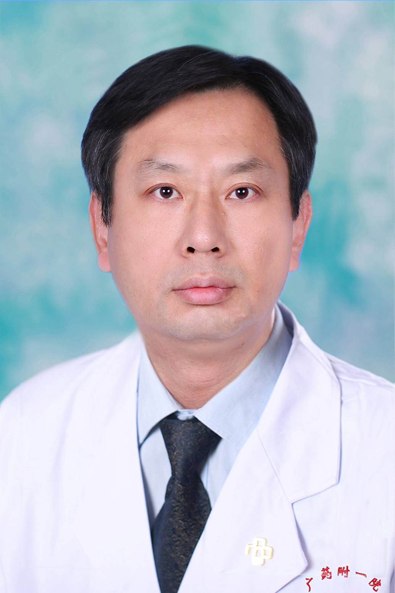

<!-- AUTO-GENERATED-BY: work/generate_obsidian_profiles.py -->

<!-- TEMPLATE: D:\workspace\信息收集整理\医生画像仓库\模板\医生画像模板.md -->

# 张伟斌

## 基础信息

| 字段 | 内容 |
|---|---|
| 姓名 | 张伟斌 |
| 医院 | 广东药科大学附属第一医院 |
| 科室 | 普外二科（胃肠外科）（健康管理中心） |
| 职称/身份 | 教授、主任医师、硕士生导师 |
| 来源链接 | [官网原文](https://www.gy120.net/articleshow.asp?articleid=16) |
| 采集日期 | 2026-08-15 |

## 简介/擅长

从事胃结直肠肿瘤、肛肠疾病以及腹壁疝等疾病的诊断与治疗。擅长腹腔镜下胃结直肠肿瘤、腹壁疝等疾病的微创手术治疗，以及腹部无切口的腹腔镜下消化道肿瘤根治手术，痔、瘘、出口梗阻综合征等肛肠疾病的手术治疗。擅长胃肠道急腹症、消化道肿瘤的综合治疗等。

## 教育与进修经历

- 个人介绍：1989 年毕业于东南大学医学院，从事普外临床工作至今 2006 年始任胃肠外科科主任，带领团队开展了小切口阑尾切除、腹股沟疝无张力修补及痔的 PPH 、 RPH 及岀口梗阻综合征的综合治疗等，以及腹腔镜下腹壁疝修补、阑尾切除手术等，取得满意治疗效果；

## 可包装亮点

- 官网目录标注：科室负责人；
- 个人介绍：1989 年毕业于东南大学医学院，从事普外临床工作至今 2006 年始任胃肠外科科主任，带领团队开展了小切口阑尾切除、腹股沟疝无张力修补及痔的 PPH 、 RPH 及岀口梗阻综合征的综合治疗等，以及腹腔镜下腹壁疝修补、阑尾切除手术等，取得满意治疗效果；
- 社会任职：广东省健康管理学会胃肠病学分会常委 广东省医疗行业协会消化外科管理分会常委 广东省医学会胃肠外科分会委员 广东省临床医学会微创外科委员会委员 广东省医师协会胃肠外科医师工作委员会委员 广东省医师协会 EARS 专委会委员 广东省医师协会腹壁疝专业医师分会委员 广东省医师协会肿瘤 MDT 专委会委员 广东省医师协会甲状腺专业医师分会委员 广东省医师…

## 重点疾病/人群标签

- 慢性病：
- 肿瘤：肿瘤、癌、肠癌、术后、恢复、MDT
- 生殖疾病：
- 免疫/风湿：
- 术后恢复/康复：肿瘤、癌、肠癌、术后、恢复、MDT
- 疑难重症：肿瘤、癌、肠癌、术后、恢复、MDT

## 证据摘录

> 只摘录官网公开信息中的短句或关键字段，不复制大段原文。

- 官网身份字段：教授、主任医师、硕士生导师
- 官网简介/擅长：从事胃结直肠肿瘤、肛肠疾病以及腹壁疝等疾病的诊断与治疗。擅长腹腔镜下胃结直肠肿瘤、腹壁疝等疾病的微创手术治疗，以及腹部无切口的腹腔镜下消化道肿瘤根治手术，痔、瘘、出口梗阻综合征等肛肠疾病的手术治疗。擅长胃肠道急腹症、消化道肿瘤的综合治疗等。
- 官网亮眼经历线索：官网目录标注：科室负责人；个人介绍：1989 年毕业于东南大学医学院，从事普外临床工作至今 2006 年始任胃肠外科科主任，带领团队开展了小切口阑尾切除、腹股沟疝无张力修补及痔的 PPH 、 RPH 及岀口梗阻综合征的综合治疗等，以及腹腔镜下腹壁疝修补、阑尾切除手术等，取得满意治疗效果； 社会任职：广东省健康管理学会胃肠病学分会常委 广东省医疗行业协会消化外科管理分会常委 广东省医学会胃肠外科分会委员 广东省临床医学会微创外科委员会委…
- 来源链接：https://www.gy120.net/articleshow.asp?articleid=16

## BD 画像摘要

张伟斌医生可作为肿瘤、术后恢复/康复、疑难重症方向的基础画像候选。后续 BD 使用应继续以官网来源和人工复核为准，不添加疗效承诺或无来源包装。

## 合规边界

- 仅使用医院官网、官方公众号、官方小程序等公开渠道。
- 不采集私人电话、私人微信、家庭住址、患者隐私或非公开排班信息。
- 不写“保证治愈”“疗效第一”“包治疑难杂症”等无法由官网证明的表述。
