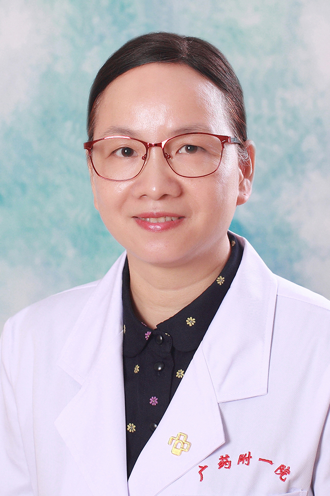

<!-- AUTO-GENERATED-BY: work/generate_obsidian_profiles.py -->

<!-- TEMPLATE: D:\workspace\信息收集整理\医生画像仓库\模板\医生画像模板.md -->

# 张卫

## 基础信息

| 字段 | 内容 |
|---|---|
| 姓名 | 张卫 |
| 医院 | 广东药科大学附属第一医院 |
| 科室 | 电生理专科门诊（健康管理中心） |
| 职称/身份 | 教授、主任医师、硕士生导师 |
| 来源链接 | [官网原文](https://www.gy120.net/articleshow.asp?articleid=378) |
| 采集日期 | 2026-08-15 |

## 简介/擅长

冠心病、高血压诊治，起搏器的程控及随访，冠心病介入治疗。

## 科研项目与成果

- 坚持临床、教学、科研并行发展，相互促进。
- 科研与获奖：参与 “ 生脉胶囊治疗慢性充血性心力衰竭的随机双盲对照试验 生脉胶囊调控慢性心衰心脏基因表达谱与细胞因子的研究 自发性高血压大鼠 NHE-1 与左心室肥厚相关性研究 ” 等国家 省（厅）级科研项目和学院科研共 10 项 同时对高血压左室肥厚患者进行发病机制研究和干预治疗，并对不同左室构型对心功能的影响进行临床研究；
- 主持与高血压左室肥厚相关的省级科研项目 2 项 以主要研究者参与国家级多中心科研项目多项，参与国际多中心合作科研项目 1 项

## 论文与学术产出

- 社会任职：广东省健康管理学会心血管病专业委员 广东省老年保健协会委员 中国女医师协会介入治疗组组长 广东省中西医结合冠心病专业委员 广东省中西医结合心律失常专业委员 主要论著：发表学术论文 40 余篇；

## 可包装亮点

- 先后到中山大学附属第二医院、中山大学附属第一医院、德国 Johannisstift Krankenhaus 等著名医院研修学习。
- 2012 年晋升心血管内科主任医师。
- 社会任职：广东省健康管理学会心血管病专业委员 广东省老年保健协会委员 中国女医师协会介入治疗组组长 广东省中西医结合冠心病专业委员 广东省中西医结合心律失常专业委员 主要论著：发表学术论文 40 余篇；
- 科研与获奖：参与 “ 生脉胶囊治疗慢性充血性心力衰竭的随机双盲对照试验 生脉胶囊调控慢性心衰心脏基因表达谱与细胞因子的研究 自发性高血压大鼠 NHE-1 与左心室肥厚相关性研究 ” 等国家 省（厅）级科研项目和学院科研共 10 项 同时对高血压左室肥厚患者进行发病机制研究和干预治疗，并对不同左室构型对心功能的影响进行临床研究

## 重点疾病/人群标签

- 慢性病：
- 肿瘤：
- 生殖疾病：
- 免疫/风湿：
- 术后恢复/康复：
- 疑难重症：

## 证据摘录

> 只摘录官网公开信息中的短句或关键字段，不复制大段原文。

- 官网身份字段：教授、主任医师、硕士生导师
- 官网简介/擅长：冠心病、高血压诊治，起搏器的程控及随访，冠心病介入治疗。
- 官网亮眼经历线索：先后到中山大学附属第二医院、中山大学附属第一医院、德国 Johannisstift Krankenhaus 等著名医院研修学习。 2012 年晋升心血管内科主任医师。 社会任职：广东省健康管理学会心血管病专业委员 广东省老年保健协会委员 中国女医师协会介入治疗组组长 广东省中西医结合冠心病专业委员 广东省中西医结合心律失常专业委员 主要论著：发表学术论文 40 余篇； 科研与获奖：参与 “ 生脉胶囊治疗慢性充血性心力衰竭的随机双盲对照…
- 异常提示：同名待甄别
- 来源链接：https://www.gy120.net/articleshow.asp?articleid=378

## BD 画像摘要

张卫医生可作为广东药科大学附属第一医院电生理专科门诊（健康管理中心）的基础医生资料入库。当前重点方向以总底表标签为准，官网未展示的信息保持空白。

## 合规边界

- 仅使用医院官网、官方公众号、官方小程序等公开渠道。
- 不采集私人电话、私人微信、家庭住址、患者隐私或非公开排班信息。
- 不写“保证治愈”“疗效第一”“包治疑难杂症”等无法由官网证明的表述。
