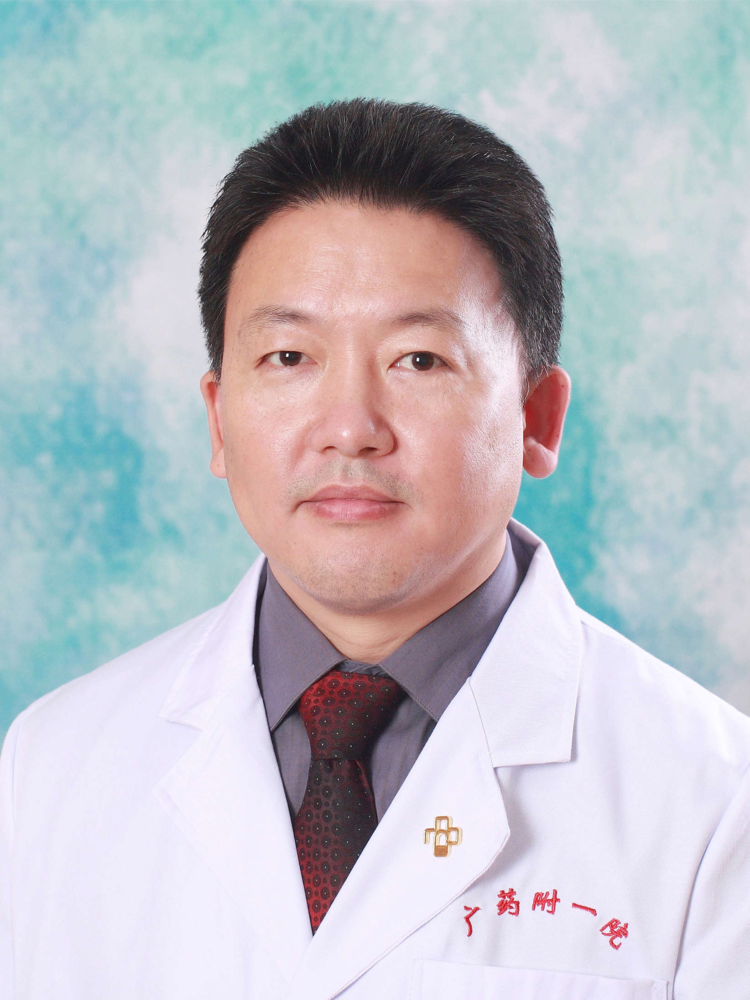

<!-- AUTO-GENERATED-BY: work/generate_obsidian_profiles.py -->

<!-- TEMPLATE: D:\workspace\信息收集整理\医生画像仓库\模板\医生画像模板.md -->

# 张威

## 基础信息

| 字段 | 内容 |
|---|---|
| 姓名 | 张威 |
| 医院 | 广东药科大学附属第一医院 |
| 科室 | 神经外科 |
| 职称/身份 | 教授、主任医师、硕士生导师 |
| 来源链接 | [官网原文](https://www.gy120.net/articleshow.asp?articleid=145) |
| 采集日期 | 2026-08-15 |

## 简介/擅长

擅长颅内肿瘤的诊断及手术治疗。

## 教育与进修经历

- 个人介绍：广东药学院以及暨南大学硕士生导师 1992.8始从事神经外科工作，中山大学神经外科学硕士研究生毕业 2009年3月至4月赴德国埃尔朗根-纽伦堡大学医学院（Erlangen-Nurnberg）神经外科访问学者 2011年晋升主任医师 社会任职：中国人民政治协商会议第十六届广州市越秀区委员会委员 广东省医院学会副会长 广东省健康管理学会医联体建设专业委员会主任委员 广东省垂体疾病干细胞治疗工程技术研究中心主任 中国神经外科重症管理协作组委员 广东省医学会神经外科分会常委 广东省医师协会神经外科分会常委 广州…

## 科研项目与成果

- 6.裸鼠体内培养对腺垂体HLA-Ⅱ表达的影响. 山东医药 7. 诊断学基本技能训练和指导 参编 全国高等医药院校规划教材 科研与获奖：1.大及巨大垂体腺瘤经蝶入路切除术后早期疗效评估与预后相关因素分析。
- 广州铁路（集团）公司科研开发计划项目 2. MRI、术中观察、鞍底硬脑膜活检诊断垂体腺瘤侵袭性的比照研究及评估。
- 广东省医学科研课题。
- 广东省社会发展领域科技计划项目。

## 论文与学术产出

- 6.裸鼠体内培养对腺垂体HLA-Ⅱ表达的影响. 山东医药 7. 诊断学基本技能训练和指导 参编 全国高等医药院校规划教材 科研与获奖：1.大及巨大垂体腺瘤经蝶入路切除术后早期疗效评估与预后相关因素分析。

## 可包装亮点

- 官网目录标注：首席专家；
- 个人介绍：广东药学院以及暨南大学硕士生导师 1992.8始从事神经外科工作，中山大学神经外科学硕士研究生毕业 2009年3月至4月赴德国埃尔朗根-纽伦堡大学医学院（Erlangen-Nurnberg）神经外科访问学者 2011年晋升主任医师 社会任职：中国人民政治协商会议第十六届广州市越秀区委员会委员 广东省医院学会副会长 广东省健康管理学会医联体建设专业…

## 重点疾病/人群标签

- 慢性病：
- 肿瘤：肿瘤、瘤、免疫、术后、重症
- 生殖疾病：
- 免疫/风湿：肿瘤、瘤、免疫、术后、重症
- 术后恢复/康复：肿瘤、瘤、免疫、术后、重症
- 疑难重症：肿瘤、瘤、免疫、术后、重症

## 证据摘录

> 只摘录官网公开信息中的短句或关键字段，不复制大段原文。

- 官网身份字段：教授、主任医师、硕士生导师
- 官网简介/擅长：擅长颅内肿瘤的诊断及手术治疗。
- 官网亮眼经历线索：官网目录标注：首席专家；个人介绍：广东药学院以及暨南大学硕士生导师 1992.8始从事神经外科工作，中山大学神经外科学硕士研究生毕业 2009年3月至4月赴德国埃尔朗根-纽伦堡大学医学院（Erlangen-Nurnberg）神经外科访问学者 2011年晋升主任医师 社会任职：中国人民政治协商会议第十六届广州市越秀区委员会委员 广东省医院学会副会长 广东省健康管理学会医联体建设专业委员会主任委员 广东省垂体疾病干细胞治疗工程技术研究中心…
- 来源链接：https://www.gy120.net/articleshow.asp?articleid=145

## BD 画像摘要

张威医生可作为肿瘤、免疫/风湿/感染、术后恢复/康复、疑难重症方向的基础画像候选。后续 BD 使用应继续以官网来源和人工复核为准，不添加疗效承诺或无来源包装。

## 合规边界

- 仅使用医院官网、官方公众号、官方小程序等公开渠道。
- 不采集私人电话、私人微信、家庭住址、患者隐私或非公开排班信息。
- 不写“保证治愈”“疗效第一”“包治疑难杂症”等无法由官网证明的表述。
