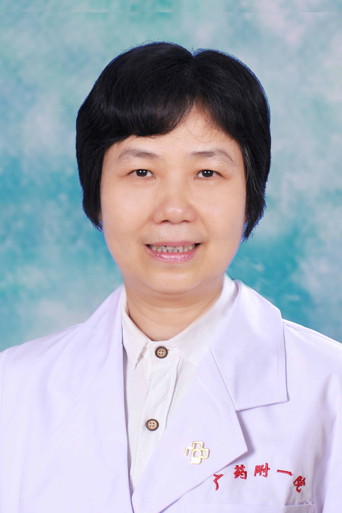

<!-- AUTO-GENERATED-BY: work/generate_obsidian_profiles.py -->

<!-- TEMPLATE: D:\workspace\信息收集整理\医生画像仓库\模板\医生画像模板.md -->

# 张少华

## 基础信息

| 字段 | 内容 |
|---|---|
| 姓名 | 张少华 |
| 医院 | 广东药科大学附属第一医院 |
| 科室 | 肠道门诊（农林）（健康管理中心） |
| 职称/身份 | 教授、主任医师 |
| 来源链接 | [官网原文](https://www.gy120.net/articleshow.asp?articleid=32) |
| 采集日期 | 2026-08-15 |

## 简介/擅长

擅长于病毒性肝炎、肝硬化、登革热、伤寒和副伤寒、肺结核、流行性出血热、恙虫病、麻疹及不明原因发热等疾病的诊治。

## 教育与进修经历

- 个人介绍：1982年毕业于中山医学院医疗系；

## 科研项目与成果

- 科研与获奖：主持科研“荧光分子信标探针检测外周血白细胞和肝组织HBVcccDNA的临床研究”获2006年度广东省卫生厅科研立项，项目编号：A2006330。

## 论文与学术产出

- 先后发表论文十余篇。

## 可包装亮点

- 2006年晋升为主任医师。
- 社会任职：广东省医学会感染病与寄生虫学分会第六届委员会委员 广东省肝脏病学会委员会常务委员 广东省中西医结合学会肝病专业委员会第四届委员会委员 广东省医师协会感染科医师工作委员会常务委员 广州市医学会感染病学分会委员 广州市医学会医疗事故技术鉴定专家库成员 主要论著：“乙型肝炎病毒C基因启动子双突变的检测意义”、“乙型肝炎病毒C基因启动子双突变与肝硬化、肝…
- 先后发表论文十余篇。
- 科研与获奖：主持科研“荧光分子信标探针检测外周血白细胞和肝组织HBVcccDNA的临床研究”获2006年度广东省卫生厅科研立项，项目编号：A2006330。

## 重点疾病/人群标签

- 慢性病：
- 肿瘤：肝癌、感染
- 生殖疾病：
- 免疫/风湿：肝癌、感染
- 术后恢复/康复：
- 疑难重症：

## 证据摘录

> 只摘录官网公开信息中的短句或关键字段，不复制大段原文。

- 官网身份字段：教授、主任医师
- 官网简介/擅长：擅长于病毒性肝炎、肝硬化、登革热、伤寒和副伤寒、肺结核、流行性出血热、恙虫病、麻疹及不明原因发热等疾病的诊治。
- 官网亮眼经历线索：2006年晋升为主任医师。 社会任职：广东省医学会感染病与寄生虫学分会第六届委员会委员 广东省肝脏病学会委员会常务委员 广东省中西医结合学会肝病专业委员会第四届委员会委员 广东省医师协会感染科医师工作委员会常务委员 广州市医学会感染病学分会委员 广州市医学会医疗事故技术鉴定专家库成员 主要论著：“乙型肝炎病毒C基因启动子双突变的检测意义”、“乙型肝炎病毒C基因启动子双突变与肝硬化、肝癌的临床研究”。 先后发表论文十余篇。 科研与获奖：…
- 来源链接：https://www.gy120.net/articleshow.asp?articleid=32

## BD 画像摘要

张少华医生可作为肿瘤、免疫/风湿/感染方向的基础画像候选。后续 BD 使用应继续以官网来源和人工复核为准，不添加疗效承诺或无来源包装。

## 合规边界

- 仅使用医院官网、官方公众号、官方小程序等公开渠道。
- 不采集私人电话、私人微信、家庭住址、患者隐私或非公开排班信息。
- 不写“保证治愈”“疗效第一”“包治疑难杂症”等无法由官网证明的表述。
