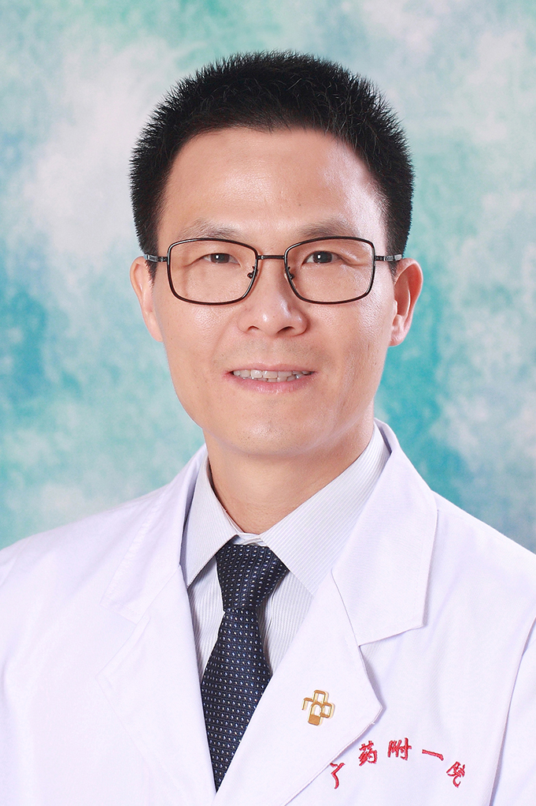

<!-- AUTO-GENERATED-BY: work/generate_obsidian_profiles.py -->

<!-- TEMPLATE: D:\workspace\信息收集整理\医生画像仓库\模板\医生画像模板.md -->

# 张明兴

## 基础信息

| 字段 | 内容 |
|---|---|
| 姓名 | 张明兴 |
| 医院 | 广东药科大学附属第一医院 |
| 科室 | 康复医学科（健康管理中心） |
| 职称/身份 | 教授、主任医师 |
| 来源链接 | [官网原文](https://www.gy120.net/articleshow.asp?articleid=174) |
| 采集日期 | 2026-08-15 |

## 简介/擅长

擅长神经系统疾病（脑卒中、脑外伤、脊髓损伤、帕金森病、痴呆）所引起的功能障碍康复。

## 教育与进修经历

- 个人介绍：1995年6月毕业于上海铁道大学医学院临床医学系 1995年8月至今 广东药学院附属第一医院工作 社会任职：广东省康复医学会卒中预防与康复分会委员 广东省康复医学会中西医结合分会委员

## 可包装亮点

- 官网目录标注：科室负责人；
- 个人介绍：1995年6月毕业于上海铁道大学医学院临床医学系 1995年8月至今 广东药学院附属第一医院工作 社会任职：广东省康复医学会卒中预防与康复分会委员 广东省康复医学会中西医结合分会委员

## 重点疾病/人群标签

- 慢性病：
- 肿瘤：
- 生殖疾病：
- 免疫/风湿：
- 术后恢复/康复：康复、功能障碍
- 疑难重症：

## 证据摘录

> 只摘录官网公开信息中的短句或关键字段，不复制大段原文。

- 官网身份字段：教授、主任医师
- 官网简介/擅长：擅长神经系统疾病（脑卒中、脑外伤、脊髓损伤、帕金森病、痴呆）所引起的功能障碍康复。
- 官网亮眼经历线索：官网目录标注：科室负责人；个人介绍：1995年6月毕业于上海铁道大学医学院临床医学系 1995年8月至今 广东药学院附属第一医院工作 社会任职：广东省康复医学会卒中预防与康复分会委员 广东省康复医学会中西医结合分会委员
- 来源链接：https://www.gy120.net/articleshow.asp?articleid=174

## BD 画像摘要

张明兴医生可作为术后恢复/康复方向的基础画像候选。后续 BD 使用应继续以官网来源和人工复核为准，不添加疗效承诺或无来源包装。

## 合规边界

- 仅使用医院官网、官方公众号、官方小程序等公开渠道。
- 不采集私人电话、私人微信、家庭住址、患者隐私或非公开排班信息。
- 不写“保证治愈”“疗效第一”“包治疑难杂症”等无法由官网证明的表述。
