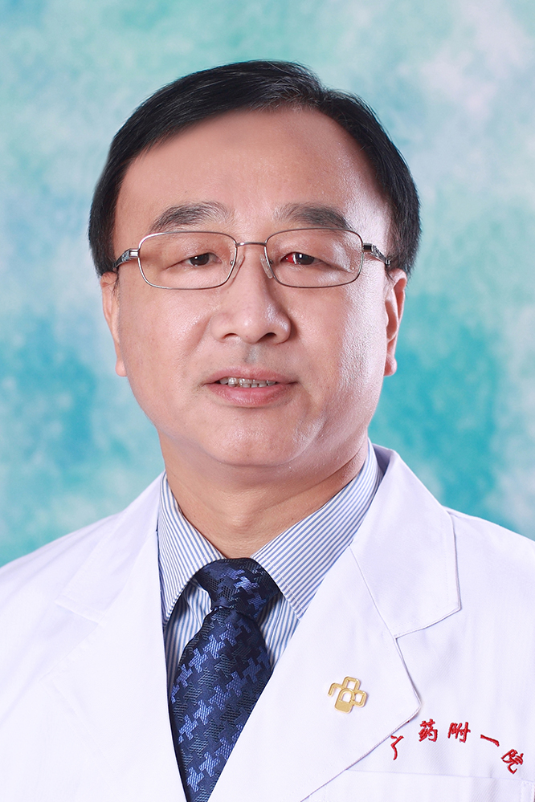

<!-- AUTO-GENERATED-BY: work/generate_obsidian_profiles.py -->

<!-- TEMPLATE: D:\workspace\信息收集整理\医生画像仓库\模板\医生画像模板.md -->

# 张永成

## 基础信息

| 字段 | 内容 |
|---|---|
| 姓名 | 张永成 |
| 医院 | 广东药科大学附属第一医院 |
| 科室 | 乳腺科（农林门诊） |
| 职称/身份 | 教授、主任医师、硕士生导师 |
| 来源链接 | [官网原文](https://www.gy120.net/articleshow.asp?articleid=55) |
| 采集日期 | 2026-08-15 |

## 简介/擅长

提倡对乳腺癌进行积极的个体化综合治疗，擅长乳腺肿物微创旋切术、乳腺癌前哨淋巴结活检、乳腺癌保乳手术、皮下乳腺全切Ⅰ期乳房重建手术和乳腺癌新辅助化疗、生物靶向治疗等技术项目

## 教育与进修经历

- 个人介绍：1990年7月毕业于南京铁道医学院临床医学专业（现东南大学医学院）， 毕业后分配在广州铁路中心医院，现为广东药学院附属第一医院，从事普通外科专业。

## 科研项目与成果

- 科研与获奖：主持研究课题获广东省科技厅科研基金资助，已取得阶段性成果。

## 论文与学术产出

- 社会任职：广东省胸部肿瘤防治研究会乳腺癌专业委员会常委 广东省中西医结合学会围手术期专业委员会常委 广东省医学会乳腺病学分会委员 广东省医师协会乳腺专科医师工作委员会委员 广东省健康管理学会乳腺病学专业委员会委员 广州抗癌协会乳腺癌专业委员会委员 广东省、广州市医疗技术鉴定委员会专家 《中华临床医师杂志》编辑 主要论著：近年来在包括国家级核心期刊《中华内分泌外科杂志》、《中华乳腺病杂志》在内的多家学术刊物发表学术论文 10 余篇 ；
- 作为乳腺病专家多次接受《广州日报》、《新快报》等多家媒体专访并发表科普文章，受到读者好评。

## 可包装亮点

- 官网目录标注：科室负责人；
- 2006-2010年，任乳腺外科副主任医师2010年至今，任乳腺外科主任医师、硕士研究生导师。
- 2011年开始担任乳腺外科主任。
- 社会任职：广东省胸部肿瘤防治研究会乳腺癌专业委员会常委 广东省中西医结合学会围手术期专业委员会常委 广东省医学会乳腺病学分会委员 广东省医师协会乳腺专科医师工作委员会委员 广东省健康管理学会乳腺病学专业委员会委员 广州抗癌协会乳腺癌专业委员会委员 广东省、广州市医疗技术鉴定委员会专家 《中华临床医师杂志》编辑 主要论著：近年来在包括国家级核心期刊《中华内分…
- 作为乳腺病专家多次接受《广州日报》、《新快报》等多家媒体专访并发表科普文章，受到读者好评。

## 重点疾病/人群标签

- 慢性病：
- 肿瘤：肿瘤、癌、化疗、靶向、乳腺癌
- 生殖疾病：
- 免疫/风湿：
- 术后恢复/康复：
- 疑难重症：

## 证据摘录

> 只摘录官网公开信息中的短句或关键字段，不复制大段原文。

- 官网身份字段：教授、主任医师、硕士生导师
- 官网简介/擅长：提倡对乳腺癌进行积极的个体化综合治疗，擅长乳腺肿物微创旋切术、乳腺癌前哨淋巴结活检、乳腺癌保乳手术、皮下乳腺全切Ⅰ期乳房重建手术和乳腺癌新辅助化疗、生物靶向治疗等技术项目
- 官网亮眼经历线索：官网目录标注：科室负责人；2006-2010年，任乳腺外科副主任医师2010年至今，任乳腺外科主任医师、硕士研究生导师。 2011年开始担任乳腺外科主任。 社会任职：广东省胸部肿瘤防治研究会乳腺癌专业委员会常委 广东省中西医结合学会围手术期专业委员会常委 广东省医学会乳腺病学分会委员 广东省医师协会乳腺专科医师工作委员会委员 广东省健康管理学会乳腺病学专业委员会委员 广州抗癌协会乳腺癌专业委员会委员 广东省、广州市医疗技术鉴定委员会专…
- 来源链接：https://www.gy120.net/articleshow.asp?articleid=55

## BD 画像摘要

张永成医生可作为肿瘤方向的基础画像候选。后续 BD 使用应继续以官网来源和人工复核为准，不添加疗效承诺或无来源包装。

## 合规边界

- 仅使用医院官网、官方公众号、官方小程序等公开渠道。
- 不采集私人电话、私人微信、家庭住址、患者隐私或非公开排班信息。
- 不写“保证治愈”“疗效第一”“包治疑难杂症”等无法由官网证明的表述。
