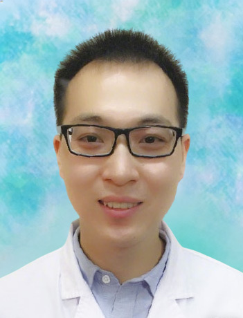

<!-- AUTO-GENERATED-BY: work/generate_obsidian_profiles.py -->

<!-- TEMPLATE: D:\workspace\信息收集整理\医生画像仓库\模板\医生画像模板.md -->

# 张涛

## 基础信息

| 字段 | 内容 |
|---|---|
| 姓名 | 张涛 |
| 医院 | 广东药科大学附属第一医院 |
| 科室 | 检验科 |
| 职称/身份 | 副主任技师、副教授、生化大组组长 |
| 来源链接 | [官网原文](https://www.gy120.net/articleshow.asp?articleid=542) |
| 采集日期 | 2026-08-15 |

## 简介/擅长

具有丰富的临床检验经验，熟练掌握临床检验相关工作的基本理论和实验技能。在临床生物化学检验专业方向有较深的造诣。

## 教育与进修经历

- 个人介绍：本科，医学学士学位，副主任技师，副教授，生化大组组长 。
- 毕业于南方医科大学医学检验专业 ， 2013年7月开始就职于广东药科大学附属第一医院检验科，先后于微生物组、临检组、生化组进行轮转，其中2021年1月—2021年6月在中山大学附属第一医院检验科进修；

## 科研项目与成果

- 2021-2023年参与我院新冠核酸检测工作，坚守一线，其中2022年4-5月支援上海市新冠核酸检测，2022年11-12月支援广州海珠区新冠核酸检测，为疫情防控和处置提供了及时准确的实验室依据。
- 社会任职：广东省医师协会检验医师分会第三届委员会青年医师工作组组员 广东省预防医学会检验医学转化与创新专业委员会第一届委员会委员 科研与获奖：发表核心期刊论文2篇，作为第一发明人获得授权专利2项，作为主要参与人获得授权专利5项，参与科研基金及教改课题3项，参与编写专著1部。

## 论文与学术产出

- 社会任职：广东省医师协会检验医师分会第三届委员会青年医师工作组组员 广东省预防医学会检验医学转化与创新专业委员会第一届委员会委员 科研与获奖：发表核心期刊论文2篇，作为第一发明人获得授权专利2项，作为主要参与人获得授权专利5项，参与科研基金及教改课题3项，参与编写专著1部。

## 可包装亮点

- 毕业于南方医科大学医学检验专业 ， 2013年7月开始就职于广东药科大学附属第一医院检验科，先后于微生物组、临检组、生化组进行轮转，其中2021年1月—2021年6月在中山大学附属第一医院检验科进修；
- 社会任职：广东省医师协会检验医师分会第三届委员会青年医师工作组组员 广东省预防医学会检验医学转化与创新专业委员会第一届委员会委员 科研与获奖：发表核心期刊论文2篇，作为第一发明人获得授权专利2项，作为主要参与人获得授权专利5项，参与科研基金及教改课题3项，参与编写专著1部。

## 重点疾病/人群标签

- 慢性病：
- 肿瘤：
- 生殖疾病：
- 免疫/风湿：
- 术后恢复/康复：
- 疑难重症：

## 证据摘录

> 只摘录官网公开信息中的短句或关键字段，不复制大段原文。

- 官网身份字段：副主任技师、副教授、生化大组组长
- 官网简介/擅长：具有丰富的临床检验经验，熟练掌握临床检验相关工作的基本理论和实验技能。在临床生物化学检验专业方向有较深的造诣。
- 官网亮眼经历线索：毕业于南方医科大学医学检验专业 ， 2013年7月开始就职于广东药科大学附属第一医院检验科，先后于微生物组、临检组、生化组进行轮转，其中2021年1月—2021年6月在中山大学附属第一医院检验科进修； 社会任职：广东省医师协会检验医师分会第三届委员会青年医师工作组组员 广东省预防医学会检验医学转化与创新专业委员会第一届委员会委员 科研与获奖：发表核心期刊论文2篇，作为第一发明人获得授权专利2项，作为主要参与人获得授权专利5项，参与科研…
- 来源链接：https://www.gy120.net/articleshow.asp?articleid=542

## BD 画像摘要

张涛医生可作为广东药科大学附属第一医院检验科的基础医生资料入库。当前重点方向以总底表标签为准，官网未展示的信息保持空白。

## 合规边界

- 仅使用医院官网、官方公众号、官方小程序等公开渠道。
- 不采集私人电话、私人微信、家庭住址、患者隐私或非公开排班信息。
- 不写“保证治愈”“疗效第一”“包治疑难杂症”等无法由官网证明的表述。
