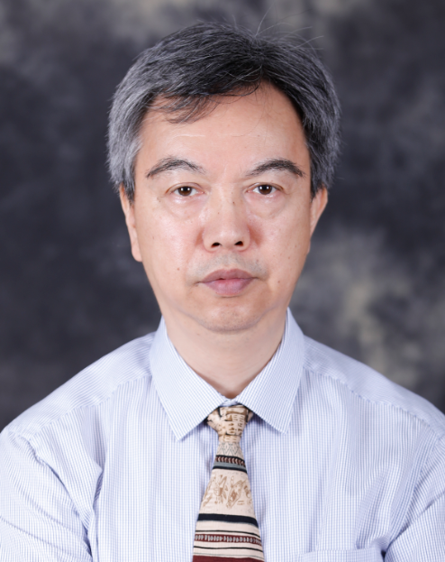

<!-- AUTO-GENERATED-BY: work/generate_obsidian_profiles.py -->

<!-- TEMPLATE: D:\workspace\信息收集整理\医生画像仓库\模板\医生画像模板.md -->

# 张滨

## 基础信息

| 字段 | 内容 |
|---|---|
| 姓名 | 张滨 |
| 医院 | 广东药科大学附属第一医院 |
| 科室 | 泌尿外科（健康管理中心） |
| 职称/身份 | 主任医师 |
| 来源链接 | [官网原文](https://www.gy120.net/articleshow.asp?articleid=507) |
| 采集日期 | 2026-08-15 |

## 简介/擅长

男性不育症：包括少弱精症，无精子症；男性性功能障碍：包括性欲异常，阳痿，早泄，不射精等；男性性腺发育障碍：包括小睾丸，阴茎短小等；男性生殖器发育异常：包括阴茎弯曲，包皮过长等；前列腺疾病：包括血精，射精疼痛，排尿异常等；夫妻性不和谐，女性性交疼痛，女性性交恐惧等。

## 教育与进修经历

- 个人介绍：1982 年毕业于中山医科大学医疗系，曾就职于广州市黄埔区港湾医院担任住院医师。
- 1988 年赴日本留学， 1995 年获得医学博士学位。

## 科研项目与成果

- 科研与获奖：获得广东省科学技术奖励（三等第 1 名）。
- 先后获得国家自然，省科技，市科技多项科学基金。

## 论文与学术产出

- 社会任职：广东省中医药学会生殖医学分会副主任委员 广东省性学会顾问 广东省医学会性医学分会荣誉主任委员 日本性机能研究会成员 主要论著：主编国家级"十一五"和"十二五"规划教材《性医学》。

## 可包装亮点

- 社会任职：广东省中医药学会生殖医学分会副主任委员 广东省性学会顾问 广东省医学会性医学分会荣誉主任委员 日本性机能研究会成员 主要论著：主编国家级"十一五"和"十二五"规划教材《性医学》。
- 主讲的视频公开课《性与生殖健康》为国家级精品课程并获得相应奖励。
- 科研与获奖：获得广东省科学技术奖励（三等第 1 名）。

## 重点疾病/人群标签

- 慢性病：
- 肿瘤：
- 生殖疾病：
- 免疫/风湿：
- 术后恢复/康复：
- 疑难重症：

## 证据摘录

> 只摘录官网公开信息中的短句或关键字段，不复制大段原文。

- 官网身份字段：主任医师
- 官网简介/擅长：男性不育症：包括少弱精症，无精子症；男性性功能障碍：包括性欲异常，阳痿，早泄，不射精等；男性性腺发育障碍：包括小睾丸，阴茎短小等；男性生殖器发育异常：包括阴茎弯曲，包皮过长等；前列腺疾病：包括血精，射精疼痛，排尿异常等；夫妻性不和谐，女性性交疼痛，女性性交恐惧等。
- 官网亮眼经历线索：社会任职：广东省中医药学会生殖医学分会副主任委员 广东省性学会顾问 广东省医学会性医学分会荣誉主任委员 日本性机能研究会成员 主要论著：主编国家级"十一五"和"十二五"规划教材《性医学》。 主讲的视频公开课《性与生殖健康》为国家级精品课程并获得相应奖励。 科研与获奖：获得广东省科学技术奖励（三等第 1 名）。
- 异常提示：同名待甄别
- 来源链接：https://www.gy120.net/articleshow.asp?articleid=507

## BD 画像摘要

张滨医生可作为广东药科大学附属第一医院泌尿外科（健康管理中心）的基础医生资料入库。当前重点方向以总底表标签为准，官网未展示的信息保持空白。

## 合规边界

- 仅使用医院官网、官方公众号、官方小程序等公开渠道。
- 不采集私人电话、私人微信、家庭住址、患者隐私或非公开排班信息。
- 不写“保证治愈”“疗效第一”“包治疑难杂症”等无法由官网证明的表述。
