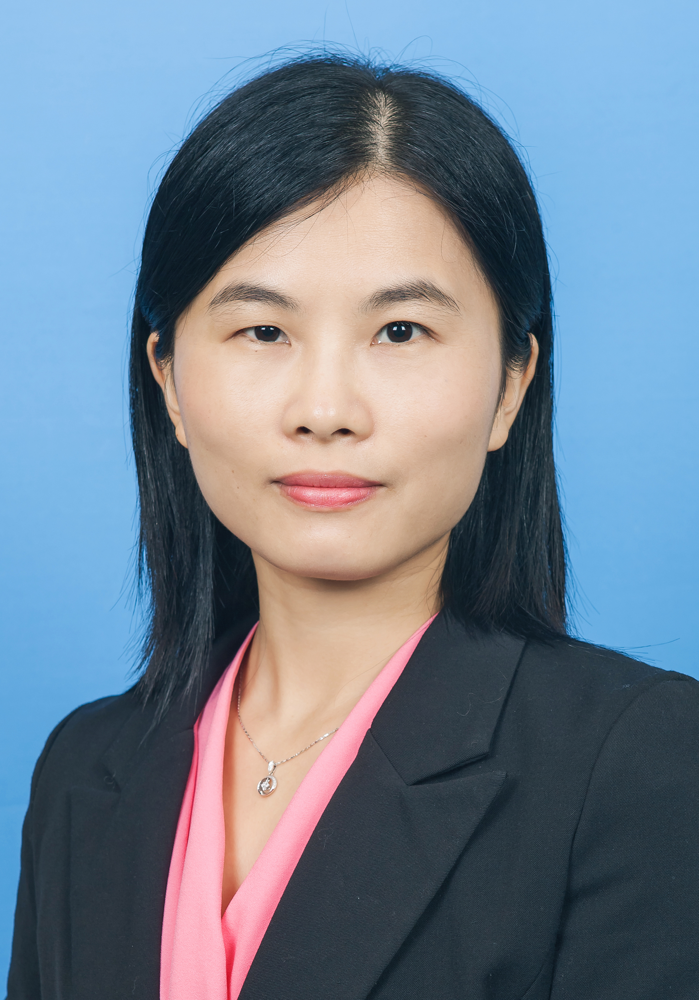

<!-- AUTO-GENERATED-BY: work/generate_obsidian_profiles.py -->

<!-- TEMPLATE: D:\workspace\信息收集整理\医生画像仓库\模板\医生画像模板.md -->

# 张琼霞

## 基础信息

| 字段 | 内容 |
|---|---|
| 姓名 | 张琼霞 |
| 医院 | 广东药科大学附属第一医院 |
| 科室 | 肿瘤一科（农林门诊） |
| 职称/身份 | 主治医师 |
| 来源链接 | [官网原文](https://www.gy120.net/articleshow.asp?articleid=430) |
| 采集日期 | 2026-08-15 |

## 简介/擅长

擅长鼻咽癌、肺癌、胃癌、食管癌、原发性肝癌、结直肠癌、头颈癌、乳腺癌、恶性淋巴瘤等实体瘤的综合治疗。

## 科研项目与成果

- 社会任职：广东省抗癌协会委员 广东省青年化疗委员会会员 广东省医学会肿瘤学分会 鼻咽癌学组 组员 科研与获奖：在 Oncotarget 、 Autophagy. 、 Oncogene 、中华医学杂志等专业期刊发表学术论文 5 篇 参与国自然青年基金项目、省自然等项目多项。

## 论文与学术产出

- 社会任职：广东省抗癌协会委员 广东省青年化疗委员会会员 广东省医学会肿瘤学分会 鼻咽癌学组 组员 科研与获奖：在 Oncotarget 、 Autophagy. 、 Oncogene 、中华医学杂志等专业期刊发表学术论文 5 篇 参与国自然青年基金项目、省自然等项目多项。

## 可包装亮点

- 社会任职：广东省抗癌协会委员 广东省青年化疗委员会会员 广东省医学会肿瘤学分会 鼻咽癌学组 组员 科研与获奖：在 Oncotarget 、 Autophagy. 、 Oncogene 、中华医学杂志等专业期刊发表学术论文 5 篇 参与国自然青年基金项目、省自然等项目多项。

## 重点疾病/人群标签

- 慢性病：
- 肿瘤：肿瘤、癌、瘤、淋巴瘤、化疗、鼻咽癌、肺癌、肝癌、胃癌、肠癌、乳腺癌
- 生殖疾病：
- 免疫/风湿：
- 术后恢复/康复：
- 疑难重症：

## 证据摘录

> 只摘录官网公开信息中的短句或关键字段，不复制大段原文。

- 官网身份字段：主治医师
- 官网简介/擅长：擅长鼻咽癌、肺癌、胃癌、食管癌、原发性肝癌、结直肠癌、头颈癌、乳腺癌、恶性淋巴瘤等实体瘤的综合治疗。
- 官网亮眼经历线索：社会任职：广东省抗癌协会委员 广东省青年化疗委员会会员 广东省医学会肿瘤学分会 鼻咽癌学组 组员 科研与获奖：在 Oncotarget 、 Autophagy. 、 Oncogene 、中华医学杂志等专业期刊发表学术论文 5 篇 参与国自然青年基金项目、省自然等项目多项。
- 来源链接：https://www.gy120.net/articleshow.asp?articleid=430

## BD 画像摘要

张琼霞医生可作为肿瘤方向的基础画像候选。后续 BD 使用应继续以官网来源和人工复核为准，不添加疗效承诺或无来源包装。

## 合规边界

- 仅使用医院官网、官方公众号、官方小程序等公开渠道。
- 不采集私人电话、私人微信、家庭住址、患者隐私或非公开排班信息。
- 不写“保证治愈”“疗效第一”“包治疑难杂症”等无法由官网证明的表述。
