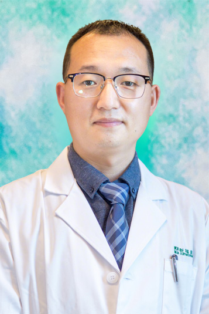

<!-- AUTO-GENERATED-BY: work/generate_obsidian_profiles.py -->

<!-- TEMPLATE: D:\workspace\信息收集整理\医生画像仓库\模板\医生画像模板.md -->

# 张福宏

## 基础信息

| 字段 | 内容 |
|---|---|
| 姓名 | 张福宏 |
| 医院 | 广东药科大学附属第一医院 |
| 科室 | 耳鼻咽喉科（农林门诊） |
| 职称/身份 | 主任医师、教授、临床医学专业硕士、耳鼻咽喉科主任 |
| 来源链接 | [官网原文](https://www.gy120.net/articleshow.asp?articleid=531) |
| 采集日期 | 2026-08-15 |

## 简介/擅长

擅长内镜微创手术治疗鼻窦炎、鼻息肉、慢性鼻炎、过敏性鼻炎、鼻甲肥大、鼻中隔偏曲、鼻腔肿瘤、鼻窦肿瘤、腺样体肥大、扁桃体肥大、成人鼾症、慢性扁桃体炎、声带肿物、咽喉肿瘤、鼓膜穿孔、外耳道胆脂瘤，擅长显微外科手术治疗中耳胆脂瘤、各种类型的中耳炎、耳前瘘管。擅长耳聋、耳鸣、眩晕的综合诊治。特色诊疗技术鼻内镜下筛窦轮廓化，鼻内镜下额窦开放术，脑脊液鼻漏修补术，鼻内镜下鼻中隔缝合免填塞技术，鼻内镜下鼻中隔穿孔修补术，内镜下扁桃体次全切除术（扁桃体囊内切除术）在国内属于领先水平。

## 教育与进修经历

- 个人介绍：毕业于吉林大学白求恩医学院临床医学七年制，毕业后于兰州大学第一医院工作12年，曾于复旦大学附属眼耳鼻喉科医院学习1年，并于上海交通大学第六医院、北京同仁医院短期学习，师从我国著名鼻科专家中山大学第一医院史剑波教授学习鼻内镜外科技术4年，多次参加中山大学第一医院许庚教授团队鼻内镜外科解剖培训。

## 论文与学术产出

- 社会任职：广东省医学会变态反应学会委员 广东省医师协会变态反应工作委员会委员 广东省临床医学会耳内镜专业委员会委员 广东省医疗行业协会耳鼻咽喉头颈外科管理分会 常委 广东省基层医药协会慢性鼻窦炎专业委员会 常委 广东省中西医结合学会耳鼻咽喉专业委员会 常委 广东省康复医学会前庭与平衡康复分会理事会 理事 中国非公立医疗机构协会耳鼻咽喉头颈外科专业委员会委员 主要论著：发表论文10余篇，其中SCI论文2篇

## 可包装亮点

- 官网目录标注：科室负责人；
- 社会任职：广东省医学会变态反应学会委员 广东省医师协会变态反应工作委员会委员 广东省临床医学会耳内镜专业委员会委员 广东省医疗行业协会耳鼻咽喉头颈外科管理分会 常委 广东省基层医药协会慢性鼻窦炎专业委员会 常委 广东省中西医结合学会耳鼻咽喉专业委员会 常委 广东省康复医学会前庭与平衡康复分会理事会 理事 中国非公立医疗机构协会耳鼻咽喉头颈外科专业委员会委员…

## 重点疾病/人群标签

- 慢性病：慢性、肿瘤、瘤、康复
- 肿瘤：慢性、肿瘤、瘤、康复
- 生殖疾病：
- 免疫/风湿：
- 术后恢复/康复：慢性、肿瘤、瘤、康复
- 疑难重症：

## 证据摘录

> 只摘录官网公开信息中的短句或关键字段，不复制大段原文。

- 官网身份字段：主任医师、教授、临床医学专业硕士、耳鼻咽喉科主任
- 官网简介/擅长：擅长内镜微创手术治疗鼻窦炎、鼻息肉、慢性鼻炎、过敏性鼻炎、鼻甲肥大、鼻中隔偏曲、鼻腔肿瘤、鼻窦肿瘤、腺样体肥大、扁桃体肥大、成人鼾症、慢性扁桃体炎、声带肿物、咽喉肿瘤、鼓膜穿孔、外耳道胆脂瘤，擅长显微外科手术治疗中耳胆脂瘤、各种类型的中耳炎、耳前瘘管。擅长耳聋、耳鸣、眩晕的综合诊治。特色诊疗技术鼻内镜下筛窦轮廓化，鼻内镜下额窦开放术，脑脊液鼻漏修补术，鼻内镜下鼻中隔缝合免填塞技术，鼻内镜下鼻中隔穿孔修补术，内镜下扁桃体次全切除术（扁桃…
- 官网亮眼经历线索：官网目录标注：科室负责人；社会任职：广东省医学会变态反应学会委员 广东省医师协会变态反应工作委员会委员 广东省临床医学会耳内镜专业委员会委员 广东省医疗行业协会耳鼻咽喉头颈外科管理分会 常委 广东省基层医药协会慢性鼻窦炎专业委员会 常委 广东省中西医结合学会耳鼻咽喉专业委员会 常委 广东省康复医学会前庭与平衡康复分会理事会 理事 中国非公立医疗机构协会耳鼻咽喉头颈外科专业委员会委员 主要论著：发表论文10余篇，其中SCI论文2篇
- 来源链接：https://www.gy120.net/articleshow.asp?articleid=531

## BD 画像摘要

张福宏医生可作为慢性病、肿瘤、术后恢复/康复方向的基础画像候选。后续 BD 使用应继续以官网来源和人工复核为准，不添加疗效承诺或无来源包装。

## 合规边界

- 仅使用医院官网、官方公众号、官方小程序等公开渠道。
- 不采集私人电话、私人微信、家庭住址、患者隐私或非公开排班信息。
- 不写“保证治愈”“疗效第一”“包治疑难杂症”等无法由官网证明的表述。
