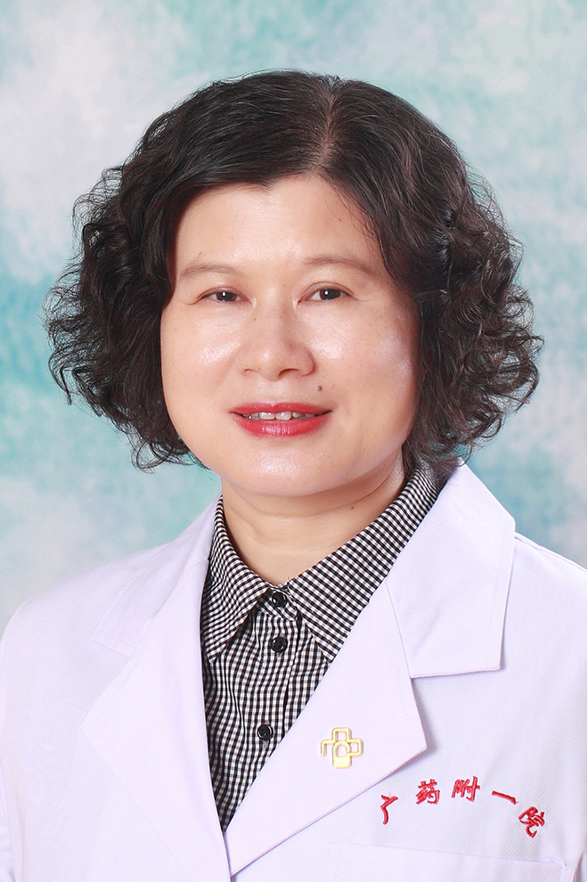

<!-- AUTO-GENERATED-BY: work/generate_obsidian_profiles.py -->

<!-- TEMPLATE: D:\workspace\信息收集整理\医生画像仓库\模板\医生画像模板.md -->

# 徐丽梅

## 基础信息

| 字段 | 内容 |
|---|---|
| 姓名 | 徐丽梅 |
| 医院 | 广东药科大学附属第一医院 |
| 科室 | 全科医学科（健康管理中心） |
| 职称/身份 | 副教授、主任医师 |
| 来源链接 | [官网原文](https://www.gy120.net/articleshow.asp?articleid=143) |
| 采集日期 | 2026-08-15 |

## 简介/擅长

从事内分泌内科专业，擅长糖尿病、甲状腺疾病、垂体疾病、高脂血症等内分泌系统疾病的诊治。

## 教育与进修经历

- 个人介绍：1993年7月——1994年6月 广州铁路中心医院内科 见习医师 1994年7月——2001年8月 广州铁路中心医院内科 住院医师 2001年9月——2002年12月 广州铁路中心医院内二科 主治医师 2003年1月——2003年12月 中山大学附属第一医院内分泌科 进修医师 2004年1月——2007年4月 广东药学院附属第一医院内二科 主治医师 2007年5月—— 2022年 广东药学院附属第一医院内二科 副主任医师 2023年1月——至今 广东药学院附属第一医院内二科 主任医师 主要论著：《在内科…

## 可包装亮点

- 个人介绍：1993年7月——1994年6月 广州铁路中心医院内科 见习医师 1994年7月——2001年8月 广州铁路中心医院内科 住院医师 2001年9月——2002年12月 广州铁路中心医院内二科 主治医师 2003年1月——2003年12月 中山大学附属第一医院内分泌科 进修医师 2004年1月——2007年4月 广东药学院附属第一医院内二科 主治医…

## 重点疾病/人群标签

- 慢性病：糖尿病、高脂血症
- 肿瘤：
- 生殖疾病：
- 免疫/风湿：
- 术后恢复/康复：
- 疑难重症：

## 证据摘录

> 只摘录官网公开信息中的短句或关键字段，不复制大段原文。

- 官网身份字段：副教授、主任医师
- 官网简介/擅长：从事内分泌内科专业，擅长糖尿病、甲状腺疾病、垂体疾病、高脂血症等内分泌系统疾病的诊治。
- 官网亮眼经历线索：个人介绍：1993年7月——1994年6月 广州铁路中心医院内科 见习医师 1994年7月——2001年8月 广州铁路中心医院内科 住院医师 2001年9月——2002年12月 广州铁路中心医院内二科 主治医师 2003年1月——2003年12月 中山大学附属第一医院内分泌科 进修医师 2004年1月——2007年4月 广东药学院附属第一医院内二科 主治医师 2007年5月—— 2022年 广东药学院附属第一医院内二科 副主任医师 2…
- 来源链接：https://www.gy120.net/articleshow.asp?articleid=143

## BD 画像摘要

徐丽梅医生可作为慢性病方向的基础画像候选。后续 BD 使用应继续以官网来源和人工复核为准，不添加疗效承诺或无来源包装。

## 合规边界

- 仅使用医院官网、官方公众号、官方小程序等公开渠道。
- 不采集私人电话、私人微信、家庭住址、患者隐私或非公开排班信息。
- 不写“保证治愈”“疗效第一”“包治疑难杂症”等无法由官网证明的表述。
