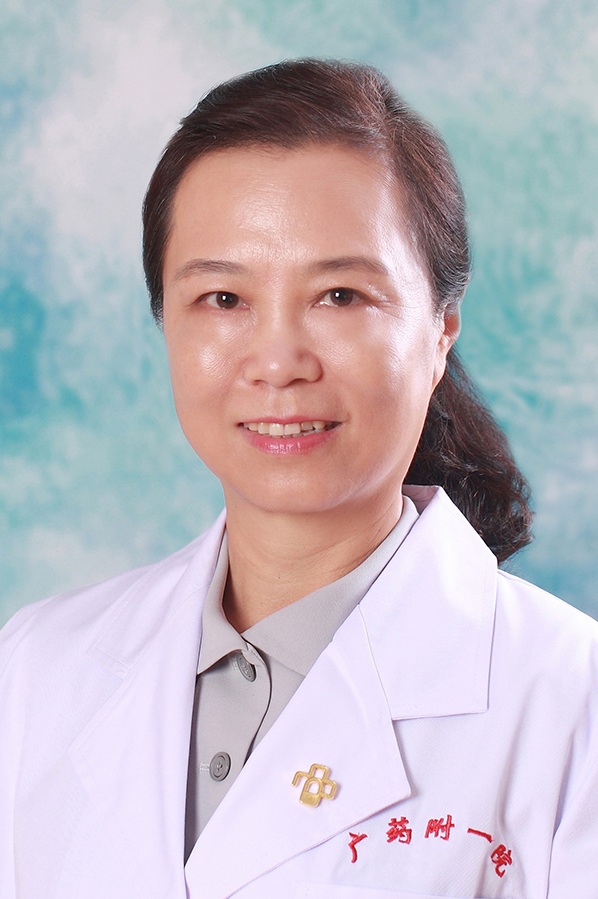

<!-- AUTO-GENERATED-BY: work/generate_obsidian_profiles.py -->

<!-- TEMPLATE: D:\workspace\信息收集整理\医生画像仓库\模板\医生画像模板.md -->

# 惠俐

## 基础信息

| 字段 | 内容 |
|---|---|
| 姓名 | 惠俐 |
| 医院 | 广东药科大学附属第一医院 |
| 科室 | 普外三科（整形美容科）（健康管理中心） |
| 职称/身份 | 教授、主任医师 |
| 来源链接 | [官网原文](https://www.gy120.net/articleshow.asp?articleid=172) |
| 采集日期 | 2026-08-15 |

## 简介/擅长

擅长于各种整形美容外科手术，尤其在1.面部整形2.综合鼻整形、隆胸、乳头乳晕畸形矫正；3.耳再造、耳廓畸形矫正；4.肉毒毒素除皱、玻尿酸、自体脂肪填充改变面部轮廓；5.妇科私密整形手术等方面颇有造诣。

## 教育与进修经历

- 个人介绍：毕业于中山大学（中山医科大学）临床医学专业 自1988年开始从事整形美容外科专业至今 曾在上海第二医学院新华医院颌面美容外科培训、广东医学院整形外科进修 南方医科大学研究生课程班学习 并在2006年6月到美国霍普金斯大学整形外科学习交流 社会任职：中华医学会广东整形外科分会委员 科研与获奖：曾主持和完成了多项广东省和广州市临床科研项目，在国家级和省级杂志上发表多篇医学论文，获多项院级科学技术进步奖。

## 科研项目与成果

- 个人介绍：毕业于中山大学（中山医科大学）临床医学专业 自1988年开始从事整形美容外科专业至今 曾在上海第二医学院新华医院颌面美容外科培训、广东医学院整形外科进修 南方医科大学研究生课程班学习 并在2006年6月到美国霍普金斯大学整形外科学习交流 社会任职：中华医学会广东整形外科分会委员 科研与获奖：曾主持和完成了多项广东省和广州市临床科研项目，在国家级和省级杂志上发表多篇医学论文，获多项院级科学技术进步奖。

## 论文与学术产出

- 个人介绍：毕业于中山大学（中山医科大学）临床医学专业 自1988年开始从事整形美容外科专业至今 曾在上海第二医学院新华医院颌面美容外科培训、广东医学院整形外科进修 南方医科大学研究生课程班学习 并在2006年6月到美国霍普金斯大学整形外科学习交流 社会任职：中华医学会广东整形外科分会委员 科研与获奖：曾主持和完成了多项广东省和广州市临床科研项目，在国家级和省级杂志上发表多篇医学论文，获多项院级科学技术进步奖。

## 可包装亮点

- 个人介绍：毕业于中山大学（中山医科大学）临床医学专业 自1988年开始从事整形美容外科专业至今 曾在上海第二医学院新华医院颌面美容外科培训、广东医学院整形外科进修 南方医科大学研究生课程班学习 并在2006年6月到美国霍普金斯大学整形外科学习交流 社会任职：中华医学会广东整形外科分会委员 科研与获奖：曾主持和完成了多项广东省和广州市临床科研项目，在国家级和…

## 重点疾病/人群标签

- 慢性病：
- 肿瘤：
- 生殖疾病：
- 免疫/风湿：
- 术后恢复/康复：
- 疑难重症：

## 证据摘录

> 只摘录官网公开信息中的短句或关键字段，不复制大段原文。

- 官网身份字段：教授、主任医师
- 官网简介/擅长：擅长于各种整形美容外科手术，尤其在1.面部整形2.综合鼻整形、隆胸、乳头乳晕畸形矫正；3.耳再造、耳廓畸形矫正；4.肉毒毒素除皱、玻尿酸、自体脂肪填充改变面部轮廓；5.妇科私密整形手术等方面颇有造诣。
- 官网亮眼经历线索：个人介绍：毕业于中山大学（中山医科大学）临床医学专业 自1988年开始从事整形美容外科专业至今 曾在上海第二医学院新华医院颌面美容外科培训、广东医学院整形外科进修 南方医科大学研究生课程班学习 并在2006年6月到美国霍普金斯大学整形外科学习交流 社会任职：中华医学会广东整形外科分会委员 科研与获奖：曾主持和完成了多项广东省和广州市临床科研项目，在国家级和省级杂志上发表多篇医学论文，获多项院级科学技术进步奖。
- 来源链接：https://www.gy120.net/articleshow.asp?articleid=172

## BD 画像摘要

惠俐医生可作为广东药科大学附属第一医院普外三科（整形美容科）（健康管理中心）的基础医生资料入库。当前重点方向以总底表标签为准，官网未展示的信息保持空白。

## 合规边界

- 仅使用医院官网、官方公众号、官方小程序等公开渠道。
- 不采集私人电话、私人微信、家庭住址、患者隐私或非公开排班信息。
- 不写“保证治愈”“疗效第一”“包治疑难杂症”等无法由官网证明的表述。
