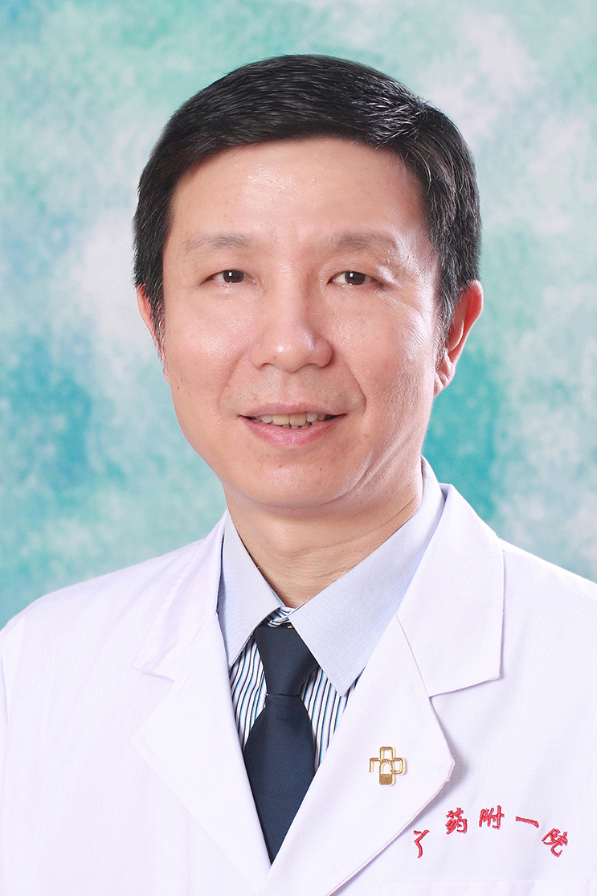

<!-- AUTO-GENERATED-BY: work/generate_obsidian_profiles.py -->

<!-- TEMPLATE: D:\workspace\信息收集整理\医生画像仓库\模板\医生画像模板.md -->

# 朱宇东

## 基础信息

| 字段 | 内容 |
|---|---|
| 姓名 | 朱宇东 |
| 医院 | 广东药科大学附属第一医院 |
| 科室 | 眼科（健康管理中心） |
| 职称/身份 | 副主任医师 |
| 来源链接 | [官网原文](https://www.gy120.net/articleshow.asp?articleid=148) |
| 采集日期 | 2026-08-15 |

## 简介/擅长

熟练掌握眼科常见病、多发病的诊治及急、重症眼病抢救，对青光眼、眼外伤、白内障、眼底病、斜视、弱视等疾病的诊断、处理及鉴别诊断较有研究

## 教育与进修经历

- 个人介绍：1987-1992 南京东南大学医学部医学本科毕业 1992-2000 本院眼科从事临床工作，任住院医师 2000年 于中山眼科中心进修 2000-2006 本院眼科从事临床工作，任主治医师 2006 -至今 聘任眼科副主任医师 社会任职：广东省视光学会视力保健委员会委员 主要论著：1.朱宇东.双眼人工晶体混浊1例. 中国实用眼科杂志，2003年第22卷第6期 2.人工晶体置换术的临床分析。

## 科研项目与成果

- 眼外伤职业眼病杂志，2005年第27卷第4期 3.多焦点折叠人工晶体的临床观察，广东药学院学报，2005年第21卷第2期 4.巩膜外垫压术后的超声乳化术，实用医学杂志，2005年第4期 5.甲状腺相关眼病复视的手术治疗，眼外伤职业眼病杂志，2005年第27卷第11期 6.硅油填充术后继发性青光眼的临床分析 《国际眼科杂志》2009年第9期 科研与获奖：1. 真空小梁成形术治疗原发性开角型青光眼的临床研究 广东省医学科研基金 2. 各期糖尿病视网膜病变患者房水和血清PEDF表达与眼电生理改变的相关分析 广东省科技厅…

## 可包装亮点

- 个人介绍：1987-1992 南京东南大学医学部医学本科毕业 1992-2000 本院眼科从事临床工作，任住院医师 2000年 于中山眼科中心进修 2000-2006 本院眼科从事临床工作，任主治医师 2006 -至今 聘任眼科副主任医师 社会任职：广东省视光学会视力保健委员会委员 主要论著：1.朱宇东.双眼人工晶体混浊1例. 中国实用眼科杂志，2003年…
- 眼外伤职业眼病杂志，2005年第27卷第4期 3.多焦点折叠人工晶体的临床观察，广东药学院学报，2005年第21卷第2期 4.巩膜外垫压术后的超声乳化术，实用医学杂志，2005年第4期 5.甲状腺相关眼病复视的手术治疗，眼外伤职业眼病杂志，2005年第27卷第11期 6.硅油填充术后继发性青光眼的临床分析 《国际眼科杂志》2009年第9期 科研与获奖：1.…

## 重点疾病/人群标签

- 慢性病：糖尿病、术后、重症
- 肿瘤：
- 生殖疾病：
- 免疫/风湿：
- 术后恢复/康复：糖尿病、术后、重症
- 疑难重症：糖尿病、术后、重症

## 证据摘录

> 只摘录官网公开信息中的短句或关键字段，不复制大段原文。

- 官网身份字段：副主任医师
- 官网简介/擅长：熟练掌握眼科常见病、多发病的诊治及急、重症眼病抢救，对青光眼、眼外伤、白内障、眼底病、斜视、弱视等疾病的诊断、处理及鉴别诊断较有研究
- 官网亮眼经历线索：个人介绍：1987-1992 南京东南大学医学部医学本科毕业 1992-2000 本院眼科从事临床工作，任住院医师 2000年 于中山眼科中心进修 2000-2006 本院眼科从事临床工作，任主治医师 2006 -至今 聘任眼科副主任医师 社会任职：广东省视光学会视力保健委员会委员 主要论著：1.朱宇东.双眼人工晶体混浊1例. 中国实用眼科杂志，2003年第22卷第6期 2.人工晶体置换术的临床分析。 眼外伤职业眼病杂志，2005年第…
- 来源链接：https://www.gy120.net/articleshow.asp?articleid=148

## BD 画像摘要

朱宇东医生可作为慢性病、术后恢复/康复、疑难重症方向的基础画像候选。后续 BD 使用应继续以官网来源和人工复核为准，不添加疗效承诺或无来源包装。

## 合规边界

- 仅使用医院官网、官方公众号、官方小程序等公开渠道。
- 不采集私人电话、私人微信、家庭住址、患者隐私或非公开排班信息。
- 不写“保证治愈”“疗效第一”“包治疑难杂症”等无法由官网证明的表述。
