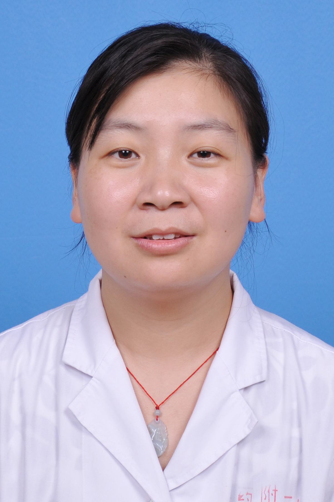

<!-- AUTO-GENERATED-BY: work/generate_obsidian_profiles.py -->

<!-- TEMPLATE: D:\workspace\信息收集整理\医生画像仓库\模板\医生画像模板.md -->

# 朱艳丽

## 基础信息

| 字段 | 内容 |
|---|---|
| 姓名 | 朱艳丽 |
| 医院 | 广东药科大学附属第一医院 |
| 科室 | 耳鼻咽喉科（农林门诊） |
| 职称/身份 | 副主任医师、副教授、医学硕士 |
| 来源链接 | [官网原文](https://www.gy120.net/articleshow.asp?articleid=401) |
| 采集日期 | 2026-08-15 |

## 简介/擅长

熟练完成耳鼻咽喉头颈外科常见病、多发病的规范化诊断与治疗。同时，精通甲状腺肿物、鼻咽肿物、扁桃体癌、喉癌、下咽癌等头颈肿瘤的诊疗工作

## 教育与进修经历

- 个人介绍：2002 年本科毕业于郑州大学医学院临床医学专业，2007 年于中山大学附属肿瘤医院头颈外科专业获得硕士学位。
- 自硕士毕业至今，就职于广东药科大学附属第一医院耳鼻喉科，深耕临床诊疗与教学工作。
- 2020 年上半年，赴中山大学附属肿瘤医院头颈外科完成进修深造。

## 可包装亮点

- 2020 年上半年，赴中山大学附属肿瘤医院头颈外科完成进修深造。
- 社会任职：广东省预防医学会耳鼻咽喉科分会委员 广东省医学会耳鼻咽喉分会听力学组成员

## 重点疾病/人群标签

- 慢性病：慢性、肿瘤、癌
- 肿瘤：慢性、肿瘤、癌
- 生殖疾病：
- 免疫/风湿：
- 术后恢复/康复：
- 疑难重症：

## 证据摘录

> 只摘录官网公开信息中的短句或关键字段，不复制大段原文。

- 官网身份字段：副主任医师、副教授、医学硕士
- 官网简介/擅长：熟练完成耳鼻咽喉头颈外科常见病、多发病的规范化诊断与治疗。同时，精通甲状腺肿物、鼻咽肿物、扁桃体癌、喉癌、下咽癌等头颈肿瘤的诊疗工作
- 官网亮眼经历线索：2020 年上半年，赴中山大学附属肿瘤医院头颈外科完成进修深造。 社会任职：广东省预防医学会耳鼻咽喉科分会委员 广东省医学会耳鼻咽喉分会听力学组成员
- 来源链接：https://www.gy120.net/articleshow.asp?articleid=401

## BD 画像摘要

朱艳丽医生可作为慢性病、肿瘤方向的基础画像候选。后续 BD 使用应继续以官网来源和人工复核为准，不添加疗效承诺或无来源包装。

## 合规边界

- 仅使用医院官网、官方公众号、官方小程序等公开渠道。
- 不采集私人电话、私人微信、家庭住址、患者隐私或非公开排班信息。
- 不写“保证治愈”“疗效第一”“包治疑难杂症”等无法由官网证明的表述。
