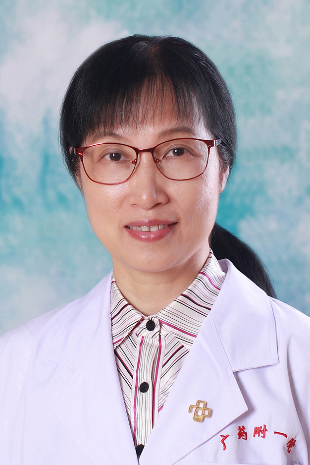

<!-- AUTO-GENERATED-BY: work/generate_obsidian_profiles.py -->

<!-- TEMPLATE: D:\workspace\信息收集整理\医生画像仓库\模板\医生画像模板.md -->

# 李兰英

## 基础信息

| 字段 | 内容 |
|---|---|
| 姓名 | 李兰英 |
| 医院 | 广东药科大学附属第一医院 |
| 科室 | 呼吸与危重症医学科（农林门诊） |
| 职称/身份 | 副教授、副主任医师 |
| 来源链接 | [官网原文](https://www.gy120.net/articleshow.asp?articleid=357) |
| 采集日期 | 2026-08-15 |

## 简介/擅长

擅长对咳嗽、慢性阻塞性肺病、急慢性呼吸衰竭、支气管哮喘、肺部感染、支气管扩张、肺结核等呼吸系统疾病的诊疗。能熟练进行肺功能、电子支气管镜、有创/无创呼吸机等操作。

## 教育与进修经历

- 个人介绍：1988年毕业于中山医科大学临床医学系（六年制），从事呼吸内科临床工作20余年。
- 曾于1997年在广东省人民医院进修学习《呼吸疾病诊治与重症治疗》和“肺功能、纤支镜检查”一年三个月。

## 科研项目与成果

- 科研与获奖：独立主持省级科研课题一项，参与多项科研课题。

## 论文与学术产出

- 社会任职：广东省医学会呼吸分会间质性肺病学组成员 主要论著：在医学核心期刊公开发表数篇较高水平论文。

## 可包装亮点

- 曾于1997年在广东省人民医院进修学习《呼吸疾病诊治与重症治疗》和“肺功能、纤支镜检查”一年三个月。
- 社会任职：广东省医学会呼吸分会间质性肺病学组成员 主要论著：在医学核心期刊公开发表数篇较高水平论文。
- 科研与获奖：独立主持省级科研课题一项，参与多项科研课题。

## 重点疾病/人群标签

- 慢性病：慢性、感染、危重、重症
- 肿瘤：
- 生殖疾病：
- 免疫/风湿：慢性、感染、危重、重症
- 术后恢复/康复：
- 疑难重症：慢性、感染、危重、重症

## 证据摘录

> 只摘录官网公开信息中的短句或关键字段，不复制大段原文。

- 官网身份字段：副教授、副主任医师
- 官网简介/擅长：擅长对咳嗽、慢性阻塞性肺病、急慢性呼吸衰竭、支气管哮喘、肺部感染、支气管扩张、肺结核等呼吸系统疾病的诊疗。能熟练进行肺功能、电子支气管镜、有创/无创呼吸机等操作。
- 官网亮眼经历线索：曾于1997年在广东省人民医院进修学习《呼吸疾病诊治与重症治疗》和“肺功能、纤支镜检查”一年三个月。 社会任职：广东省医学会呼吸分会间质性肺病学组成员 主要论著：在医学核心期刊公开发表数篇较高水平论文。 科研与获奖：独立主持省级科研课题一项，参与多项科研课题。
- 来源链接：https://www.gy120.net/articleshow.asp?articleid=357

## BD 画像摘要

李兰英医生可作为慢性病、免疫/风湿/感染、疑难重症方向的基础画像候选。后续 BD 使用应继续以官网来源和人工复核为准，不添加疗效承诺或无来源包装。

## 合规边界

- 仅使用医院官网、官方公众号、官方小程序等公开渠道。
- 不采集私人电话、私人微信、家庭住址、患者隐私或非公开排班信息。
- 不写“保证治愈”“疗效第一”“包治疑难杂症”等无法由官网证明的表述。
