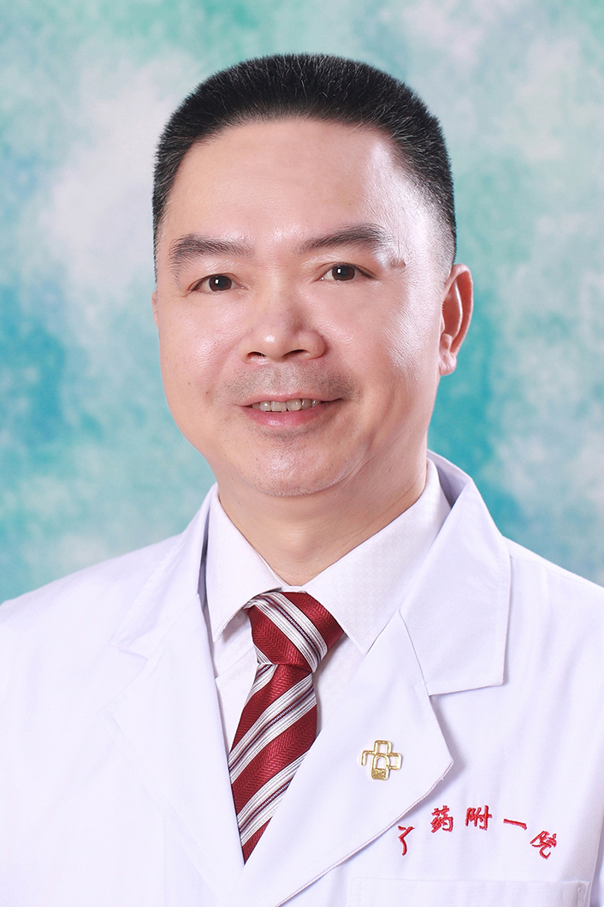

<!-- AUTO-GENERATED-BY: work/generate_obsidian_profiles.py -->

<!-- TEMPLATE: D:\workspace\信息收集整理\医生画像仓库\模板\医生画像模板.md -->

# 李国标

## 基础信息

| 字段 | 内容 |
|---|---|
| 姓名 | 李国标 |
| 医院 | 广东药科大学附属第一医院 |
| 科室 | 心内一科（健康管理中心） |
| 职称/身份 | 教授、主任医师、 |
| 来源链接 | [官网原文](https://www.gy120.net/articleshow.asp?articleid=107) |
| 采集日期 | 2026-08-15 |

## 简介/擅长

冠心病、高血压、心律失常、先心病的诊治及心血管疾病介入治疗

## 科研项目与成果

- 科研与获奖：积极开展代谢综合征的相关研究，以血管疾病作为主要的研究方向，积极申报科研课题，主持了3项厅级及以上的课题；
- 参与中西医结合防治代谢病的省科技计划项目“女贞丹参方降脂作用的机理研究”的课题研究，2009年“中药复方防治高脂血症临床与实验研究”获广东省科学技术一等奖（B16-0-1-02-R10）。

## 论文与学术产出

- 主要论著：近年来以第一作者完成5篇论文，参与了6篇论文的发表，参与编写著作2部。

## 可包装亮点

- 主要论著：近年来以第一作者完成5篇论文，参与了6篇论文的发表，参与编写著作2部。
- 科研与获奖：积极开展代谢综合征的相关研究，以血管疾病作为主要的研究方向，积极申报科研课题，主持了3项厅级及以上的课题；
- 参与中西医结合防治代谢病的省科技计划项目“女贞丹参方降脂作用的机理研究”的课题研究，2009年“中药复方防治高脂血症临床与实验研究”获广东省科学技术一等奖（B16-0-1-02-R10）。

## 重点疾病/人群标签

- 慢性病：高血压、冠心病、高脂血症、代谢
- 肿瘤：
- 生殖疾病：
- 免疫/风湿：
- 术后恢复/康复：
- 疑难重症：

## 证据摘录

> 只摘录官网公开信息中的短句或关键字段，不复制大段原文。

- 官网身份字段：教授、主任医师、
- 官网简介/擅长：冠心病、高血压、心律失常、先心病的诊治及心血管疾病介入治疗
- 官网亮眼经历线索：主要论著：近年来以第一作者完成5篇论文，参与了6篇论文的发表，参与编写著作2部。 科研与获奖：积极开展代谢综合征的相关研究，以血管疾病作为主要的研究方向，积极申报科研课题，主持了3项厅级及以上的课题； 参与中西医结合防治代谢病的省科技计划项目“女贞丹参方降脂作用的机理研究”的课题研究，2009年“中药复方防治高脂血症临床与实验研究”获广东省科学技术一等奖（B16-0-1-02-R10）。
- 来源链接：https://www.gy120.net/articleshow.asp?articleid=107

## BD 画像摘要

李国标医生可作为慢性病方向的基础画像候选。后续 BD 使用应继续以官网来源和人工复核为准，不添加疗效承诺或无来源包装。

## 合规边界

- 仅使用医院官网、官方公众号、官方小程序等公开渠道。
- 不采集私人电话、私人微信、家庭住址、患者隐私或非公开排班信息。
- 不写“保证治愈”“疗效第一”“包治疑难杂症”等无法由官网证明的表述。
