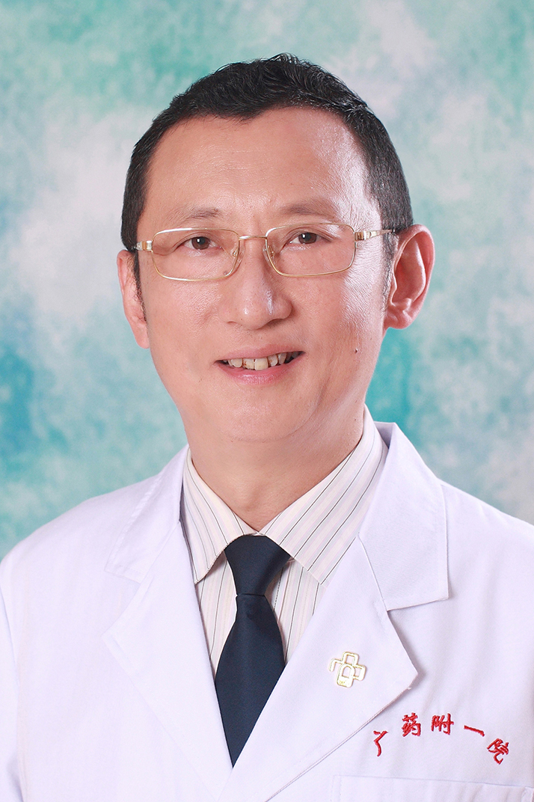

<!-- AUTO-GENERATED-BY: work/generate_obsidian_profiles.py -->

<!-- TEMPLATE: D:\workspace\信息收集整理\医生画像仓库\模板\医生画像模板.md -->

# 李峻

## 基础信息

| 字段 | 内容 |
|---|---|
| 姓名 | 李峻 |
| 医院 | 广东药科大学附属第一医院 |
| 科室 | 泌尿外科（农林门诊） |
| 职称/身份 | 副教授、副主任医师 |
| 来源链接 | [官网原文](https://www.gy120.net/articleshow.asp?articleid=200) |
| 采集日期 | 2026-08-15 |

## 简介/擅长

泌尿外科微创技术治疗泌尿系结石、肿瘤及前列腺增生等。

## 教育与进修经历

- 个人介绍：1992年毕业于东南大学临床医学系，至今从事泌尿外科工作 20 余年；
- 199 8年在广州医科大学第一附属医院泌尿外科进修 1 年；

## 科研项目与成果

- 科研与获奖：2008 年广东省卫生厅课题

## 可包装亮点

- 199 8年在广州医科大学第一附属医院泌尿外科进修 1 年；
- 2008 年晋升为副主任医师。
- 科研与获奖：2008 年广东省卫生厅课题

## 重点疾病/人群标签

- 慢性病：
- 肿瘤：肿瘤
- 生殖疾病：
- 免疫/风湿：
- 术后恢复/康复：
- 疑难重症：

## 证据摘录

> 只摘录官网公开信息中的短句或关键字段，不复制大段原文。

- 官网身份字段：副教授、副主任医师
- 官网简介/擅长：泌尿外科微创技术治疗泌尿系结石、肿瘤及前列腺增生等。
- 官网亮眼经历线索：199 8年在广州医科大学第一附属医院泌尿外科进修 1 年； 2008 年晋升为副主任医师。 科研与获奖：2008 年广东省卫生厅课题
- 来源链接：https://www.gy120.net/articleshow.asp?articleid=200

## BD 画像摘要

李峻医生可作为肿瘤方向的基础画像候选。后续 BD 使用应继续以官网来源和人工复核为准，不添加疗效承诺或无来源包装。

## 合规边界

- 仅使用医院官网、官方公众号、官方小程序等公开渠道。
- 不采集私人电话、私人微信、家庭住址、患者隐私或非公开排班信息。
- 不写“保证治愈”“疗效第一”“包治疑难杂症”等无法由官网证明的表述。
