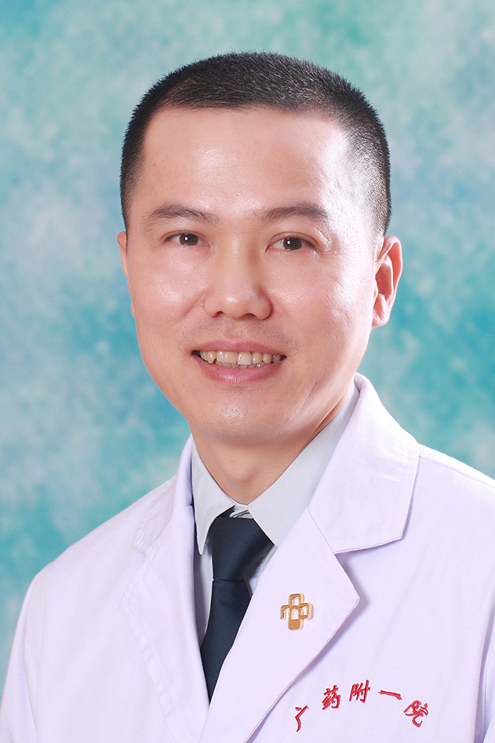

<!-- AUTO-GENERATED-BY: work/generate_obsidian_profiles.py -->

<!-- TEMPLATE: D:\workspace\信息收集整理\医生画像仓库\模板\医生画像模板.md -->

# 李平

## 基础信息

| 字段 | 内容 |
|---|---|
| 姓名 | 李平 |
| 医院 | 广东药科大学附属第一医院 |
| 科室 | 普外三科（整形美容科）（健康管理中心） |
| 职称/身份 | 副教授、副主任医师 |
| 来源链接 | [官网原文](https://www.gy120.net/articleshow.asp?articleid=236) |
| 采集日期 | 2026-08-15 |

## 简介/擅长

眼鼻综合整形、面部年轻化综合抗衰老、乳房轮廓整形、瘢痕及先天畸形的序列治疗

## 教育与进修经历

- 个人介绍：毕业于广东医学院研究生学院整形外科专业 大学本科和硕士 2003年07月-2007年10月在广东医学院附属医院整形外科任住院医师、总住院医师；
- 2006年02月-2006年05月于上海复旦大学附属华山医院手外科进修学习；

## 科研项目与成果

- 4. 皮肤扩张器在头面部大面积皮肤病损治疗中的应用 . 新医学 (2012) 5. 口服氨甲环酸联合 Q 开关 Nd:YAG 激光治疗黄褐斑疗效观察 . 中国美容医学 ,2016 6. 自体耳软骨联合膨体聚四氟乙烯在鼻整形的应用 . 现代诊断与治 .2019 科研与获奖：《可降解聚酰胺微型骨内固定板钉系统的动物实验研究》 ( 广东省卫生厅立项资助， 2012 年，课题负责人 ) 主持和参加省部及市级科研项目 3 项，在国内核心 期刊发表论文多篇。

## 论文与学术产出

- 4. 皮肤扩张器在头面部大面积皮肤病损治疗中的应用 . 新医学 (2012) 5. 口服氨甲环酸联合 Q 开关 Nd:YAG 激光治疗黄褐斑疗效观察 . 中国美容医学 ,2016 6. 自体耳软骨联合膨体聚四氟乙烯在鼻整形的应用 . 现代诊断与治 .2019 科研与获奖：《可降解聚酰胺微型骨内固定板钉系统的动物实验研究》 ( 广东省卫生厅立项资助， 2012 年，课题负责人 ) 主持和参加省部及市级科研项目 3 项，在国内核心 期刊发表论文多篇。

## 可包装亮点

- 官网目录标注：科室负责人；
- 2006年02月-2006年05月于上海复旦大学附属华山医院手外科进修学习；
- 2013年09月-至今在广东药学院附属第一医院整形外科任副主任医师。
- 社会任职：中国整形美容协会瘢痕医学分会委员 中国康复医学会修复重建外科分会瘢痕学组委员 中国整形美容协会面部年轻化分会委员 广东省医师协会整形外科医师分会常务委员 广东省医学会医学美容学分会常务委员 广东省医学美容学会整形美容专业委员会常务委员 广东省医学美容学会抗衰老专业委员会常务委员 美国射极峰中国首批鼻修复中心特聘专家 主要论著：1. 病理性瘢痕成纤…
- 4. 皮肤扩张器在头面部大面积皮肤病损治疗中的应用 . 新医学 (2012) 5. 口服氨甲环酸联合 Q 开关 Nd:YAG 激光治疗黄褐斑疗效观察 . 中国美容医学 ,2016...

## 重点疾病/人群标签

- 慢性病：
- 肿瘤：
- 生殖疾病：
- 免疫/风湿：
- 术后恢复/康复：康复
- 疑难重症：

## 证据摘录

> 只摘录官网公开信息中的短句或关键字段，不复制大段原文。

- 官网身份字段：副教授、副主任医师
- 官网简介/擅长：眼鼻综合整形、面部年轻化综合抗衰老、乳房轮廓整形、瘢痕及先天畸形的序列治疗
- 官网亮眼经历线索：官网目录标注：科室负责人；2006年02月-2006年05月于上海复旦大学附属华山医院手外科进修学习； 2013年09月-至今在广东药学院附属第一医院整形外科任副主任医师。 社会任职：中国整形美容协会瘢痕医学分会委员 中国康复医学会修复重建外科分会瘢痕学组委员 中国整形美容协会面部年轻化分会委员 广东省医师协会整形外科医师分会常务委员 广东省医学会医学美容学分会常务委员 广东省医学美容学会整形美容专业委员会常务委员 广东省医学美容学会…
- 来源链接：https://www.gy120.net/articleshow.asp?articleid=236

## BD 画像摘要

李平医生可作为术后恢复/康复方向的基础画像候选。后续 BD 使用应继续以官网来源和人工复核为准，不添加疗效承诺或无来源包装。

## 合规边界

- 仅使用医院官网、官方公众号、官方小程序等公开渠道。
- 不采集私人电话、私人微信、家庭住址、患者隐私或非公开排班信息。
- 不写“保证治愈”“疗效第一”“包治疑难杂症”等无法由官网证明的表述。
