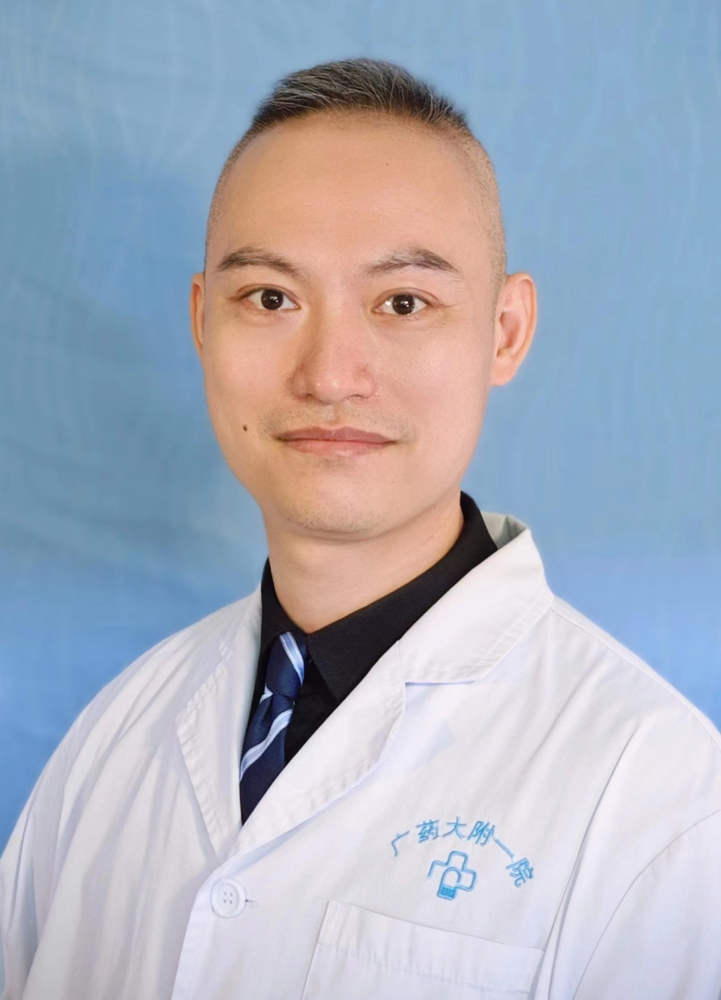

<!-- AUTO-GENERATED-BY: work/generate_obsidian_profiles.py -->

<!-- TEMPLATE: D:\workspace\信息收集整理\医生画像仓库\模板\医生画像模板.md -->

# 李张维

## 基础信息

| 字段 | 内容 |
|---|---|
| 姓名 | 李张维 |
| 医院 | 广东药科大学附属第一医院 |
| 科室 | 口腔科（农林门诊） |
| 职称/身份 | 副主任医师 |
| 来源链接 | [官网原文](https://www.gy120.net/articleshow.asp?articleid=279) |
| 采集日期 | 2026-08-15 |

## 简介/擅长

复杂牙的微创拔除、牙体牙髓疾病、牙周黏膜疾病、口腔种植修复、缺失牙的修复等的诊疗。

## 教育与进修经历

- 个人介绍：1、2004年毕业于四川大学华西口腔医学院（本科）；
- 2、2009年毕业于四川大学华西口腔医学院（硕士研究生）；

## 科研项目与成果

- 主要论著：1、 李张维，等.不同长度的玻璃纤维桩修复对下颌前磨牙抗折强度的影响[J]. 医学研究杂志，2011, 40(8): 111-113. 2、李张维,等.纤维桩修复喇叭口型根管的临床应用[J]. 实用心脑肺血管病杂志, 2012, 20(9): 1529-1530 3、李张维,等.不同桩核系统对薄弱根管修复后牙体抗折性能的影响[J]. 广州医学院学报, 2012, 30(9): 138-140 科研与获奖：1、参与广东省自然科学基金课题：CEREC全瓷冠在种植修复中的应力分析研究. 课题编号: S2013…
- 2、主持院内课题：Merlin抑癌蛋白在舌鳞状细胞癌中的表达及意义. 课题编号: 201210.

## 可包装亮点

- 官网目录标注：科室负责人；
- 社会任职：广东省健康管理学会口腔颌面头颈医学专业委员会常务委员；
- 广东省精准医学应用学会咬合与颞下颌疾病分会常务委员；
- 广东省预防医学会口腔疾病防治专业委员会常务委员；
- 广东省整形美容协会口腔整形美容分会委员

## 重点疾病/人群标签

- 慢性病：
- 肿瘤：癌、复杂
- 生殖疾病：
- 免疫/风湿：
- 术后恢复/康复：
- 疑难重症：癌、复杂

## 证据摘录

> 只摘录官网公开信息中的短句或关键字段，不复制大段原文。

- 官网身份字段：副主任医师
- 官网简介/擅长：复杂牙的微创拔除、牙体牙髓疾病、牙周黏膜疾病、口腔种植修复、缺失牙的修复等的诊疗。
- 官网亮眼经历线索：官网目录标注：科室负责人；社会任职：广东省健康管理学会口腔颌面头颈医学专业委员会常务委员； 广东省精准医学应用学会咬合与颞下颌疾病分会常务委员； 广东省预防医学会口腔疾病防治专业委员会常务委员； 广东省整形美容协会口腔整形美容分会委员
- 来源链接：https://www.gy120.net/articleshow.asp?articleid=279

## BD 画像摘要

李张维医生可作为肿瘤、疑难重症方向的基础画像候选。后续 BD 使用应继续以官网来源和人工复核为准，不添加疗效承诺或无来源包装。

## 合规边界

- 仅使用医院官网、官方公众号、官方小程序等公开渠道。
- 不采集私人电话、私人微信、家庭住址、患者隐私或非公开排班信息。
- 不写“保证治愈”“疗效第一”“包治疑难杂症”等无法由官网证明的表述。
