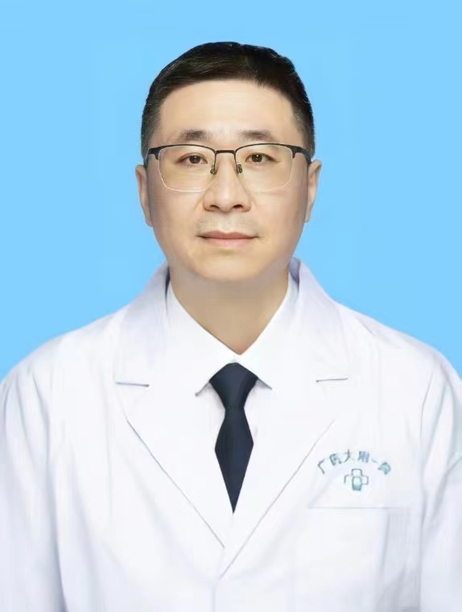

<!-- AUTO-GENERATED-BY: work/generate_obsidian_profiles.py -->

<!-- TEMPLATE: D:\workspace\信息收集整理\医生画像仓库\模板\医生画像模板.md -->

# 李晓初

## 基础信息

| 字段 | 内容 |
|---|---|
| 姓名 | 李晓初 |
| 医院 | 广东药科大学附属第一医院 |
| 科室 | 创伤与关节外科（骨一科）（健康管理中心） |
| 职称/身份 | 副教授、副主任医师 |
| 来源链接 | [官网原文](https://www.gy120.net/articleshow.asp?articleid=515) |
| 采集日期 | 2026-08-15 |

## 简介/擅长

各种创伤的保守和手术治疗，以及陈旧性骨折和创伤后畸形的手术矫正，对肩肘关节的各种复杂骨折脱位，肘关节僵硬及风湿类疾病的手术治疗有深入的研究。擅长中医中药治疗颈腰腿疼痛、关节疼痛。擅长髋、膝关节置换手术，特别是在肩肘关节置换方面处于国内领先水平。

## 可包装亮点

- 官网目录标注：科室负责人

## 重点疾病/人群标签

- 慢性病：
- 肿瘤：
- 生殖疾病：
- 免疫/风湿：风湿、疼痛、复杂
- 术后恢复/康复：风湿、疼痛、复杂
- 疑难重症：风湿、疼痛、复杂

## 证据摘录

> 只摘录官网公开信息中的短句或关键字段，不复制大段原文。

- 官网身份字段：副教授、副主任医师
- 官网简介/擅长：各种创伤的保守和手术治疗，以及陈旧性骨折和创伤后畸形的手术矫正，对肩肘关节的各种复杂骨折脱位，肘关节僵硬及风湿类疾病的手术治疗有深入的研究。擅长中医中药治疗颈腰腿疼痛、关节疼痛。擅长髋、膝关节置换手术，特别是在肩肘关节置换方面处于国内领先水平。
- 官网亮眼经历线索：官网目录标注：科室负责人
- 来源链接：https://www.gy120.net/articleshow.asp?articleid=515

## BD 画像摘要

李晓初医生可作为免疫/风湿/感染、术后恢复/康复、疑难重症方向的基础画像候选。后续 BD 使用应继续以官网来源和人工复核为准，不添加疗效承诺或无来源包装。

## 合规边界

- 仅使用医院官网、官方公众号、官方小程序等公开渠道。
- 不采集私人电话、私人微信、家庭住址、患者隐私或非公开排班信息。
- 不写“保证治愈”“疗效第一”“包治疑难杂症”等无法由官网证明的表述。
