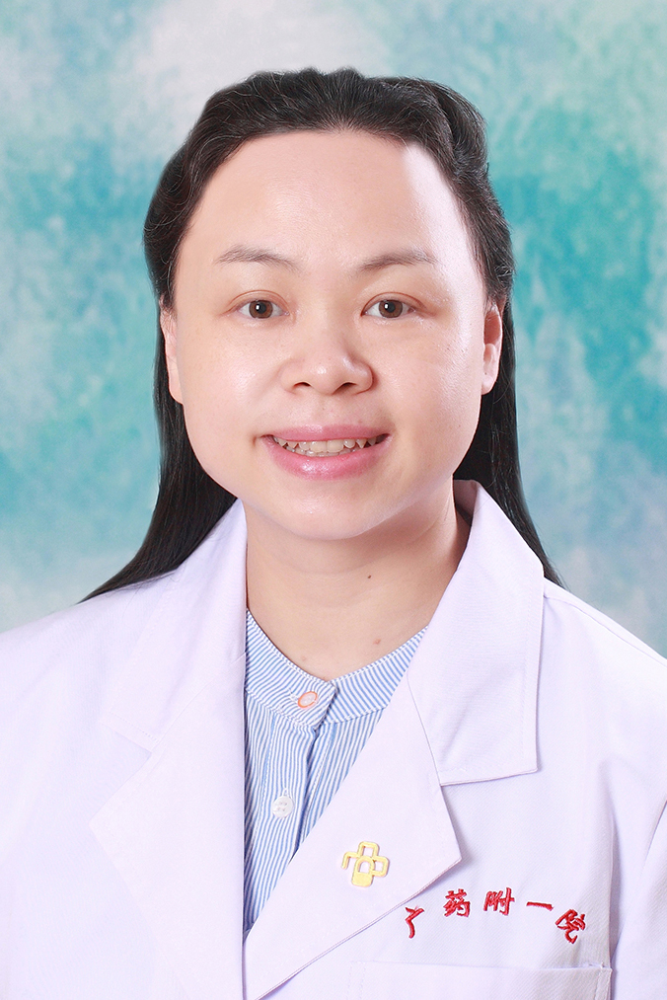

<!-- AUTO-GENERATED-BY: work/generate_obsidian_profiles.py -->

<!-- TEMPLATE: D:\workspace\信息收集整理\医生画像仓库\模板\医生画像模板.md -->

# 李烨

## 基础信息

| 字段 | 内容 |
|---|---|
| 姓名 | 李烨 |
| 医院 | 广东药科大学附属第一医院 |
| 科室 | 肠道门诊（农林）（健康管理中心） |
| 职称/身份 | 副主任医师 |
| 来源链接 | [官网原文](https://www.gy120.net/articleshow.asp?articleid=325) |
| 采集日期 | 2026-08-15 |

## 简介/擅长

擅长于病毒性肝炎、肝硬化、登革热、伤寒和副伤寒、肺结核、流行性出血热、恙虫病、麻疹及不明原因发热等疾病的诊治

## 可包装亮点

- 个人介绍：1995年9月-2000年6月 中南大学临床医学全日制本科学士 2007年9月-2010年6月 广州医学院临床医学同等学历硕士研究生 2000年7月-2004年12 月 广州铁路中心医院 内科 住院医师 2004年12月-2006年6月 广东药学院附属第一医院 内科 住院医师 2006年6月-2007年10月 广东药学院附属第一医院 感染科 住院…

## 重点疾病/人群标签

- 慢性病：
- 肿瘤：
- 生殖疾病：
- 免疫/风湿：感染
- 术后恢复/康复：
- 疑难重症：

## 证据摘录

> 只摘录官网公开信息中的短句或关键字段，不复制大段原文。

- 官网身份字段：副主任医师
- 官网简介/擅长：擅长于病毒性肝炎、肝硬化、登革热、伤寒和副伤寒、肺结核、流行性出血热、恙虫病、麻疹及不明原因发热等疾病的诊治
- 官网亮眼经历线索：个人介绍：1995年9月-2000年6月 中南大学临床医学全日制本科学士 2007年9月-2010年6月 广州医学院临床医学同等学历硕士研究生 2000年7月-2004年12 月 广州铁路中心医院 内科 住院医师 2004年12月-2006年6月 广东药学院附属第一医院 内科 住院医师 2006年6月-2007年10月 广东药学院附属第一医院 感染科 住院医师 2007年10月 -2013年12月 广东药学院附属第一医院 感染科 主治…
- 来源链接：https://www.gy120.net/articleshow.asp?articleid=325

## BD 画像摘要

李烨医生可作为免疫/风湿/感染方向的基础画像候选。后续 BD 使用应继续以官网来源和人工复核为准，不添加疗效承诺或无来源包装。

## 合规边界

- 仅使用医院官网、官方公众号、官方小程序等公开渠道。
- 不采集私人电话、私人微信、家庭住址、患者隐私或非公开排班信息。
- 不写“保证治愈”“疗效第一”“包治疑难杂症”等无法由官网证明的表述。
