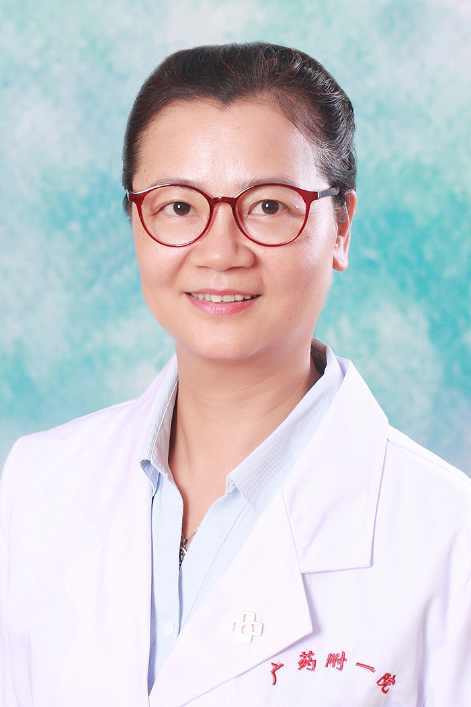

<!-- AUTO-GENERATED-BY: work/generate_obsidian_profiles.py -->

<!-- TEMPLATE: D:\workspace\信息收集整理\医生画像仓库\模板\医生画像模板.md -->

# 李玉齐

## 基础信息

| 字段 | 内容 |
|---|---|
| 姓名 | 李玉齐 |
| 医院 | 广东药科大学附属第一医院 |
| 科室 | 肿瘤一科（农林门诊） |
| 职称/身份 | 副教授、副主任医师 |
| 来源链接 | [官网原文](https://www.gy120.net/articleshow.asp?articleid=256) |
| 采集日期 | 2026-08-15 |

## 简介/擅长

擅长鼻咽癌、胃肠道肿瘤、乳腺癌等恶性肿瘤的化学治疗与靶向、放疗、介入、中医药等的综合治疗；恶性肿瘤的姑息治疗、止痛治疗等。

## 教育与进修经历

- 个人介绍：1992年7月毕业于南京铁道医学院（现东南大学医学院）临床医学专业，获医学学士学位，同年分配到广州铁路中心医院（现广东药学院附属第一医院）任医师。
- 2005年在复旦大学附属肿瘤医院内科进修半年。

## 科研项目与成果

- 2012年晋升为肿瘤内科副主任医师 社会任职：广东省医学会医学伦理学常委 广东省肿瘤靶向干预与防控学会代谢与肿瘤防治专委会常委 科研与获奖：主持及参与省、厅级课题多项，发表多篇文章。
- 作为第二负责人参与广东省卫生厅2010年立项课题：《NMR代谢指纹谱在乳腺癌个体化治疗研究中的应用》。

## 论文与学术产出

- 2012年晋升为肿瘤内科副主任医师 社会任职：广东省医学会医学伦理学常委 广东省肿瘤靶向干预与防控学会代谢与肿瘤防治专委会常委 科研与获奖：主持及参与省、厅级课题多项，发表多篇文章。

## 可包装亮点

- 2005年在复旦大学附属肿瘤医院内科进修半年。
- 2012年晋升为肿瘤内科副主任医师 社会任职：广东省医学会医学伦理学常委 广东省肿瘤靶向干预与防控学会代谢与肿瘤防治专委会常委 科研与获奖：主持及参与省、厅级课题多项，发表多篇文章。

## 重点疾病/人群标签

- 慢性病：代谢、肿瘤、放疗、靶向、鼻咽癌、乳腺癌、姑息
- 肿瘤：代谢、肿瘤、放疗、靶向、鼻咽癌、乳腺癌、姑息
- 生殖疾病：
- 免疫/风湿：
- 术后恢复/康复：代谢、肿瘤、放疗、靶向、鼻咽癌、乳腺癌、姑息
- 疑难重症：

## 证据摘录

> 只摘录官网公开信息中的短句或关键字段，不复制大段原文。

- 官网身份字段：副教授、副主任医师
- 官网简介/擅长：擅长鼻咽癌、胃肠道肿瘤、乳腺癌等恶性肿瘤的化学治疗与靶向、放疗、介入、中医药等的综合治疗；恶性肿瘤的姑息治疗、止痛治疗等。
- 官网亮眼经历线索：2005年在复旦大学附属肿瘤医院内科进修半年。 2012年晋升为肿瘤内科副主任医师 社会任职：广东省医学会医学伦理学常委 广东省肿瘤靶向干预与防控学会代谢与肿瘤防治专委会常委 科研与获奖：主持及参与省、厅级课题多项，发表多篇文章。
- 来源链接：https://www.gy120.net/articleshow.asp?articleid=256

## BD 画像摘要

李玉齐医生可作为慢性病、肿瘤、术后恢复/康复方向的基础画像候选。后续 BD 使用应继续以官网来源和人工复核为准，不添加疗效承诺或无来源包装。

## 合规边界

- 仅使用医院官网、官方公众号、官方小程序等公开渠道。
- 不采集私人电话、私人微信、家庭住址、患者隐私或非公开排班信息。
- 不写“保证治愈”“疗效第一”“包治疑难杂症”等无法由官网证明的表述。
