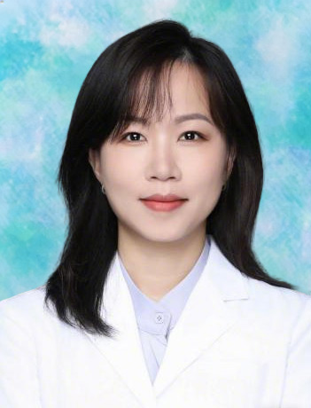

<!-- AUTO-GENERATED-BY: work/generate_obsidian_profiles.py -->

<!-- TEMPLATE: D:\workspace\信息收集整理\医生画像仓库\模板\医生画像模板.md -->

# 李瑞莹

## 基础信息

| 字段 | 内容 |
|---|---|
| 姓名 | 李瑞莹 |
| 医院 | 广东药科大学附属第一医院 |
| 科室 | 检验科 |
| 职称/身份 | 副主任技师、副教授 |
| 来源链接 | [官网原文](https://www.gy120.net/articleshow.asp?articleid=537) |
| 采集日期 | 2026-08-15 |

## 简介/擅长

在微生物实验室工作十余年，擅长临床感染常见病原菌及少见菌的鉴定，以及感染性疾病的实验室诊断

## 教育与进修经历

- 个人介绍：毕业于广东医科大学医学检验专业 ， 2003年8月开始参加工作，就职于广东药科大学附属第一医院检验科，主要从事临床检验科相关工作，并于2016年取得医学检验技术副主任技师职称，同时兼任广东药科大学医学检验专业的微生物检验技术教学工作。

## 科研项目与成果

- 社会任职：广东省健康管理学会检验医学创新与转化专业委员会委员 科研与获奖：至今在国内外正式期刊发表学术论文6篇，获得国家实用型专利2项，参与科研项目3项，指导学生参加全国青年科普创新实验作品大赛获得三等奖，指导学生参加第五届广东省医学检验实习生临床案例竞赛获得三等奖。

## 论文与学术产出

- 社会任职：广东省健康管理学会检验医学创新与转化专业委员会委员 科研与获奖：至今在国内外正式期刊发表学术论文6篇，获得国家实用型专利2项，参与科研项目3项，指导学生参加全国青年科普创新实验作品大赛获得三等奖，指导学生参加第五届广东省医学检验实习生临床案例竞赛获得三等奖。

## 可包装亮点

- 社会任职：广东省健康管理学会检验医学创新与转化专业委员会委员 科研与获奖：至今在国内外正式期刊发表学术论文6篇，获得国家实用型专利2项，参与科研项目3项，指导学生参加全国青年科普创新实验作品大赛获得三等奖，指导学生参加第五届广东省医学检验实习生临床案例竞赛获得三等奖。

## 重点疾病/人群标签

- 慢性病：
- 肿瘤：
- 生殖疾病：
- 免疫/风湿：感染
- 术后恢复/康复：
- 疑难重症：

## 证据摘录

> 只摘录官网公开信息中的短句或关键字段，不复制大段原文。

- 官网身份字段：副主任技师、副教授
- 官网简介/擅长：在微生物实验室工作十余年，擅长临床感染常见病原菌及少见菌的鉴定，以及感染性疾病的实验室诊断
- 官网亮眼经历线索：社会任职：广东省健康管理学会检验医学创新与转化专业委员会委员 科研与获奖：至今在国内外正式期刊发表学术论文6篇，获得国家实用型专利2项，参与科研项目3项，指导学生参加全国青年科普创新实验作品大赛获得三等奖，指导学生参加第五届广东省医学检验实习生临床案例竞赛获得三等奖。
- 来源链接：https://www.gy120.net/articleshow.asp?articleid=537

## BD 画像摘要

李瑞莹医生可作为免疫/风湿/感染方向的基础画像候选。后续 BD 使用应继续以官网来源和人工复核为准，不添加疗效承诺或无来源包装。

## 合规边界

- 仅使用医院官网、官方公众号、官方小程序等公开渠道。
- 不采集私人电话、私人微信、家庭住址、患者隐私或非公开排班信息。
- 不写“保证治愈”“疗效第一”“包治疑难杂症”等无法由官网证明的表述。
