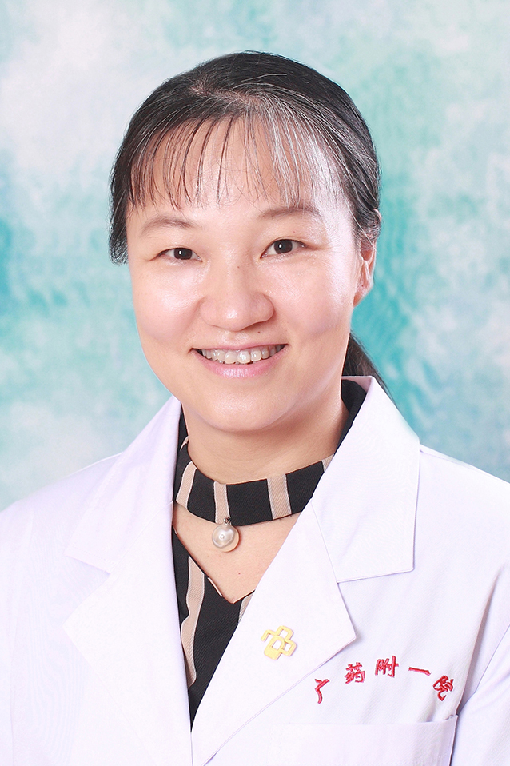

<!-- AUTO-GENERATED-BY: work/generate_obsidian_profiles.py -->

<!-- TEMPLATE: D:\workspace\信息收集整理\医生画像仓库\模板\医生画像模板.md -->

# 李筠

## 基础信息

| 字段 | 内容 |
|---|---|
| 姓名 | 李筠 |
| 医院 | 广东药科大学附属第一医院 |
| 科室 | 妇产科（农林门诊） |
| 职称/身份 | 副教授、副主任医师 |
| 来源链接 | [官网原文](https://www.gy120.net/articleshow.asp?articleid=336) |
| 采集日期 | 2026-08-15 |

## 简介/擅长

熟悉妇产科的各种常见病、多发病的诊治，在异常子宫出血及围产医学领域，尤其是在高危妊娠、母胎监护、多胎妊娠、妊娠期糖尿病、妊娠期高血压疾病、疤痕子宫再次妊娠、妊娠合并内外科疾病方面具有深入的研究和丰富的临床经验，擅长各种产科急重症疾病的抢救及诊治。擅长高危妊娠诊治，擅长治疗异常子宫出血、不孕症，疤痕子宫再次妊娠经阴道分娩，擅长于宫腔镜下手术及产科各种手术。

## 教育与进修经历

- 个人介绍：毕业于东南大学医学院（原南京铁道医学院）医疗系毕业，一直从事妇产科临床一线工作，具有丰富的妇产科临床经验，特别擅长各类围产期疾病、高危妊娠、产科危重症救治及宫腔镜手术。

## 科研项目与成果

- 社会任职：广东省医学会围产医学分会委员 广东省医师协会围产医学会委员 广东省医学会妇幼保健学分会委员 广东省药学会妇产药学专家组成员 广东省基层医药学会围产医学分会委员 科研与获奖：省级科研及市及科研各1项

## 可包装亮点

- 个人介绍：毕业于东南大学医学院（原南京铁道医学院）医疗系毕业，一直从事妇产科临床一线工作，具有丰富的妇产科临床经验，特别擅长各类围产期疾病、高危妊娠、产科危重症救治及宫腔镜手术。
- 社会任职：广东省医学会围产医学分会委员 广东省医师协会围产医学会委员 广东省医学会妇幼保健学分会委员 广东省药学会妇产药学专家组成员 广东省基层医药学会围产医学分会委员 科研与获奖：省级科研及市及科研各1项

## 重点疾病/人群标签

- 慢性病：高血压、糖尿病、不孕、危重、重症、高危
- 肿瘤：
- 生殖疾病：高血压、糖尿病、不孕、危重、重症、高危
- 免疫/风湿：
- 术后恢复/康复：
- 疑难重症：高血压、糖尿病、不孕、危重、重症、高危

## 证据摘录

> 只摘录官网公开信息中的短句或关键字段，不复制大段原文。

- 官网身份字段：副教授、副主任医师
- 官网简介/擅长：熟悉妇产科的各种常见病、多发病的诊治，在异常子宫出血及围产医学领域，尤其是在高危妊娠、母胎监护、多胎妊娠、妊娠期糖尿病、妊娠期高血压疾病、疤痕子宫再次妊娠、妊娠合并内外科疾病方面具有深入的研究和丰富的临床经验，擅长各种产科急重症疾病的抢救及诊治。擅长高危妊娠诊治，擅长治疗异常子宫出血、不孕症，疤痕子宫再次妊娠经阴道分娩，擅长于宫腔镜下手术及产科各种手术。
- 官网亮眼经历线索：个人介绍：毕业于东南大学医学院（原南京铁道医学院）医疗系毕业，一直从事妇产科临床一线工作，具有丰富的妇产科临床经验，特别擅长各类围产期疾病、高危妊娠、产科危重症救治及宫腔镜手术。 社会任职：广东省医学会围产医学分会委员 广东省医师协会围产医学会委员 广东省医学会妇幼保健学分会委员 广东省药学会妇产药学专家组成员 广东省基层医药学会围产医学分会委员 科研与获奖：省级科研及市及科研各1项
- 来源链接：https://www.gy120.net/articleshow.asp?articleid=336

## BD 画像摘要

李筠医生可作为慢性病、生殖疾病、疑难重症方向的基础画像候选。后续 BD 使用应继续以官网来源和人工复核为准，不添加疗效承诺或无来源包装。

## 合规边界

- 仅使用医院官网、官方公众号、官方小程序等公开渠道。
- 不采集私人电话、私人微信、家庭住址、患者隐私或非公开排班信息。
- 不写“保证治愈”“疗效第一”“包治疑难杂症”等无法由官网证明的表述。
