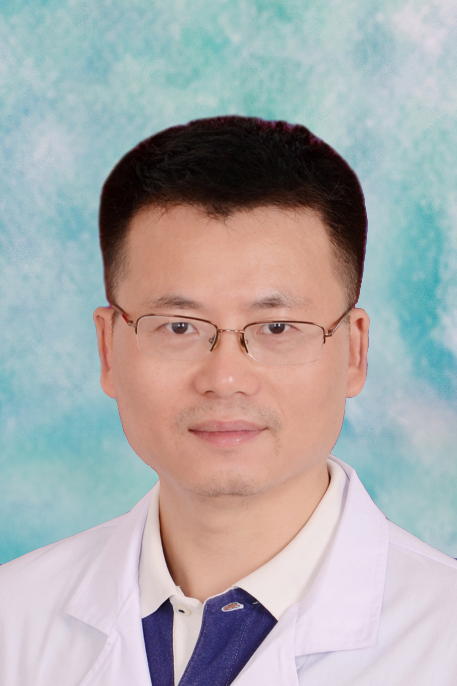

<!-- AUTO-GENERATED-BY: work/generate_obsidian_profiles.py -->

<!-- TEMPLATE: D:\workspace\信息收集整理\医生画像仓库\模板\医生画像模板.md -->

# 李雄

## 基础信息

| 字段 | 内容 |
|---|---|
| 姓名 | 李雄 |
| 医院 | 广东药科大学附属第一医院 |
| 科室 | 中西医结合代谢病科（农林门诊） |
| 职称/身份 | 原中南大学湘雅医院特聘教授，博士生导师，主任医师 |
| 来源链接 | [官网原文](https://www.gy120.net/articleshow.asp?articleid=465) |
| 采集日期 | 2026-08-15 |

## 简介/擅长

代谢性骨病（骨质疏松、骨坏死等）、骨关节炎、骨质增生、椎间盘突出症、颈椎病、肩周炎和癌症的中西医结合诊疗

## 科研项目与成果

- 广东省药理学会理事 科研与获奖：在国际期刊发表高水平SCI论文50多篇，主编全国高等教育规划教材《临床药物治疗学》等专著3部，获国家发明专利3项。

## 论文与学术产出

- 广东省药理学会理事 科研与获奖：在国际期刊发表高水平SCI论文50多篇，主编全国高等教育规划教材《临床药物治疗学》等专著3部，获国家发明专利3项。

## 可包装亮点

- 社会任职：广东省药理学会治疗药物监测研究专业委员会副主任委员；
- 中国医学细胞生物学学会常务委员；
- 中国精准医学学会常务委员；
- 中国病理生理学会肿瘤专业委员会常务委员

## 重点疾病/人群标签

- 慢性病：代谢、肿瘤、癌
- 肿瘤：代谢、肿瘤、癌
- 生殖疾病：
- 免疫/风湿：
- 术后恢复/康复：
- 疑难重症：

## 证据摘录

> 只摘录官网公开信息中的短句或关键字段，不复制大段原文。

- 官网身份字段：原中南大学湘雅医院特聘教授，博士生导师，主任医师
- 官网简介/擅长：代谢性骨病（骨质疏松、骨坏死等）、骨关节炎、骨质增生、椎间盘突出症、颈椎病、肩周炎和癌症的中西医结合诊疗
- 官网亮眼经历线索：社会任职：广东省药理学会治疗药物监测研究专业委员会副主任委员； 中国医学细胞生物学学会常务委员； 中国精准医学学会常务委员； 中国病理生理学会肿瘤专业委员会常务委员
- 来源链接：https://www.gy120.net/articleshow.asp?articleid=465

## BD 画像摘要

李雄医生可作为慢性病、肿瘤方向的基础画像候选。后续 BD 使用应继续以官网来源和人工复核为准，不添加疗效承诺或无来源包装。

## 合规边界

- 仅使用医院官网、官方公众号、官方小程序等公开渠道。
- 不采集私人电话、私人微信、家庭住址、患者隐私或非公开排班信息。
- 不写“保证治愈”“疗效第一”“包治疑难杂症”等无法由官网证明的表述。
