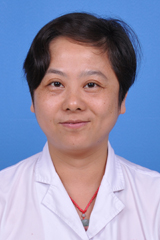

<!-- AUTO-GENERATED-BY: work/generate_obsidian_profiles.py -->

<!-- TEMPLATE: D:\workspace\信息收集整理\医生画像仓库\模板\医生画像模板.md -->

# 李青

## 基础信息

| 字段 | 内容 |
|---|---|
| 姓名 | 李青 |
| 医院 | 广东药科大学附属第一医院 |
| 科室 | 眼科（健康管理中心） |
| 职称/身份 | 主治医师 |
| 来源链接 | [官网原文](https://www.gy120.net/articleshow.asp?articleid=216) |
| 采集日期 | 2026-08-15 |

## 简介/擅长

擅长于老年性白内障、屈光不正、角膜病、眼底病等眼科常见病的检查和治疗

## 教育与进修经历

- 个人介绍：1987年7月至1992年6月：毕业于南京东南大学医学院 1992年7月至今：在广东药学院附属第一医院眼科工作 科研与获奖：2008年 评为院级“服务之星”. 1. 真空小梁成形术治疗原发性开角型青光眼的临床研究 广东省医学科研基金 2. 各期糖尿病视网膜病变患者房水和血清PEDF表达与眼电生理改变的相关分析 广东省科技厅基金资助

## 科研项目与成果

- 个人介绍：1987年7月至1992年6月：毕业于南京东南大学医学院 1992年7月至今：在广东药学院附属第一医院眼科工作 科研与获奖：2008年 评为院级“服务之星”. 1. 真空小梁成形术治疗原发性开角型青光眼的临床研究 广东省医学科研基金 2. 各期糖尿病视网膜病变患者房水和血清PEDF表达与眼电生理改变的相关分析 广东省科技厅基金资助

## 可包装亮点

- 个人介绍：1987年7月至1992年6月：毕业于南京东南大学医学院 1992年7月至今：在广东药学院附属第一医院眼科工作 科研与获奖：2008年 评为院级“服务之星”. 1. 真空小梁成形术治疗原发性开角型青光眼的临床研究 广东省医学科研基金 2. 各期糖尿病视网膜病变患者房水和血清PEDF表达与眼电生理改变的相关分析 广东省科技厅基金资助

## 重点疾病/人群标签

- 慢性病：糖尿病
- 肿瘤：
- 生殖疾病：
- 免疫/风湿：
- 术后恢复/康复：
- 疑难重症：

## 证据摘录

> 只摘录官网公开信息中的短句或关键字段，不复制大段原文。

- 官网身份字段：主治医师
- 官网简介/擅长：擅长于老年性白内障、屈光不正、角膜病、眼底病等眼科常见病的检查和治疗
- 官网亮眼经历线索：个人介绍：1987年7月至1992年6月：毕业于南京东南大学医学院 1992年7月至今：在广东药学院附属第一医院眼科工作 科研与获奖：2008年 评为院级“服务之星”. 1. 真空小梁成形术治疗原发性开角型青光眼的临床研究 广东省医学科研基金 2. 各期糖尿病视网膜病变患者房水和血清PEDF表达与眼电生理改变的相关分析 广东省科技厅基金资助
- 来源链接：https://www.gy120.net/articleshow.asp?articleid=216

## BD 画像摘要

李青医生可作为慢性病方向的基础画像候选。后续 BD 使用应继续以官网来源和人工复核为准，不添加疗效承诺或无来源包装。

## 合规边界

- 仅使用医院官网、官方公众号、官方小程序等公开渠道。
- 不采集私人电话、私人微信、家庭住址、患者隐私或非公开排班信息。
- 不写“保证治愈”“疗效第一”“包治疑难杂症”等无法由官网证明的表述。
