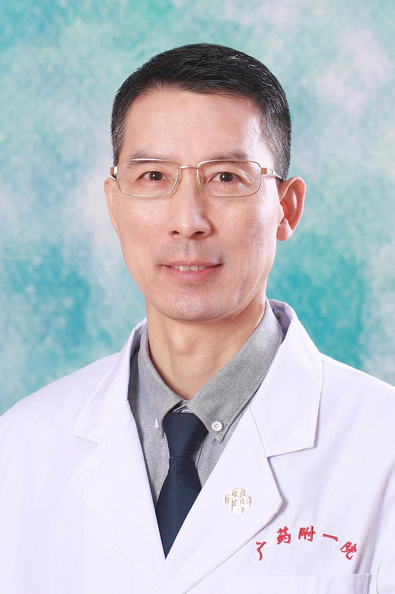

<!-- AUTO-GENERATED-BY: work/generate_obsidian_profiles.py -->

<!-- TEMPLATE: D:\workspace\信息收集整理\医生画像仓库\模板\医生画像模板.md -->

# 杨宁

## 基础信息

| 字段 | 内容 |
|---|---|
| 姓名 | 杨宁 |
| 医院 | 广东药科大学附属第一医院 |
| 科室 | 病理科（农林门诊） |
| 职称/身份 | 副教授、副主任医师 |
| 来源链接 | [官网原文](https://www.gy120.net/articleshow.asp?articleid=190) |
| 采集日期 | 2026-08-15 |

## 简介/擅长

20余年从事临床病理诊断工作，有丰富的病理诊断实践经验。

## 教育与进修经历

- 个人介绍：1986年毕业于湖南医科大学医疗系，分配至郑州铁路局中心医院病理科从事临床病理诊断，2003年调入广东药学院附属第一医院病理科从事临床病理诊断工作至今。

## 可包装亮点

- 20余年从事临床病理诊断工作，有丰富的病理诊断实践经验，曾在北京医科大学病理研修班学习临床病理诊断。
- 社会任职：中华医学会广州市病理学分会委员 中国医师协会病理科医师分会委员 广东省抗癌协会分子诊断专业委员会委员

## 重点疾病/人群标签

- 慢性病：
- 肿瘤：癌
- 生殖疾病：
- 免疫/风湿：
- 术后恢复/康复：
- 疑难重症：

## 证据摘录

> 只摘录官网公开信息中的短句或关键字段，不复制大段原文。

- 官网身份字段：副教授、副主任医师
- 官网简介/擅长：20余年从事临床病理诊断工作，有丰富的病理诊断实践经验。
- 官网亮眼经历线索：20余年从事临床病理诊断工作，有丰富的病理诊断实践经验，曾在北京医科大学病理研修班学习临床病理诊断。 社会任职：中华医学会广州市病理学分会委员 中国医师协会病理科医师分会委员 广东省抗癌协会分子诊断专业委员会委员
- 来源链接：https://www.gy120.net/articleshow.asp?articleid=190

## BD 画像摘要

杨宁医生可作为肿瘤方向的基础画像候选。后续 BD 使用应继续以官网来源和人工复核为准，不添加疗效承诺或无来源包装。

## 合规边界

- 仅使用医院官网、官方公众号、官方小程序等公开渠道。
- 不采集私人电话、私人微信、家庭住址、患者隐私或非公开排班信息。
- 不写“保证治愈”“疗效第一”“包治疑难杂症”等无法由官网证明的表述。
