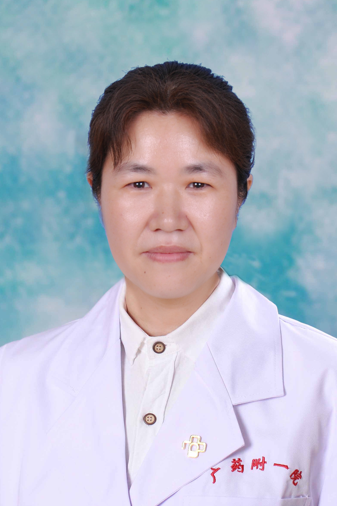

<!-- AUTO-GENERATED-BY: work/generate_obsidian_profiles.py -->

<!-- TEMPLATE: D:\workspace\信息收集整理\医生画像仓库\模板\医生画像模板.md -->

# 杨小蓉

## 基础信息

| 字段 | 内容 |
|---|---|
| 姓名 | 杨小蓉 |
| 医院 | 广东药科大学附属第一医院 |
| 科室 | 检验科 |
| 职称/身份 | 主任技师、副教授、硕士生导师 |
| 来源链接 | [官网原文](https://www.gy120.net/articleshow.asp?articleid=351) |
| 采集日期 | 2026-08-15 |

## 简介/擅长

研究方向：分子诊断方向 临床免疫检验、分子诊断以及检验报告解读

## 教育与进修经历

- 个人介绍：1998年毕业于重庆医科大学、2009年毕业于广东药学院（硕士研究生），从医10多年，有丰富的临床检验经验，在临床免疫检验、分子诊断等专业方向有较深的造诣。

## 科研项目与成果

- 个人先后获得第二届 “泽众杯”全国医学检验技术专业教师虚拟仿真实验教学项目设计大赛，创意方案组二等奖，带领的团队同时获得2个二等奖，3个三等奖，2个优秀奖；

## 可包装亮点

- 官网目录标注：科室负责人；
- 社会任职：广东省胸部疾病学会医学检验专业委员会副主任委员、 广东省保健协会检验分会第一届副主任委员 广东省精准医学应用学会精准检测分会第一届常务委员 广东省健康管理学会医联体建设专业委员会第一届委员会常务委员 广东省医师协会检验医师分会第二届委员会常务委员 广东省免疫学会临床免疫学检验专业委员会第二届委员会常务委员 广东省转化医学学会分子诊断学专业委员会常…

## 重点疾病/人群标签

- 慢性病：
- 肿瘤：肿瘤、癌、肝癌、免疫
- 生殖疾病：
- 免疫/风湿：肿瘤、癌、肝癌、免疫
- 术后恢复/康复：
- 疑难重症：

## 证据摘录

> 只摘录官网公开信息中的短句或关键字段，不复制大段原文。

- 官网身份字段：主任技师、副教授、硕士生导师
- 官网简介/擅长：研究方向：分子诊断方向 临床免疫检验、分子诊断以及检验报告解读
- 官网亮眼经历线索：官网目录标注：科室负责人；社会任职：广东省胸部疾病学会医学检验专业委员会副主任委员、 广东省保健协会检验分会第一届副主任委员 广东省精准医学应用学会精准检测分会第一届常务委员 广东省健康管理学会医联体建设专业委员会第一届委员会常务委员 广东省医师协会检验医师分会第二届委员会常务委员 广东省免疫学会临床免疫学检验专业委员会第二届委员会常务委员 广东省转化医学学会分子诊断学专业委员会常务委员 广东省卫生经济学会检验经济分会常务委员 白求恩…
- 来源链接：https://www.gy120.net/articleshow.asp?articleid=351

## BD 画像摘要

杨小蓉医生可作为肿瘤、免疫/风湿/感染方向的基础画像候选。后续 BD 使用应继续以官网来源和人工复核为准，不添加疗效承诺或无来源包装。

## 合规边界

- 仅使用医院官网、官方公众号、官方小程序等公开渠道。
- 不采集私人电话、私人微信、家庭住址、患者隐私或非公开排班信息。
- 不写“保证治愈”“疗效第一”“包治疑难杂症”等无法由官网证明的表述。
