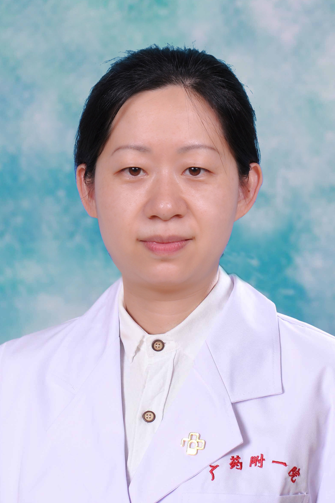

<!-- AUTO-GENERATED-BY: work/generate_obsidian_profiles.py -->

<!-- TEMPLATE: D:\workspace\信息收集整理\医生画像仓库\模板\医生画像模板.md -->

# 杨焰

## 基础信息

| 字段 | 内容 |
|---|---|
| 姓名 | 杨焰 |
| 医院 | 广东药科大学附属第一医院 |
| 科室 | 物检科 |
| 职称/身份 | 副教授、主任医师 |
| 来源链接 | [官网原文](https://www.gy120.net/articleshow.asp?articleid=361) |
| 采集日期 | 2026-08-15 |

## 简介/擅长

从事超声专业工作二十多年，主要是腹部、浅表器官、外周血管及盆底等相关疾病的超声诊断。

## 教育与进修经历

- 个人介绍：1992年同济医科大学毕业至今，一直在本院从事超声诊断工作。

## 可包装亮点

- 社会任职：广东省医学会超声医学分会委员 广东省医师协会超声医师分会委员 广东省泌尿生殖协会女性泌尿学分会委员

## 重点疾病/人群标签

- 慢性病：
- 肿瘤：
- 生殖疾病：生殖
- 免疫/风湿：
- 术后恢复/康复：
- 疑难重症：

## 证据摘录

> 只摘录官网公开信息中的短句或关键字段，不复制大段原文。

- 官网身份字段：副教授、主任医师
- 官网简介/擅长：从事超声专业工作二十多年，主要是腹部、浅表器官、外周血管及盆底等相关疾病的超声诊断。
- 官网亮眼经历线索：社会任职：广东省医学会超声医学分会委员 广东省医师协会超声医师分会委员 广东省泌尿生殖协会女性泌尿学分会委员
- 来源链接：https://www.gy120.net/articleshow.asp?articleid=361

## BD 画像摘要

杨焰医生可作为生殖疾病方向的基础画像候选。后续 BD 使用应继续以官网来源和人工复核为准，不添加疗效承诺或无来源包装。

## 合规边界

- 仅使用医院官网、官方公众号、官方小程序等公开渠道。
- 不采集私人电话、私人微信、家庭住址、患者隐私或非公开排班信息。
- 不写“保证治愈”“疗效第一”“包治疑难杂症”等无法由官网证明的表述。
