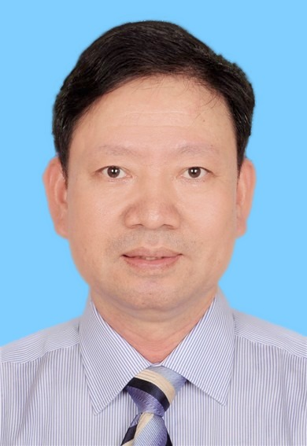

<!-- AUTO-GENERATED-BY: work/generate_obsidian_profiles.py -->

<!-- TEMPLATE: D:\workspace\信息收集整理\医生画像仓库\模板\医生画像模板.md -->

# 林绍强

## 基础信息

| 字段 | 内容 |
|---|---|
| 姓名 | 林绍强 |
| 医院 | 广东药科大学附属第一医院 |
| 科室 | 消化内科（健康管理中心） |
| 职称/身份 | 教授、博士生导师 |
| 来源链接 | [官网原文](https://www.gy120.net/articleshow.asp?articleid=441) |
| 采集日期 | 2026-08-15 |

## 简介/擅长

胃肠肝胆胰疾病、消化系统肿瘤早期诊断和筛查，擅长治疗慢性肝炎、肝硬化、脂肪肝，以及肝癌和其他癌肿的基因诊断和生物免疫细胞治疗。

## 教育与进修经历

- 个人介绍：第一军医大学临床医学本科毕业，暨南大学感染病学硕士毕业，德国洪堡大学肿瘤学博士毕业。
- 曾任暨南大学附属第一医院感染病科主治医师、德国洪堡大学威尔萧附属医院胃肠与肝脏病科进修医师、暨南大学附属第一医院生物治疗中心主任。

## 科研项目与成果

- 社会任职：中华医学会创伤学分会创伤药物与转化应用专委会副主委 广东省医院协会医学科研实验室管理专业委员会副主委 广东省中西医结合学会转化医学专委会常委 广东省医学会细胞治疗专委会委员 中华细胞与干细胞研究杂志编委 中国整合药学联盟理事会副秘书长 科研与获奖：主持国家基金项目2项、重大新药创制1项、973子课题2项、广州市科创委产学研协同创新重大专项1项，973计划专家组成员，参与获得中华医学科技一等奖、教育自然科学二等奖、浙江省自然科学三等奖、浙江省科技进步三等奖各一项。

## 可包装亮点

- 个人介绍：第一军医大学临床医学本科毕业，暨南大学感染病学硕士毕业，德国洪堡大学肿瘤学博士毕业。
- 曾任暨南大学附属第一医院感染病科主治医师、德国洪堡大学威尔萧附属医院胃肠与肝脏病科进修医师、暨南大学附属第一医院生物治疗中心主任。
- 社会任职：中华医学会创伤学分会创伤药物与转化应用专委会副主委 广东省医院协会医学科研实验室管理专业委员会副主委 广东省中西医结合学会转化医学专委会常委 广东省医学会细胞治疗专委会委员 中华细胞与干细胞研究杂志编委 中国整合药学联盟理事会副秘书长 科研与获奖：主持国家基金项目2项、重大新药创制1项、973子课题2项、广州市科创委产学研协同创新重大专项1项，9…

## 重点疾病/人群标签

- 慢性病：慢性、肿瘤、癌、肝癌、免疫、感染
- 肿瘤：慢性、肿瘤、癌、肝癌、免疫、感染
- 生殖疾病：
- 免疫/风湿：慢性、肿瘤、癌、肝癌、免疫、感染
- 术后恢复/康复：
- 疑难重症：

## 证据摘录

> 只摘录官网公开信息中的短句或关键字段，不复制大段原文。

- 官网身份字段：教授、博士生导师
- 官网简介/擅长：胃肠肝胆胰疾病、消化系统肿瘤早期诊断和筛查，擅长治疗慢性肝炎、肝硬化、脂肪肝，以及肝癌和其他癌肿的基因诊断和生物免疫细胞治疗。
- 官网亮眼经历线索：个人介绍：第一军医大学临床医学本科毕业，暨南大学感染病学硕士毕业，德国洪堡大学肿瘤学博士毕业。 曾任暨南大学附属第一医院感染病科主治医师、德国洪堡大学威尔萧附属医院胃肠与肝脏病科进修医师、暨南大学附属第一医院生物治疗中心主任。 社会任职：中华医学会创伤学分会创伤药物与转化应用专委会副主委 广东省医院协会医学科研实验室管理专业委员会副主委 广东省中西医结合学会转化医学专委会常委 广东省医学会细胞治疗专委会委员 中华细胞与干细胞研究杂志编…
- 来源链接：https://www.gy120.net/articleshow.asp?articleid=441

## BD 画像摘要

林绍强医生可作为慢性病、肿瘤、免疫/风湿/感染方向的基础画像候选。后续 BD 使用应继续以官网来源和人工复核为准，不添加疗效承诺或无来源包装。

## 合规边界

- 仅使用医院官网、官方公众号、官方小程序等公开渠道。
- 不采集私人电话、私人微信、家庭住址、患者隐私或非公开排班信息。
- 不写“保证治愈”“疗效第一”“包治疑难杂症”等无法由官网证明的表述。
