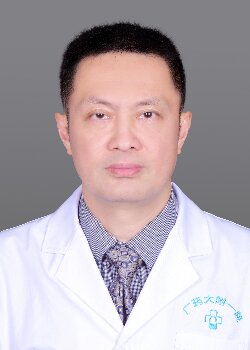

<!-- AUTO-GENERATED-BY: work/generate_obsidian_profiles.py -->

<!-- TEMPLATE: D:\workspace\信息收集整理\医生画像仓库\模板\医生画像模板.md -->

# 梁葳

## 基础信息

| 字段 | 内容 |
|---|---|
| 姓名 | 梁葳 |
| 医院 | 广东药科大学附属第一医院 |
| 科室 | 健康管理部（健康管理中心） |
| 职称/身份 | 副教授、副主任医师 |
| 来源链接 | [官网原文](https://www.gy120.net/articleshow.asp?articleid=232) |
| 采集日期 | 2026-08-15 |

## 简介/擅长

各种心血管疾病及肺、食管、纵膈肿瘤等疾病的治疗。

## 教育与进修经历

- 个人介绍：1994年7月毕业于北京医科大学五年制本科临床医学专业，获医学学士学位， 2004年11月获得心胸外科副主任医师资格。
- 2002年9月至2003年11月在北京安贞医院进修心脏外科。

## 科研项目与成果

- 主要论著：撰写论文“法洛四联症外科治疗34例” “8例心内膜心肌纤维化的诊疗经验” “非小细胞肺癌中MAGE-3蛋白的Western Blot分析” 分别在《中国心血管病研究杂志》、《心肺血管病杂志》、《广东医学院学报》上发表 参与撰写的论文“改良Nicks法治疗小瓣环主动脉瓣疾病” “腔内带膜支架植入治疗DeBakeyIII型主动脉夹层动脉瘤”分别在《中国胸心血管外科杂志》、《广东医学》上发表 科研与获奖：参与成功完成粤西地区首例“同种异体原位心脏移植”，获得茂名市科技进步一等奖；
- 开展的“腔内带膜支架植入治疗DeBakeyIII型主动脉夹层动脉瘤”项目获茂名市科技进步二等奖；
- 参与开展的“改良Nicks法治疗小瓣环主动脉瓣疾病” 项目获得茂名市科技进步三等奖；
- 另参与的科研项目“心脏不停跳下进行二尖瓣置换术”、“乳腺癌普查”获得茂名市科委立项

## 论文与学术产出

- 主要论著：撰写论文“法洛四联症外科治疗34例” “8例心内膜心肌纤维化的诊疗经验” “非小细胞肺癌中MAGE-3蛋白的Western Blot分析” 分别在《中国心血管病研究杂志》、《心肺血管病杂志》、《广东医学院学报》上发表 参与撰写的论文“改良Nicks法治疗小瓣环主动脉瓣疾病” “腔内带膜支架植入治疗DeBakeyIII型主动脉夹层动脉瘤”分别在《中国胸心血管外科杂志》、《广东医学》上发表 科研与获奖：参与成功完成粤西地区首例“同种异体原位心脏移植”，获得茂名市科技进步一等奖；

## 可包装亮点

- 个人介绍：1994年7月毕业于北京医科大学五年制本科临床医学专业，获医学学士学位， 2004年11月获得心胸外科副主任医师资格。
- 2002年9月至2003年11月在北京安贞医院进修心脏外科。
- 主要论著：撰写论文“法洛四联症外科治疗34例” “8例心内膜心肌纤维化的诊疗经验” “非小细胞肺癌中MAGE-3蛋白的Western Blot分析” 分别在《中国心血管病研究杂志》、《心肺血管病杂志》、《广东医学院学报》上发表 参与撰写的论文“改良Nicks法治疗小瓣环主动脉瓣疾病” “腔内带膜支架植入治疗DeBakeyIII型主动脉夹层动脉瘤”分别在《中…
- 开展的“腔内带膜支架植入治疗DeBakeyIII型主动脉夹层动脉瘤”项目获茂名市科技进步二等奖

## 重点疾病/人群标签

- 慢性病：
- 肿瘤：肿瘤、瘤、肺癌、乳腺癌
- 生殖疾病：
- 免疫/风湿：
- 术后恢复/康复：
- 疑难重症：

## 证据摘录

> 只摘录官网公开信息中的短句或关键字段，不复制大段原文。

- 官网身份字段：副教授、副主任医师
- 官网简介/擅长：各种心血管疾病及肺、食管、纵膈肿瘤等疾病的治疗。
- 官网亮眼经历线索：个人介绍：1994年7月毕业于北京医科大学五年制本科临床医学专业，获医学学士学位， 2004年11月获得心胸外科副主任医师资格。 2002年9月至2003年11月在北京安贞医院进修心脏外科。 主要论著：撰写论文“法洛四联症外科治疗34例” “8例心内膜心肌纤维化的诊疗经验” “非小细胞肺癌中MAGE-3蛋白的Western Blot分析” 分别在《中国心血管病研究杂志》、《心肺血管病杂志》、《广东医学院学报》上发表 参与撰写的论文“改…
- 来源链接：https://www.gy120.net/articleshow.asp?articleid=232

## BD 画像摘要

梁葳医生可作为肿瘤方向的基础画像候选。后续 BD 使用应继续以官网来源和人工复核为准，不添加疗效承诺或无来源包装。

## 合规边界

- 仅使用医院官网、官方公众号、官方小程序等公开渠道。
- 不采集私人电话、私人微信、家庭住址、患者隐私或非公开排班信息。
- 不写“保证治愈”“疗效第一”“包治疑难杂症”等无法由官网证明的表述。
