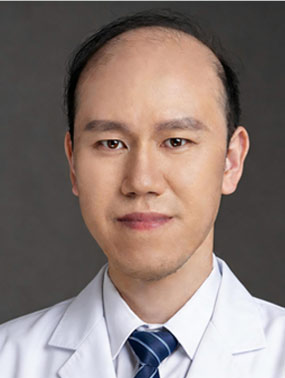

<!-- AUTO-GENERATED-BY: work/generate_obsidian_profiles.py -->

<!-- TEMPLATE: D:\workspace\信息收集整理\医生画像仓库\模板\医生画像模板.md -->

# 武俊男

## 基础信息

| 字段 | 内容 |
|---|---|
| 姓名 | 武俊男 |
| 医院 | 广东药科大学附属第一医院 |
| 科室 | 耳鼻咽喉科 |
| 职称/身份 | 副主任医师 |
| 来源链接 | [官网原文](https://www.gy120.net/articleshow.asp?articleid=534) |
| 采集日期 | 2026-08-15 |

## 简介/擅长

擅长扁桃体、腺样体肥大低温等离子微创手术

## 科研项目与成果

- 申请课题 4 项，获得国家发明专利 3 项，发表核心论文多篇。

## 论文与学术产出

- 申请课题 4 项，获得国家发明专利 3 项，发表核心论文多篇。

## 可包装亮点

- 个人介绍：曾就职于吉林大学附属第一医院耳鼻咽喉-头颈外科，师从国际鼻科学会区域副主席、国内著名鼻科教授中山大学附属第一医院史剑波教授。
- 申请课题 4 项，获得国家发明专利 3 项，发表核心论文多篇。
- 2021 年和 2022 年获得两次广东省鼻内镜外科手术视频大赛“二等奖”，2022 年同时获得全国鼻内镜手术大赛“二等奖”，2024 年 9月参加中华医学会举办“中青年鼻内镜手术视频大赛”全国二等奖。
- 社会任职：就职于南方医科大学深圳眼科医学中心鼻眼相关外科 中国医药教育协会耳鼻喉咽喉头颈外科分会常委 广东省医疗行业协会耳鼻咽喉头颈外科管理分会常委 广东省医师协会耳鼻喉咽喉头颈外科分会委员 广东省医学会耳鼻咽喉头颈外科分会青年委员 广东省医学会耳鼻咽喉头颈外科分会鼻科组委员

## 重点疾病/人群标签

- 慢性病：慢性、肿瘤、难治
- 肿瘤：慢性、肿瘤、难治
- 生殖疾病：
- 免疫/风湿：
- 术后恢复/康复：
- 疑难重症：慢性、肿瘤、难治

## 证据摘录

> 只摘录官网公开信息中的短句或关键字段，不复制大段原文。

- 官网身份字段：副主任医师
- 官网简介/擅长：擅长扁桃体、腺样体肥大低温等离子微创手术
- 官网亮眼经历线索：个人介绍：曾就职于吉林大学附属第一医院耳鼻咽喉-头颈外科，师从国际鼻科学会区域副主席、国内著名鼻科教授中山大学附属第一医院史剑波教授。 申请课题 4 项，获得国家发明专利 3 项，发表核心论文多篇。 2021 年和 2022 年获得两次广东省鼻内镜外科手术视频大赛“二等奖”，2022 年同时获得全国鼻内镜手术大赛“二等奖”，2024 年 9月参加中华医学会举办“中青年鼻内镜手术视频大赛”全国二等奖。 社会任职：就职于南方医科大学深圳眼…
- 来源链接：https://www.gy120.net/articleshow.asp?articleid=534

## BD 画像摘要

武俊男医生可作为慢性病、肿瘤、疑难重症方向的基础画像候选。后续 BD 使用应继续以官网来源和人工复核为准，不添加疗效承诺或无来源包装。

## 合规边界

- 仅使用医院官网、官方公众号、官方小程序等公开渠道。
- 不采集私人电话、私人微信、家庭住址、患者隐私或非公开排班信息。
- 不写“保证治愈”“疗效第一”“包治疑难杂症”等无法由官网证明的表述。
