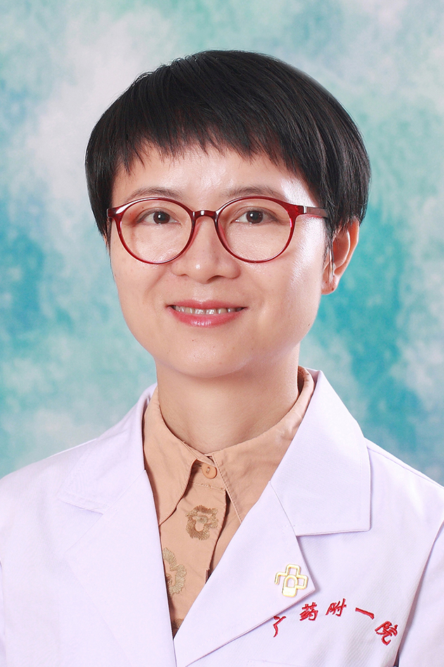

<!-- AUTO-GENERATED-BY: work/generate_obsidian_profiles.py -->

<!-- TEMPLATE: D:\workspace\信息收集整理\医生画像仓库\模板\医生画像模板.md -->

# 洪敏

## 基础信息

| 字段 | 内容 |
|---|---|
| 姓名 | 洪敏 |
| 医院 | 广东药科大学附属第一医院 |
| 科室 | 中医科（健康管理中心） |
| 职称/身份 | 主任中医师、教授 |
| 来源链接 | [官网原文](https://www.gy120.net/articleshow.asp?articleid=177) |
| 采集日期 | 2026-08-15 |

## 简介/擅长

中医药诊治内、妇、儿、皮科等常见病及疑难杂病，尤其擅用经方推崇纯中药施治咳喘、外感发热、胃肠疾病、荨麻疹、湿疹、特应性皮炎、更年期综合征、月经病、多囊卵巢综合症、亚健康等，疗效显著。

## 科研项目与成果

- 个人介绍：从事中医学临床、教学与科研工作 20 余年，主要研究方向为中医药经方防治糖脂代谢病及其并发症。
- 科研与获奖：参与和主持省级、厅局级课题五项， 2018 年评为广东省杰出青年医学人才， 2016 年获“南粤最美中医”称号，是第四批全国优秀中医临床人才、广东省第三批名中医师承指导老师。

## 论文与学术产出

- 社会任职：广东省中医药学会综合医院中医药工作委员会副主委 广东省中西医结合学会综合医院中医药工作委员会副主委 广东省中西医结合学会代谢病专业委员会常委、 广东省中医药学会老年病专业委员会常委、 广东省中医药学会治未病健康促进专业委员会常委、 广东省中医药学会膏方专业委员会常委、 广东省针灸学会脑病专业委员会常委 主要论著：发表学术论文十余篇，科普专著一部。
- 5 、五脏六腑咳论，辽宁中医药大学学报， 2011 年第 13 卷第 7 期， 159-160 6 、中药并耳穴贴压治疗失眠疗效观察，中医临床研究， 2012 年第 4 卷第 11 期， 3-5 7 、科普专著《糖尿病人关心的 300 个问题》中任副主编。

## 可包装亮点

- 官网目录标注：科室负责人；
- 历任广东药科大学附属第一医院（原广州铁路中心医院）住院医师、主治医师、副主任医师、主任医师等， 2011 年起担任中医科主任至今。
- 社会任职：广东省中医药学会综合医院中医药工作委员会副主委 广东省中西医结合学会综合医院中医药工作委员会副主委 广东省中西医结合学会代谢病专业委员会常委、 广东省中医药学会老年病专业委员会常委、 广东省中医药学会治未病健康促进专业委员会常委、 广东省中医药学会膏方专业委员会常委、 广东省针灸学会脑病专业委员会常委 主要论著：发表学术论文十余篇，科普专著一部。
- 科研与获奖：参与和主持省级、厅局级课题五项， 2018 年评为广东省杰出青年医学人才， 2016 年获“南粤最美中医”称号，是第四批全国优秀中医临床人才、广东省第三批名中医师承指导老师。

## 重点疾病/人群标签

- 慢性病：糖尿病、冠心病、代谢、卵巢、多囊、月经、康复、疑难
- 肿瘤：
- 生殖疾病：糖尿病、冠心病、代谢、卵巢、多囊、月经、康复、疑难
- 免疫/风湿：
- 术后恢复/康复：糖尿病、冠心病、代谢、卵巢、多囊、月经、康复、疑难
- 疑难重症：糖尿病、冠心病、代谢、卵巢、多囊、月经、康复、疑难

## 证据摘录

> 只摘录官网公开信息中的短句或关键字段，不复制大段原文。

- 官网身份字段：主任中医师、教授
- 官网简介/擅长：中医药诊治内、妇、儿、皮科等常见病及疑难杂病，尤其擅用经方推崇纯中药施治咳喘、外感发热、胃肠疾病、荨麻疹、湿疹、特应性皮炎、更年期综合征、月经病、多囊卵巢综合症、亚健康等，疗效显著。
- 官网亮眼经历线索：官网目录标注：科室负责人；历任广东药科大学附属第一医院（原广州铁路中心医院）住院医师、主治医师、副主任医师、主任医师等， 2011 年起担任中医科主任至今。 社会任职：广东省中医药学会综合医院中医药工作委员会副主委 广东省中西医结合学会综合医院中医药工作委员会副主委 广东省中西医结合学会代谢病专业委员会常委、 广东省中医药学会老年病专业委员会常委、 广东省中医药学会治未病健康促进专业委员会常委、 广东省中医药学会膏方专业委员会常委…
- 来源链接：https://www.gy120.net/articleshow.asp?articleid=177

## BD 画像摘要

洪敏医生可作为慢性病、生殖疾病、术后恢复/康复、疑难重症方向的基础画像候选。后续 BD 使用应继续以官网来源和人工复核为准，不添加疗效承诺或无来源包装。

## 合规边界

- 仅使用医院官网、官方公众号、官方小程序等公开渠道。
- 不采集私人电话、私人微信、家庭住址、患者隐私或非公开排班信息。
- 不写“保证治愈”“疗效第一”“包治疑难杂症”等无法由官网证明的表述。
