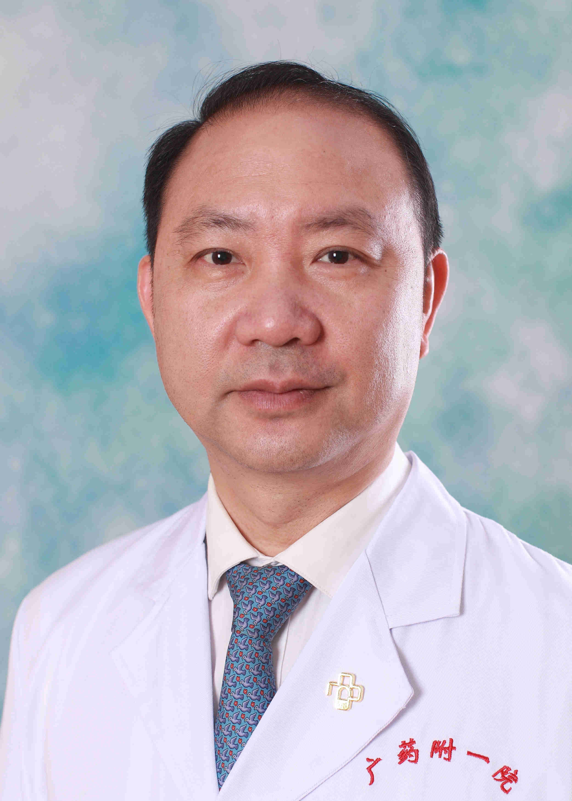

<!-- AUTO-GENERATED-BY: work/generate_obsidian_profiles.py -->

<!-- TEMPLATE: D:\workspace\信息收集整理\医生画像仓库\模板\医生画像模板.md -->

# 潘宣

## 基础信息

| 字段 | 内容 |
|---|---|
| 姓名 | 潘宣 |
| 医院 | 广东药科大学附属第一医院 |
| 科室 | 口腔科（农林门诊） |
| 职称/身份 | 教授、主任医师、硕士生导师 |
| 来源链接 | [官网原文](https://www.gy120.net/articleshow.asp?articleid=45) |
| 采集日期 | 2026-08-15 |

## 简介/擅长

口腔肿瘤诊治及口腔种植术等。

## 教育与进修经历

- 个人介绍：1984年毕业于中山医学院口腔系，在广州铁路中心医院（现广东药学院附属第一医院）口腔科历任医师、主治医师，1997年起任副主任医师、科主任，2005年起任副院长，2006年起任主任医师、教授、硕导；
- 2010年获中山大学医药卫生EMBA学位；
- 参编卫生部“十一五”规划教材及广东省住院医师规范化培训考试大纲各一部。

## 科研项目与成果

- 社会任职：中华口腔医学会全科口腔医学专委会副主委 广东省口腔医学会全科口腔医学专委会主委 广东省社区卫生学会会长 广东省口腔医师协会副会长 广东省卫生经济学会理事会副会长 广东医疗卫生对外交流协会副会长 广东省医院协会常务理事 广东省口腔医学会常务理事 广东省口腔医学会颌面外科专委会常委 广东省药学会第十七届理事会常务理事 中国医院管理杂志理事会常务理事 广东省医院协会口腔医疗管理专业委员会常委 科研与获奖：铁道部火车头奖章获得者、广东省劳动模范。
- 先后主持省级课题3项、厅局级科研课题5项、主持铁道部科技进步推广项目1项、国家级医学继续教育项目1项、广东省医学继续教育项目各2项。

## 论文与学术产出

- 先后有20多篇论文在省部级期刊上发表或在全国或省级学术会议上交流。
- 参编卫生部“十一五”规划教材及广东省住院医师规范化培训考试大纲各一部。

## 可包装亮点

- 官网目录标注：首席专家；
- 个人介绍：1984年毕业于中山医学院口腔系，在广州铁路中心医院（现广东药学院附属第一医院）口腔科历任医师、主治医师，1997年起任副主任医师、科主任，2005年起任副院长，2006年起任主任医师、教授、硕导；
- 社会任职：中华口腔医学会全科口腔医学专委会副主委 广东省口腔医学会全科口腔医学专委会主委 广东省社区卫生学会会长 广东省口腔医师协会副会长 广东省卫生经济学会理事会副会长 广东医疗卫生对外交流协会副会长 广东省医院协会常务理事 广东省口腔医学会常务理事 广东省口腔医学会颌面外科专委会常委 广东省药学会第十七届理事会常务理事 中国医院管理杂志理事会常务理事…
- 先后有20多篇论文在省部级期刊上发表或在全国或省级学术会议上交流。
- 获广东省科技进步二等奖1项，厅局级技术进步奖3项、医院技术进步奖3项，荣获2015年“天晴杯”广东医院...

## 重点疾病/人群标签

- 慢性病：
- 肿瘤：肿瘤
- 生殖疾病：
- 免疫/风湿：
- 术后恢复/康复：
- 疑难重症：

## 证据摘录

> 只摘录官网公开信息中的短句或关键字段，不复制大段原文。

- 官网身份字段：教授、主任医师、硕士生导师
- 官网简介/擅长：口腔肿瘤诊治及口腔种植术等。
- 官网亮眼经历线索：官网目录标注：首席专家；个人介绍：1984年毕业于中山医学院口腔系，在广州铁路中心医院（现广东药学院附属第一医院）口腔科历任医师、主治医师，1997年起任副主任医师、科主任，2005年起任副院长，2006年起任主任医师、教授、硕导； 社会任职：中华口腔医学会全科口腔医学专委会副主委 广东省口腔医学会全科口腔医学专委会主委 广东省社区卫生学会会长 广东省口腔医师协会副会长 广东省卫生经济学会理事会副会长 广东医疗卫生对外交流协会副会长…
- 来源链接：https://www.gy120.net/articleshow.asp?articleid=45

## BD 画像摘要

潘宣医生可作为肿瘤方向的基础画像候选。后续 BD 使用应继续以官网来源和人工复核为准，不添加疗效承诺或无来源包装。

## 合规边界

- 仅使用医院官网、官方公众号、官方小程序等公开渠道。
- 不采集私人电话、私人微信、家庭住址、患者隐私或非公开排班信息。
- 不写“保证治愈”“疗效第一”“包治疑难杂症”等无法由官网证明的表述。
