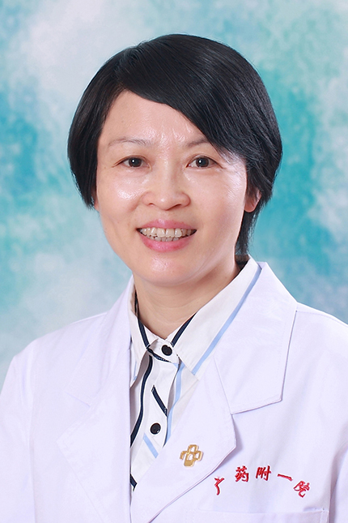

<!-- AUTO-GENERATED-BY: work/generate_obsidian_profiles.py -->

<!-- TEMPLATE: D:\workspace\信息收集整理\医生画像仓库\模板\医生画像模板.md -->

# 潘昊

## 基础信息

| 字段 | 内容 |
|---|---|
| 姓名 | 潘昊 |
| 医院 | 广东药科大学附属第一医院 |
| 科室 | 儿科（健康管理中心） |
| 职称/身份 | 副教授、副主任医师、 |
| 来源链接 | [官网原文](https://www.gy120.net/articleshow.asp?articleid=4) |
| 采集日期 | 2026-08-15 |

## 简介/擅长

尤其擅长婴幼儿的早期教育训练指导、生长发育评估、喂养指导等。还开展婴儿早教训练班，在早教训练室由专人一对一帮助婴儿开发潜能智力。另外在纠正营养不良儿童喂养方式上也有独特的经验。

## 教育与进修经历

- 个人介绍：1989年毕业于南京铁道医学院医疗系 毕业后在儿科临床工作六年后又从事儿童保健工作至今。
- 曾在上海新华医院和我省妇幼保健院参加儿童保健新知识培训班。
- 在广州市妇婴医院进修学习。

## 论文与学术产出

- 主要论著：中华儿童保健杂志发表 《早期教育对儿童气质和适应行为的影响》 《肥胖儿童的气质和个性分析》 《不良习惯幼儿气质和社会生活能力分析》 在微量元素与科学杂志发表 《体弱儿的微量元素测定分析》 《佝偻病儿童的微量元素测定分析》

## 可包装亮点

- 在广州市妇婴医院进修学习。
- 主要论著：中华儿童保健杂志发表 《早期教育对儿童气质和适应行为的影响》 《肥胖儿童的气质和个性分析》 《不良习惯幼儿气质和社会生活能力分析》 在微量元素与科学杂志发表 《体弱儿的微量元素测定分析》 《佝偻病儿童的微量元素测定分析》

## 重点疾病/人群标签

- 慢性病：
- 肿瘤：
- 生殖疾病：
- 免疫/风湿：免疫、营养
- 术后恢复/康复：免疫、营养
- 疑难重症：

## 证据摘录

> 只摘录官网公开信息中的短句或关键字段，不复制大段原文。

- 官网身份字段：副教授、副主任医师、
- 官网简介/擅长：尤其擅长婴幼儿的早期教育训练指导、生长发育评估、喂养指导等。还开展婴儿早教训练班，在早教训练室由专人一对一帮助婴儿开发潜能智力。另外在纠正营养不良儿童喂养方式上也有独特的经验。
- 官网亮眼经历线索：在广州市妇婴医院进修学习。 主要论著：中华儿童保健杂志发表 《早期教育对儿童气质和适应行为的影响》 《肥胖儿童的气质和个性分析》 《不良习惯幼儿气质和社会生活能力分析》 在微量元素与科学杂志发表 《体弱儿的微量元素测定分析》 《佝偻病儿童的微量元素测定分析》
- 来源链接：https://www.gy120.net/articleshow.asp?articleid=4

## BD 画像摘要

潘昊医生可作为免疫/风湿/感染、术后恢复/康复方向的基础画像候选。后续 BD 使用应继续以官网来源和人工复核为准，不添加疗效承诺或无来源包装。

## 合规边界

- 仅使用医院官网、官方公众号、官方小程序等公开渠道。
- 不采集私人电话、私人微信、家庭住址、患者隐私或非公开排班信息。
- 不写“保证治愈”“疗效第一”“包治疑难杂症”等无法由官网证明的表述。
