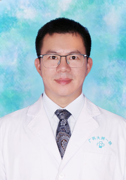

<!-- AUTO-GENERATED-BY: work/generate_obsidian_profiles.py -->

<!-- TEMPLATE: D:\workspace\信息收集整理\医生画像仓库\模板\医生画像模板.md -->

# 王凤雄

## 基础信息

| 字段 | 内容 |
|---|---|
| 姓名 | 王凤雄 |
| 医院 | 广东药科大学附属第一医院 |
| 科室 | 足踝与创面修复科（骨四科） |
| 职称/身份 | 足踝与创面修复科科主任 |
| 来源链接 | [官网原文](https://www.gy120.net/articleshow.asp?articleid=613) |
| 采集日期 | 2026-08-15 |

## 简介/擅长

擅长手显微外科，神经损伤修复，尤其擅长足踝部骨折与脱位，足踝部运动损伤，踇外翻、扁平足、高弓足、马蹄内翻足、锤状趾、爪形趾、先天性足畸形、糖尿病足合并足畸形等足踝部畸形矫正，骨关节感染，在糖尿病足保肢及慢性难治性创面具有很深的造诣。国内首创并唯一自主研发“糖尿病足健康管家”微信小程序的糖尿病足保肢专家。

## 可包装亮点

- 擅长手显微外科，神经损伤修复，尤其擅长足踝部骨折与脱位，足踝部运动损伤，踇外翻、扁平足、高弓足、马蹄内翻足、锤状趾、爪形趾、先天性足畸形、糖尿病足合并足畸形等足踝部畸形矫正，骨关节感染，在糖尿病足保肢及慢性难治性创面具有很深的造诣。
- 国内首创并唯一自主研发“糖尿病足健康管家”微信小程序的糖尿病足保肢专家。

## 重点疾病/人群标签

- 慢性病：糖尿病、慢性、感染、创面、难治
- 肿瘤：
- 生殖疾病：
- 免疫/风湿：糖尿病、慢性、感染、创面、难治
- 术后恢复/康复：糖尿病、慢性、感染、创面、难治
- 疑难重症：糖尿病、慢性、感染、创面、难治

## 证据摘录

> 只摘录官网公开信息中的短句或关键字段，不复制大段原文。

- 官网身份字段：足踝与创面修复科科主任
- 官网简介/擅长：擅长手显微外科，神经损伤修复，尤其擅长足踝部骨折与脱位，足踝部运动损伤，踇外翻、扁平足、高弓足、马蹄内翻足、锤状趾、爪形趾、先天性足畸形、糖尿病足合并足畸形等足踝部畸形矫正，骨关节感染，在糖尿病足保肢及慢性难治性创面具有很深的造诣。国内首创并唯一自主研发“糖尿病足健康管家”微信小程序的糖尿病足保肢专家。
- 来源链接：https://www.gy120.net/articleshow.asp?articleid=613

## BD 画像摘要

王凤雄医生可作为慢性病、免疫/风湿/感染、术后恢复/康复、疑难重症方向的基础画像候选。后续 BD 使用应继续以官网来源和人工复核为准，不添加疗效承诺或无来源包装。

## 合规边界

- 仅使用医院官网、官方公众号、官方小程序等公开渠道。
- 不采集私人电话、私人微信、家庭住址、患者隐私或非公开排班信息。
- 不写“保证治愈”“疗效第一”“包治疑难杂症”等无法由官网证明的表述。
