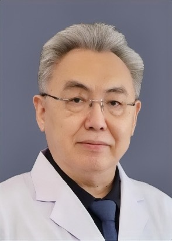

<!-- AUTO-GENERATED-BY: work/generate_obsidian_profiles.py -->

<!-- TEMPLATE: D:\workspace\信息收集整理\医生画像仓库\模板\医生画像模板.md -->

# 王向宇

## 基础信息

| 字段 | 内容 |
|---|---|
| 姓名 | 王向宇 |
| 医院 | 广东药科大学附属第一医院 |
| 科室 | 神经外科（健康管理中心） |
| 职称/身份 | 主任医师 |
| 来源链接 | [官网原文](https://www.gy120.net/articleshow.asp?articleid=530) |
| 采集日期 | 2026-08-15 |

## 简介/擅长

显微手术技术（包含锁孔手术、血管吻合手术、神经吻合手术），借此开展颅底手术、脑干手术、脑室手术；脊髓内外、椎管内外手术，包括寰枕畸形、高颈段占位病变手术。开展内镜辅助下显微神经外科手术。结合血管介入技术开展介入杂交手术或显微手术，治疗中枢神经系统血管病，如动脉瘤、脑动静脉畸形、烟雾病、颈动脉狭窄、硬膜动静脉漏、脑血管搭桥术。熟练开展功能手术治疗：痉挛性斜颈、三叉神经痛、面肌痉挛、舌咽神经痛、顽固性癫痫、肘管综合症、腕管综合征、立体定向手术、迷走神经电刺激术，脊髓电刺激术、健侧颈7神经移位术。尤其对长期昏迷患者的评估和治疗有独特治疗经验。

## 教育与进修经历

- 社会任职：中国神经外科专科医师规范化培训基地主任 国家卫健委能力建设和继续教育中心神经外科进修与培训基地主任 国家住院医师规范化培训（神经外科方向）基地主任

## 可包装亮点

- 官网目录标注：首席专家；
- 社会任职：中国神经外科专科医师规范化培训基地主任 国家卫健委能力建设和继续教育中心神经外科进修与培训基地主任 国家住院医师规范化培训（神经外科方向）基地主任

## 重点疾病/人群标签

- 慢性病：
- 肿瘤：瘤
- 生殖疾病：
- 免疫/风湿：
- 术后恢复/康复：
- 疑难重症：

## 证据摘录

> 只摘录官网公开信息中的短句或关键字段，不复制大段原文。

- 官网身份字段：主任医师
- 官网简介/擅长：显微手术技术（包含锁孔手术、血管吻合手术、神经吻合手术），借此开展颅底手术、脑干手术、脑室手术；脊髓内外、椎管内外手术，包括寰枕畸形、高颈段占位病变手术。开展内镜辅助下显微神经外科手术。结合血管介入技术开展介入杂交手术或显微手术，治疗中枢神经系统血管病，如动脉瘤、脑动静脉畸形、烟雾病、颈动脉狭窄、硬膜动静脉漏、脑血管搭桥术。熟练开展功能手术治疗：痉挛性斜颈、三叉神经痛、面肌痉挛、舌咽神经痛、顽固性癫痫、肘管综合症、腕管综合征、立体定向…
- 官网亮眼经历线索：官网目录标注：首席专家；社会任职：中国神经外科专科医师规范化培训基地主任 国家卫健委能力建设和继续教育中心神经外科进修与培训基地主任 国家住院医师规范化培训（神经外科方向）基地主任
- 来源链接：https://www.gy120.net/articleshow.asp?articleid=530

## BD 画像摘要

王向宇医生可作为肿瘤方向的基础画像候选。后续 BD 使用应继续以官网来源和人工复核为准，不添加疗效承诺或无来源包装。

## 合规边界

- 仅使用医院官网、官方公众号、官方小程序等公开渠道。
- 不采集私人电话、私人微信、家庭住址、患者隐私或非公开排班信息。
- 不写“保证治愈”“疗效第一”“包治疑难杂症”等无法由官网证明的表述。
