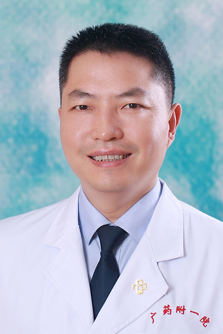

<!-- AUTO-GENERATED-BY: work/generate_obsidian_profiles.py -->

<!-- TEMPLATE: D:\workspace\信息收集整理\医生画像仓库\模板\医生画像模板.md -->

# 王希成

## 基础信息

| 字段 | 内容 |
|---|---|
| 姓名 | 王希成 |
| 医院 | 广东药科大学附属第一医院 |
| 科室 | 肿瘤一科（农林门诊） |
| 职称/身份 | 教授、主任医师、硕士生导师 |
| 来源链接 | [官网原文](https://www.gy120.net/articleshow.asp?articleid=24) |
| 采集日期 | 2026-08-15 |

## 简介/擅长

岭南名医、羊城好医生，擅长鼻咽癌等头颈部肿瘤的综合治疗。

## 科研项目与成果

- 在中华医学杂志、 JCC 、 RSC 、 ONCOTARGET 等高水平专业期刊发表学术论文 30 余篇，其中 SCI 收录 11 篇（最高影响因子 5.018 ），作为副主译出版专业专著一部，获得实用新型专利一项，培养研究生 10 名。
- 科研与获奖：承担国家药监局肿瘤GCP临床试验58项，广州市重点研发计划1项，省科技厅4项，发表SCI论文20篇

## 论文与学术产出

- 在中华医学杂志、 JCC 、 RSC 、 ONCOTARGET 等高水平专业期刊发表学术论文 30 余篇，其中 SCI 收录 11 篇（最高影响因子 5.018 ），作为副主译出版专业专著一部，获得实用新型专利一项，培养研究生 10 名。
- 科研与获奖：承担国家药监局肿瘤GCP临床试验58项，广州市重点研发计划1项，省科技厅4项，发表SCI论文20篇

## 可包装亮点

- 官网目录标注：首席专家、科室负责人；
- 社会任职：广州抗癌协会 副理事长 广东省中西医结合学会放疗专委会 副主任委员 广东省中西医结合学会肿瘤专委会 副主任委员 广东省器官医学与技术学会肿瘤精准医学专委会 副主任委员 广东省基层医药学会放疗专委会 副主任委员 广东省医药质量管理协会放射肿瘤学专委会 副主任委员 广东省保健协会肿瘤免疫治疗委员会 副主任委员 广东省临床医学学会鼻咽癌精准委员会 副主…
- 在中华医学杂志、 JCC 、 RSC 、 ONCOTARGET 等高水平专业期刊发表学术论文 30...

## 重点疾病/人群标签

- 慢性病：
- 肿瘤：肿瘤、癌、放疗、鼻咽癌、免疫
- 生殖疾病：
- 免疫/风湿：肿瘤、癌、放疗、鼻咽癌、免疫
- 术后恢复/康复：
- 疑难重症：

## 证据摘录

> 只摘录官网公开信息中的短句或关键字段，不复制大段原文。

- 官网身份字段：教授、主任医师、硕士生导师
- 官网简介/擅长：岭南名医、羊城好医生，擅长鼻咽癌等头颈部肿瘤的综合治疗。
- 官网亮眼经历线索：官网目录标注：首席专家、科室负责人；社会任职：广州抗癌协会 副理事长 广东省中西医结合学会放疗专委会 副主任委员 广东省中西医结合学会肿瘤专委会 副主任委员 广东省器官医学与技术学会肿瘤精准医学专委会 副主任委员 广东省基层医药学会放疗专委会 副主任委员 广东省医药质量管理协会放射肿瘤学专委会 副主任委员 广东省保健协会肿瘤免疫治疗委员会 副主任委员 广东省临床医学学会鼻咽癌精准委员会 副主任委员 广东省医学会肿瘤放疗分会 常务委员…
- 来源链接：https://www.gy120.net/articleshow.asp?articleid=24

## BD 画像摘要

王希成医生可作为肿瘤、免疫/风湿/感染方向的基础画像候选。后续 BD 使用应继续以官网来源和人工复核为准，不添加疗效承诺或无来源包装。

## 合规边界

- 仅使用医院官网、官方公众号、官方小程序等公开渠道。
- 不采集私人电话、私人微信、家庭住址、患者隐私或非公开排班信息。
- 不写“保证治愈”“疗效第一”“包治疑难杂症”等无法由官网证明的表述。
