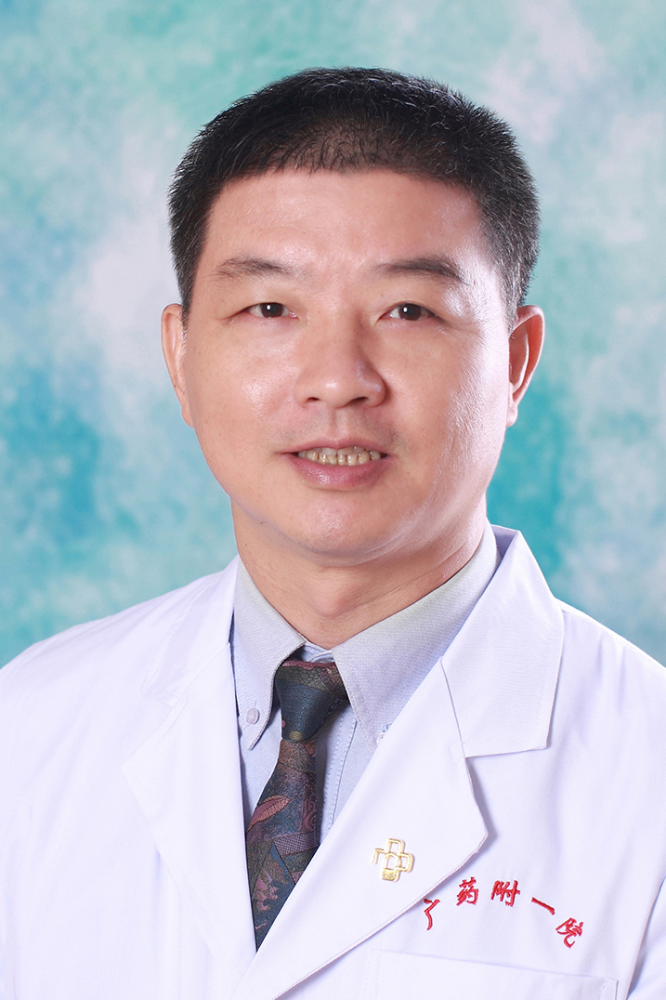

<!-- AUTO-GENERATED-BY: work/generate_obsidian_profiles.py -->

<!-- TEMPLATE: D:\workspace\信息收集整理\医生画像仓库\模板\医生画像模板.md -->

# 王忠

## 基础信息

| 字段 | 内容 |
|---|---|
| 姓名 | 王忠 |
| 医院 | 广东药科大学附属第一医院 |
| 科室 | 泌尿外科 |
| 职称/身份 | 教授、主任医师 |
| 来源链接 | [官网原文](https://www.gy120.net/articleshow.asp?articleid=180) |
| 采集日期 | 2026-08-15 |

## 简介/擅长

微创技术治疗肾结石、输尿管结石等泌尿系结石； 微创技术治疗肾肿瘤，膀胱肿瘤； 中医药治疗不育等泌尿杂症

## 教育与进修经历

- 个人介绍：1989年广东医学院西医医疗系毕业留校在广东医学院附属医院外科工作；

## 论文与学术产出

- 在国内率先开展“无气腹手助腹腔镜肾切除术”， 在国内率先开展“ESWL后肾盂切开治疗鹿角型肾结石”， 在国内率先开展“阴茎部分切除+阴茎延长治疗阴茎癌”， 在国内率先开展“通过影像学研究乳糜尿机制，并应用于临床治疗乳糜尿” 社会任职：广东省生物技术产业化促进会副秘书长 中国医促会微创专业委员会委员 中华泌尿学会会员 广东省中西医结合教执委委员 中西医结合泌尿学会委员 临床医学工程杂志副主编 广东博士协会会员 广东教育厅专家 广东省科技厅专家 广东省医鉴专家 广东省医疗器械评审专家 广州市医鉴专家 闽南经济促进会常…

## 可包装亮点

- 在国内率先开展“无气腹手助腹腔镜肾切除术”， 在国内率先开展“ESWL后肾盂切开治疗鹿角型肾结石”， 在国内率先开展“阴茎部分切除+阴茎延长治疗阴茎癌”， 在国内率先开展“通过影像学研究乳糜尿机制，并应用于临床治疗乳糜尿” 社会任职：广东省生物技术产业化促进会副秘书长 中国医促会微创专业委员会委员 中华泌尿学会会员 广东省中西医结合教执委委员 中西医结合泌…
- 获广东省金博士奖

## 重点疾病/人群标签

- 慢性病：
- 肿瘤：肿瘤、癌
- 生殖疾病：
- 免疫/风湿：
- 术后恢复/康复：
- 疑难重症：

## 证据摘录

> 只摘录官网公开信息中的短句或关键字段，不复制大段原文。

- 官网身份字段：教授、主任医师
- 官网简介/擅长：微创技术治疗肾结石、输尿管结石等泌尿系结石； 微创技术治疗肾肿瘤，膀胱肿瘤； 中医药治疗不育等泌尿杂症
- 官网亮眼经历线索：在国内率先开展“无气腹手助腹腔镜肾切除术”， 在国内率先开展“ESWL后肾盂切开治疗鹿角型肾结石”， 在国内率先开展“阴茎部分切除+阴茎延长治疗阴茎癌”， 在国内率先开展“通过影像学研究乳糜尿机制，并应用于临床治疗乳糜尿” 社会任职：广东省生物技术产业化促进会副秘书长 中国医促会微创专业委员会委员 中华泌尿学会会员 广东省中西医结合教执委委员 中西医结合泌尿学会委员 临床医学工程杂志副主编 广东博士协会会员 广东教育厅专家 广东省科技…
- 来源链接：https://www.gy120.net/articleshow.asp?articleid=180

## BD 画像摘要

王忠医生可作为肿瘤方向的基础画像候选。后续 BD 使用应继续以官网来源和人工复核为准，不添加疗效承诺或无来源包装。

## 合规边界

- 仅使用医院官网、官方公众号、官方小程序等公开渠道。
- 不采集私人电话、私人微信、家庭住址、患者隐私或非公开排班信息。
- 不写“保证治愈”“疗效第一”“包治疑难杂症”等无法由官网证明的表述。
