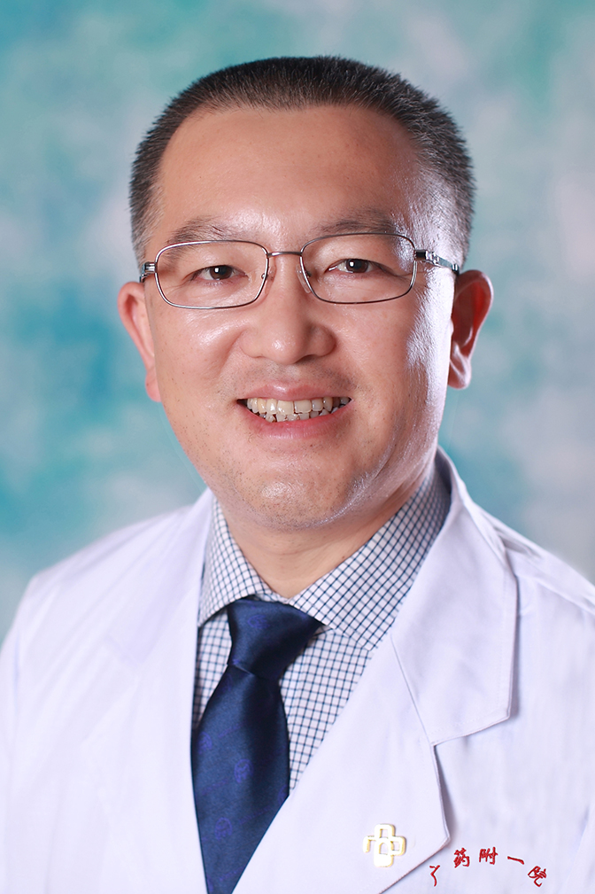

<!-- AUTO-GENERATED-BY: work/generate_obsidian_profiles.py -->

<!-- TEMPLATE: D:\workspace\信息收集整理\医生画像仓库\模板\医生画像模板.md -->

# 王晓东

## 基础信息

| 字段 | 内容 |
|---|---|
| 姓名 | 王晓东 |
| 医院 | 广东药科大学附属第一医院 |
| 科室 | 创伤与关节外科（骨一科）（健康管理中心） |
| 职称/身份 | 教授、主任医师 |
| 来源链接 | [官网原文](https://www.gy120.net/articleshow.asp?articleid=219) |
| 采集日期 | 2026-08-15 |

## 简介/擅长

原发性及继发性骨质疏松症的诊断与治疗，骨质疏松性骨折（胸腰椎骨折、髋部骨折等）的保守及手术治疗，膝关节骨性关节炎，腰椎间盘突出症等的保守及手术治疗。

## 教育与进修经历

- 个人介绍：1992 年毕业于东南大学医学院，从事骨外科临床工作二十余年，熟练掌握骨外科常见病、多发病的诊治。
- 2004 年 7 月— 2005 年 7 月参加第 41 期全国骨科医师进修班学习（北京积水潭医院骨科）。

## 可包装亮点

- 2004 年 7 月— 2005 年 7 月参加第 41 期全国骨科医师进修班学习（北京积水潭医院骨科）。
- 2007 年负责筹建中国老年学学会骨质疏松诊疗广东基地；
- 2013 年晋升为骨外科主任医师，教授。
- 社会任职：广东省医院管理评价质控中心医院等级评审专家 中国老年学和老年医学学会骨质疏松和骨内科分会第七届常委 中国医疗保健国际交流促进会骨质疏松病学分会第二届常委 中华志愿者协会中西医结合委骨质疏松科全国专业组第一届常委 广东省医学会骨质疏松分会第五届副主任委员、社区工作学组第一届副组长 广东省医师协会骨关节外科医师分会第三届常委 广东省康复医学会老年康复…

## 重点疾病/人群标签

- 慢性病：代谢、肿瘤、风湿、免疫、类风湿、康复
- 肿瘤：代谢、肿瘤、风湿、免疫、类风湿、康复
- 生殖疾病：
- 免疫/风湿：代谢、肿瘤、风湿、免疫、类风湿、康复
- 术后恢复/康复：代谢、肿瘤、风湿、免疫、类风湿、康复
- 疑难重症：

## 证据摘录

> 只摘录官网公开信息中的短句或关键字段，不复制大段原文。

- 官网身份字段：教授、主任医师
- 官网简介/擅长：原发性及继发性骨质疏松症的诊断与治疗，骨质疏松性骨折（胸腰椎骨折、髋部骨折等）的保守及手术治疗，膝关节骨性关节炎，腰椎间盘突出症等的保守及手术治疗。
- 官网亮眼经历线索：2004 年 7 月— 2005 年 7 月参加第 41 期全国骨科医师进修班学习（北京积水潭医院骨科）。 2007 年负责筹建中国老年学学会骨质疏松诊疗广东基地； 2013 年晋升为骨外科主任医师，教授。 社会任职：广东省医院管理评价质控中心医院等级评审专家 中国老年学和老年医学学会骨质疏松和骨内科分会第七届常委 中国医疗保健国际交流促进会骨质疏松病学分会第二届常委 中华志愿者协会中西医结合委骨质疏松科全国专业组第一届常委 广东省医…
- 来源链接：https://www.gy120.net/articleshow.asp?articleid=219

## BD 画像摘要

王晓东医生可作为慢性病、肿瘤、免疫/风湿/感染、术后恢复/康复方向的基础画像候选。后续 BD 使用应继续以官网来源和人工复核为准，不添加疗效承诺或无来源包装。

## 合规边界

- 仅使用医院官网、官方公众号、官方小程序等公开渠道。
- 不采集私人电话、私人微信、家庭住址、患者隐私或非公开排班信息。
- 不写“保证治愈”“疗效第一”“包治疑难杂症”等无法由官网证明的表述。
