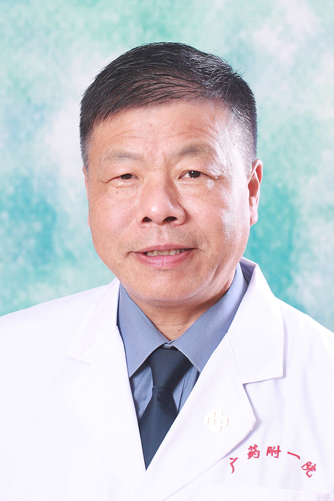

<!-- AUTO-GENERATED-BY: work/generate_obsidian_profiles.py -->

<!-- TEMPLATE: D:\workspace\信息收集整理\医生画像仓库\模板\医生画像模板.md -->

# 王浩

## 基础信息

| 字段 | 内容 |
|---|---|
| 姓名 | 王浩 |
| 医院 | 广东药科大学附属第一医院 |
| 科室 | 妇产科（农林门诊） |
| 职称/身份 | 教授、主任医师、硕士生导师 |
| 来源链接 | [官网原文](https://www.gy120.net/articleshow.asp?articleid=164) |
| 采集日期 | 2026-08-15 |

## 简介/擅长

擅长各类妇产科疑难疾病的诊治，擅长妇科良、恶性肿瘤的预防、诊断和治疗；擅长不孕不育（包括辅助生殖技术）的诊断与治疗。

## 科研项目与成果

- 在全国 “百佳”及“三甲”医院工作30余年，从事临床医学诊治与教学科研工作。
- 社会任职：广东省优生优育学会委员 广东省医疗事故鉴定委员会专家 广东省保健行业协会首席专家 广东省营养健康产业协会首席专家 《实用妇产科杂志》编委 《妇产与临床杂志》编委 科研与获奖：参与撰写专著及教材 10余部，发表学术论文20余篇，主持各级各类科研项目10项，获得科研奖项2项。
- 曾获全军科技进步三、四等奖各一项(均为第一主持人) 以主编、副主编或编者参与撰写专著20余部 以第一作者发表医学论文30余篇 主持各级各类科研项目10余项

## 论文与学术产出

- 社会任职：广东省优生优育学会委员 广东省医疗事故鉴定委员会专家 广东省保健行业协会首席专家 广东省营养健康产业协会首席专家 《实用妇产科杂志》编委 《妇产与临床杂志》编委 科研与获奖：参与撰写专著及教材 10余部，发表学术论文20余篇，主持各级各类科研项目10项，获得科研奖项2项。
- 曾获全军科技进步三、四等奖各一项(均为第一主持人) 以主编、副主编或编者参与撰写专著20余部 以第一作者发表医学论文30余篇 主持各级各类科研项目10余项

## 可包装亮点

- 个人介绍：曾担任临床医学院妇产科学科带头人、公共卫生学院儿少营养与妇女保健学科带头人。
- 社会任职：广东省优生优育学会委员 广东省医疗事故鉴定委员会专家 广东省保健行业协会首席专家 广东省营养健康产业协会首席专家 《实用妇产科杂志》编委 《妇产与临床杂志》编委 科研与获奖：参与撰写专著及教材 10余部，发表学术论文20余篇，主持各级各类科研项目10项，获得科研奖项2项。
- 曾获全军科技进步三、四等奖各一项(均为第一主持人) 以主编、副主编或编者参与撰写专著20余部 以第一作者发表医学论文30余篇 主持各级各类科研项目10余项

## 重点疾病/人群标签

- 慢性病：
- 肿瘤：肿瘤、不孕、辅助生殖、营养、疑难
- 生殖疾病：肿瘤、不孕、辅助生殖、营养、疑难
- 免疫/风湿：
- 术后恢复/康复：肿瘤、不孕、辅助生殖、营养、疑难
- 疑难重症：肿瘤、不孕、辅助生殖、营养、疑难

## 证据摘录

> 只摘录官网公开信息中的短句或关键字段，不复制大段原文。

- 官网身份字段：教授、主任医师、硕士生导师
- 官网简介/擅长：擅长各类妇产科疑难疾病的诊治，擅长妇科良、恶性肿瘤的预防、诊断和治疗；擅长不孕不育（包括辅助生殖技术）的诊断与治疗。
- 官网亮眼经历线索：个人介绍：曾担任临床医学院妇产科学科带头人、公共卫生学院儿少营养与妇女保健学科带头人。 社会任职：广东省优生优育学会委员 广东省医疗事故鉴定委员会专家 广东省保健行业协会首席专家 广东省营养健康产业协会首席专家 《实用妇产科杂志》编委 《妇产与临床杂志》编委 科研与获奖：参与撰写专著及教材 10余部，发表学术论文20余篇，主持各级各类科研项目10项，获得科研奖项2项。 曾获全军科技进步三、四等奖各一项(均为第一主持人) 以主编、副主编…
- 来源链接：https://www.gy120.net/articleshow.asp?articleid=164

## BD 画像摘要

王浩医生可作为肿瘤、生殖疾病、术后恢复/康复、疑难重症方向的基础画像候选。后续 BD 使用应继续以官网来源和人工复核为准，不添加疗效承诺或无来源包装。

## 合规边界

- 仅使用医院官网、官方公众号、官方小程序等公开渠道。
- 不采集私人电话、私人微信、家庭住址、患者隐私或非公开排班信息。
- 不写“保证治愈”“疗效第一”“包治疑难杂症”等无法由官网证明的表述。
