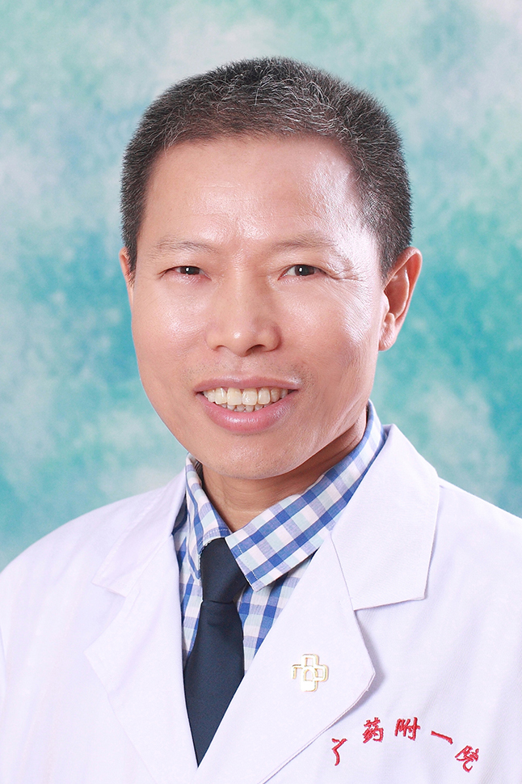

<!-- AUTO-GENERATED-BY: work/generate_obsidian_profiles.py -->

<!-- TEMPLATE: D:\workspace\信息收集整理\医生画像仓库\模板\医生画像模板.md -->

# 王玉栋

## 基础信息

| 字段 | 内容 |
|---|---|
| 姓名 | 王玉栋 |
| 医院 | 广东药科大学附属第一医院 |
| 科室 | 口腔科（农林门诊、共和门诊） |
| 职称/身份 | 教授，主任医师，硕士研究生导师 |
| 来源链接 | [官网原文](https://www.gy120.net/articleshow.asp?articleid=113) |
| 采集日期 | 2026-08-15 |

## 简介/擅长

熟练掌握各类种植牙操作技术，达到持久的功能效果；智齿阻生牙及各种疑难牙拔除术，具有解决口腔疑难杂症的能力。长期致力于口腔颌面外科工作，擅长口腔肿瘤和颌骨病变的诊疗和修复技术。

## 教育与进修经历

- 个人介绍：1988年毕业于中山大学光华口腔医学院， 1992.3-1993.2年在中山大学孙逸仙纪念医院口腔颌面外科研修。

## 科研项目与成果

- 个人介绍：1988年毕业于中山大学光华口腔医学院， 1992.3-1993.2年在中山大学孙逸仙纪念医院口腔颌面外科研修。
- 主持省科技厅、省教育厅、省医学科研基金、区科技计划项目、临床试验项目等研究课题 10余项。
- 获得发明专利、实用新型专利 4项。

## 可包装亮点

- 个人介绍：1988年毕业于中山大学光华口腔医学院， 1992.3-1993.2年在中山大学孙逸仙纪念医院口腔颌面外科研修。
- 20多年来一直从事口腔医疗工作，积累了丰富临床工作经验，具有解决口腔疑难杂症的能力。
- 社会任职：广东省精准医学应用学会咬合与颞下颌疾病分会副主委 广东省保健协会免疫细胞与干细胞治疗分会副主委 广东省保健协会数字口腔分会副主委 广东省健康管理学会口腔颌面头颈医学专业委员会副主委 广东省老年保健学会口腔医学专业委员会副主委 广东省医学教育协会医药教师发展专业委员会第一届常务委员 广东省医学美容学会口腔医学会第一届理事会理事 广东省老年保健协会第…

## 重点疾病/人群标签

- 慢性病：
- 肿瘤：肿瘤、癌、免疫、疑难
- 生殖疾病：
- 免疫/风湿：肿瘤、癌、免疫、疑难
- 术后恢复/康复：
- 疑难重症：肿瘤、癌、免疫、疑难

## 证据摘录

> 只摘录官网公开信息中的短句或关键字段，不复制大段原文。

- 官网身份字段：教授，主任医师，硕士研究生导师
- 官网简介/擅长：熟练掌握各类种植牙操作技术，达到持久的功能效果；智齿阻生牙及各种疑难牙拔除术，具有解决口腔疑难杂症的能力。长期致力于口腔颌面外科工作，擅长口腔肿瘤和颌骨病变的诊疗和修复技术。
- 官网亮眼经历线索：个人介绍：1988年毕业于中山大学光华口腔医学院， 1992.3-1993.2年在中山大学孙逸仙纪念医院口腔颌面外科研修。 20多年来一直从事口腔医疗工作，积累了丰富临床工作经验，具有解决口腔疑难杂症的能力。 社会任职：广东省精准医学应用学会咬合与颞下颌疾病分会副主委 广东省保健协会免疫细胞与干细胞治疗分会副主委 广东省保健协会数字口腔分会副主委 广东省健康管理学会口腔颌面头颈医学专业委员会副主委 广东省老年保健学会口腔医学专业委员会…
- 来源链接：https://www.gy120.net/articleshow.asp?articleid=113

## BD 画像摘要

王玉栋医生可作为肿瘤、免疫/风湿/感染、疑难重症方向的基础画像候选。后续 BD 使用应继续以官网来源和人工复核为准，不添加疗效承诺或无来源包装。

## 合规边界

- 仅使用医院官网、官方公众号、官方小程序等公开渠道。
- 不采集私人电话、私人微信、家庭住址、患者隐私或非公开排班信息。
- 不写“保证治愈”“疗效第一”“包治疑难杂症”等无法由官网证明的表述。
