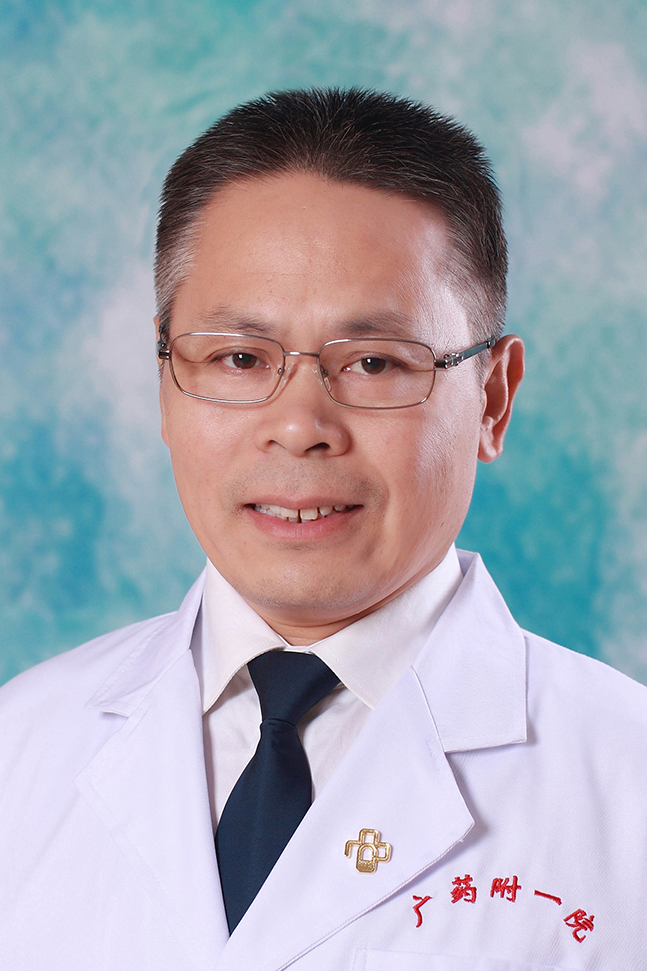

<!-- AUTO-GENERATED-BY: work/generate_obsidian_profiles.py -->

<!-- TEMPLATE: D:\workspace\信息收集整理\医生画像仓库\模板\医生画像模板.md -->

# 王玺坤

## 基础信息

| 字段 | 内容 |
|---|---|
| 姓名 | 王玺坤 |
| 医院 | 广东药科大学附属第一医院 |
| 科室 | 泌尿外科（健康管理中心） |
| 职称/身份 | 教授、主任医师、医学博士 |
| 来源链接 | [官网原文](https://www.gy120.net/articleshow.asp?articleid=159) |
| 采集日期 | 2026-08-15 |

## 简介/擅长

男性不育，前列腺疾病的诊诒。

## 教育与进修经历

- 个人介绍：1988.6 毕业于郑州大学医学院（原河南医科大学）医疗系，历任外科住院医师、主治医师、副主任医师、主任医师等；
- 多次在上级医院进修学习 2 002 年获得广州中医药大学中西医结合临床博士学位 社会任职：中华医学会行为医学分会青年委员会委员 广东省医学会行为与心身医学分会常委 性行为医学学组组长 广州市医学会泌尿外科学分会委员 《中华诊断学》杂志编委 广东省中西医结合男性学专业委员会常委 广东省人口学会理事 主要论著：主编专著《性健康与性疾病学》（ ISBN978-7-306-03361-1 ）于 2009 年 8 月由中山大学出版社出版，填补我国大学生性健康教育教材空白 科研与获奖：公开发表国家级及省级杂志论文 20 余篇…

## 科研项目与成果

- 多次在上级医院进修学习 2 002 年获得广州中医药大学中西医结合临床博士学位 社会任职：中华医学会行为医学分会青年委员会委员 广东省医学会行为与心身医学分会常委 性行为医学学组组长 广州市医学会泌尿外科学分会委员 《中华诊断学》杂志编委 广东省中西医结合男性学专业委员会常委 广东省人口学会理事 主要论著：主编专著《性健康与性疾病学》（ ISBN978-7-306-03361-1 ）于 2009 年 8 月由中山大学出版社出版，填补我国大学生性健康教育教材空白 科研与获奖：公开发表国家级及省级杂志论文 20 余篇…
- 曾担任科研课题项目 9 项，主持 5 项

## 论文与学术产出

- 多次在上级医院进修学习 2 002 年获得广州中医药大学中西医结合临床博士学位 社会任职：中华医学会行为医学分会青年委员会委员 广东省医学会行为与心身医学分会常委 性行为医学学组组长 广州市医学会泌尿外科学分会委员 《中华诊断学》杂志编委 广东省中西医结合男性学专业委员会常委 广东省人口学会理事 主要论著：主编专著《性健康与性疾病学》（ ISBN978-7-306-03361-1 ）于 2009 年 8 月由中山大学出版社出版，填补我国大学生性健康教育教材空白 科研与获奖：公开发表国家级及省级杂志论文 20 余篇…

## 可包装亮点

- 个人介绍：1988.6 毕业于郑州大学医学院（原河南医科大学）医疗系，历任外科住院医师、主治医师、副主任医师、主任医师等；
- 多次在上级医院进修学习 2 002 年获得广州中医药大学中西医结合临床博士学位 社会任职：中华医学会行为医学分会青年委员会委员 广东省医学会行为与心身医学分会常委 性行为医学学组组长 广州市医学会泌尿外科学分会委员 《中华诊断学》杂志编委 广东省中西医结合男性学专业委员会常委 广东省人口学会理事 主要论著：主编专著《性健康与性疾病学》（ ISBN978-7…

## 重点疾病/人群标签

- 慢性病：
- 肿瘤：
- 生殖疾病：
- 免疫/风湿：
- 术后恢复/康复：
- 疑难重症：

## 证据摘录

> 只摘录官网公开信息中的短句或关键字段，不复制大段原文。

- 官网身份字段：教授、主任医师、医学博士
- 官网简介/擅长：男性不育，前列腺疾病的诊诒。
- 官网亮眼经历线索：个人介绍：1988.6 毕业于郑州大学医学院（原河南医科大学）医疗系，历任外科住院医师、主治医师、副主任医师、主任医师等； 多次在上级医院进修学习 2 002 年获得广州中医药大学中西医结合临床博士学位 社会任职：中华医学会行为医学分会青年委员会委员 广东省医学会行为与心身医学分会常委 性行为医学学组组长 广州市医学会泌尿外科学分会委员 《中华诊断学》杂志编委 广东省中西医结合男性学专业委员会常委 广东省人口学会理事 主要论著：主编专…
- 来源链接：https://www.gy120.net/articleshow.asp?articleid=159

## BD 画像摘要

王玺坤医生可作为广东药科大学附属第一医院泌尿外科（健康管理中心）的基础医生资料入库。当前重点方向以总底表标签为准，官网未展示的信息保持空白。

## 合规边界

- 仅使用医院官网、官方公众号、官方小程序等公开渠道。
- 不采集私人电话、私人微信、家庭住址、患者隐私或非公开排班信息。
- 不写“保证治愈”“疗效第一”“包治疑难杂症”等无法由官网证明的表述。
