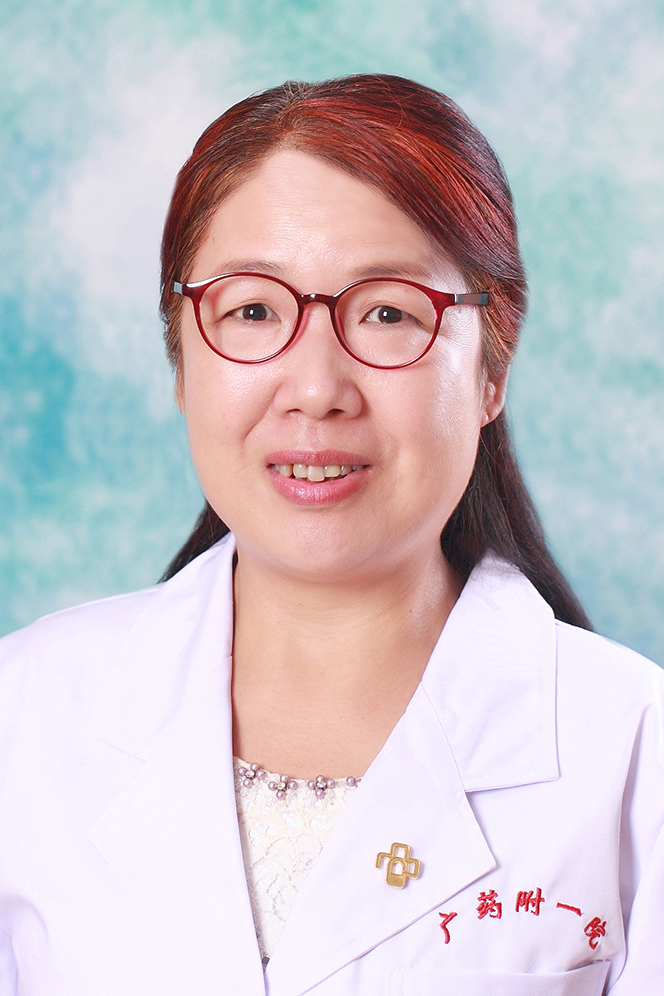

<!-- AUTO-GENERATED-BY: work/generate_obsidian_profiles.py -->

<!-- TEMPLATE: D:\workspace\信息收集整理\医生画像仓库\模板\医生画像模板.md -->

# 王虹

## 基础信息

| 字段 | 内容 |
|---|---|
| 姓名 | 王虹 |
| 医院 | 广东药科大学附属第一医院 |
| 科室 | 呼吸与危重症医学科（健康管理中心） |
| 职称/身份 | 副教授、副主任医师 |
| 来源链接 | [官网原文](https://www.gy120.net/articleshow.asp?articleid=222) |
| 采集日期 | 2026-08-15 |

## 简介/擅长

慢性咳嗽、支气管哮喘、慢性阻塞性肺疾病的诊治

## 教育与进修经历

- 个人介绍：1993 年于中山医科大学临床医学系毕业 2004 年于广州医科大学广州呼吸疾病研究所进修，取得硕士学位 中山医科大学毕业后一直从事内科临床医疗工作，从事呼吸内科专业临床工作近 20 年。

## 科研项目与成果

- 科研与获奖：主 持广东省医学科学技术研究基金立项课题《强化抑制气道粘附分子对控制不良中重度哮喘的治疗作用》 ，已顺利结题。

## 论文与学术产出

- 主要论著：分别于《中国全科医学》，《中国现代医学》及《广东医学》等核心期刊以第一作者身份公开发表学术论文 10 余篇。

## 可包装亮点

- 个人介绍：1993 年于中山医科大学临床医学系毕业 2004 年于广州医科大学广州呼吸疾病研究所进修，取得硕士学位 中山医科大学毕业后一直从事内科临床医疗工作，从事呼吸内科专业临床工作近 20 年。
- 主要论著：分别于《中国全科医学》，《中国现代医学》及《广东医学》等核心期刊以第一作者身份公开发表学术论文 10 余篇。
- 科研与获奖：主 持广东省医学科学技术研究基金立项课题《强化抑制气道粘附分子对控制不良中重度哮喘的治疗作用》 ，已顺利结题。

## 重点疾病/人群标签

- 慢性病：慢性、危重
- 肿瘤：
- 生殖疾病：
- 免疫/风湿：
- 术后恢复/康复：
- 疑难重症：慢性、危重

## 证据摘录

> 只摘录官网公开信息中的短句或关键字段，不复制大段原文。

- 官网身份字段：副教授、副主任医师
- 官网简介/擅长：慢性咳嗽、支气管哮喘、慢性阻塞性肺疾病的诊治
- 官网亮眼经历线索：个人介绍：1993 年于中山医科大学临床医学系毕业 2004 年于广州医科大学广州呼吸疾病研究所进修，取得硕士学位 中山医科大学毕业后一直从事内科临床医疗工作，从事呼吸内科专业临床工作近 20 年。 主要论著：分别于《中国全科医学》，《中国现代医学》及《广东医学》等核心期刊以第一作者身份公开发表学术论文 10 余篇。 科研与获奖：主 持广东省医学科学技术研究基金立项课题《强化抑制气道粘附分子对控制不良中重度哮喘的治疗作用》 ，已顺利结…
- 来源链接：https://www.gy120.net/articleshow.asp?articleid=222

## BD 画像摘要

王虹医生可作为慢性病、疑难重症方向的基础画像候选。后续 BD 使用应继续以官网来源和人工复核为准，不添加疗效承诺或无来源包装。

## 合规边界

- 仅使用医院官网、官方公众号、官方小程序等公开渠道。
- 不采集私人电话、私人微信、家庭住址、患者隐私或非公开排班信息。
- 不写“保证治愈”“疗效第一”“包治疑难杂症”等无法由官网证明的表述。
