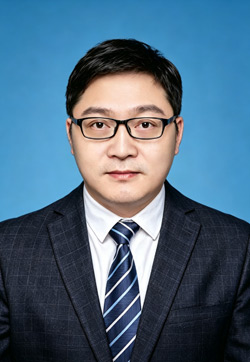

<!-- AUTO-GENERATED-BY: work/generate_obsidian_profiles.py -->

<!-- TEMPLATE: D:\workspace\信息收集整理\医生画像仓库\模板\医生画像模板.md -->

# 王飞

## 基础信息

| 字段 | 内容 |
|---|---|
| 姓名 | 王飞 |
| 医院 | 广东药科大学附属第一医院 |
| 科室 | 足踝与创面修复科（骨四科） |
| 职称/身份 | 副主任医师 |
| 来源链接 | [官网原文](https://www.gy120.net/articleshow.asp?articleid=615) |
| 采集日期 | 2026-08-15 |

## 简介/擅长

诊治四肢、骨盆髋臼骨折的手术治疗，对足踝部创伤、畸形、运动损伤及慢性劳损疾病诊治及微创手术有丰富经验

## 教育与进修经历

- 个人介绍：硕士研究生，2009年毕业于南方医科大学。
- 从事骨科临床十六年，于同济大学同济医院进修足踝外科，从事足踝外科十年，擅长诊治四肢、骨盆髋臼骨折的手术治疗，对足踝部创伤、畸形、运动损伤及慢性劳损疾病诊治及微创手术有丰富经验。

## 可包装亮点

- 从事骨科临床十六年，于同济大学同济医院进修足踝外科，从事足踝外科十年，擅长诊治四肢、骨盆髋臼骨折的手术治疗，对足踝部创伤、畸形、运动损伤及慢性劳损疾病诊治及微创手术有丰富经验。
- 任SICOT足踝中国部专业委员会青年委员、亚太足踝外科医师协会中国区委员。

## 重点疾病/人群标签

- 慢性病：慢性、创面
- 肿瘤：
- 生殖疾病：
- 免疫/风湿：
- 术后恢复/康复：慢性、创面
- 疑难重症：

## 证据摘录

> 只摘录官网公开信息中的短句或关键字段，不复制大段原文。

- 官网身份字段：副主任医师
- 官网简介/擅长：诊治四肢、骨盆髋臼骨折的手术治疗，对足踝部创伤、畸形、运动损伤及慢性劳损疾病诊治及微创手术有丰富经验
- 官网亮眼经历线索：从事骨科临床十六年，于同济大学同济医院进修足踝外科，从事足踝外科十年，擅长诊治四肢、骨盆髋臼骨折的手术治疗，对足踝部创伤、畸形、运动损伤及慢性劳损疾病诊治及微创手术有丰富经验。 任SICOT足踝中国部专业委员会青年委员、亚太足踝外科医师协会中国区委员。
- 来源链接：https://www.gy120.net/articleshow.asp?articleid=615

## BD 画像摘要

王飞医生可作为慢性病、术后恢复/康复方向的基础画像候选。后续 BD 使用应继续以官网来源和人工复核为准，不添加疗效承诺或无来源包装。

## 合规边界

- 仅使用医院官网、官方公众号、官方小程序等公开渠道。
- 不采集私人电话、私人微信、家庭住址、患者隐私或非公开排班信息。
- 不写“保证治愈”“疗效第一”“包治疑难杂症”等无法由官网证明的表述。
