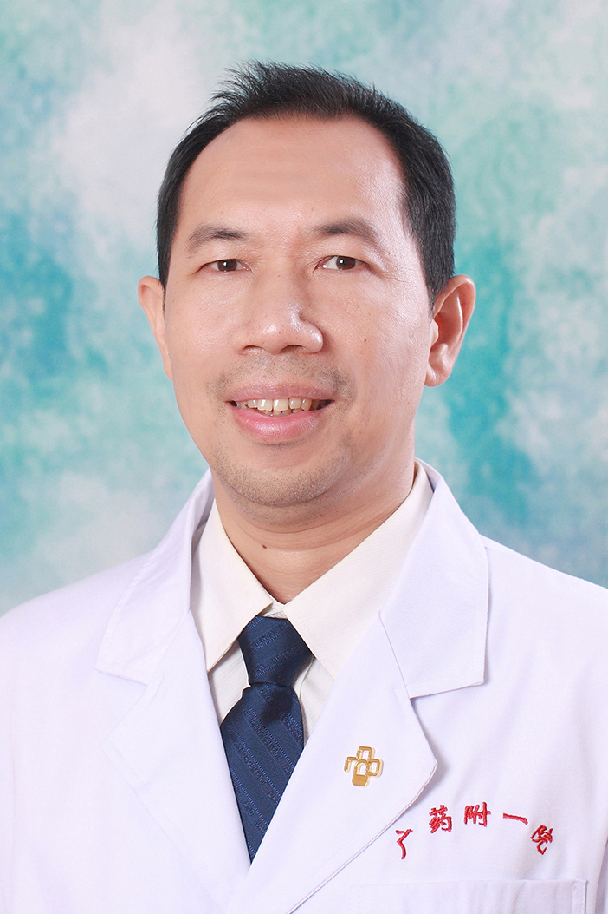

<!-- AUTO-GENERATED-BY: work/generate_obsidian_profiles.py -->

<!-- TEMPLATE: D:\workspace\信息收集整理\医生画像仓库\模板\医生画像模板.md -->

# 甄毅锋

## 基础信息

| 字段 | 内容 |
|---|---|
| 姓名 | 甄毅锋 |
| 医院 | 广东药科大学附属第一医院 |
| 科室 | 中医科 |
| 职称/身份 | 副教授、副主任医师 |
| 来源链接 | [官网原文](https://www.gy120.net/articleshow.asp?articleid=195) |
| 采集日期 | 2026-08-15 |

## 简介/擅长

高血压，冠心病，心律失常，心力衰竭等心血管疾病，老年内科常见病

## 教育与进修经历

- 个人介绍：1993年毕业于广州医科大学，从医二十余年，从事内科及老年科临床工作 2000年聘为主治医师，2004年在中山医科大学心血管内科危重病进修班学习 2010-2011年在阳山县人民医院下乡工作一年 2011年取得心血管内科副主任医师资格 主要论著：1、偶测血压正常的老年高血压患者动态血压分析《 医学理论与实践》 2、老年2型糖尿病病人低密度脂蛋白达标分析《中西医结合心脑血管病杂志》 3、伴有睡眠障碍的老年原发性高血压的治疗研究《中国基层医药》 科研与获奖：2010年取得“广东省医学科学技术研究基金项目（项…

## 科研项目与成果

- 个人介绍：1993年毕业于广州医科大学，从医二十余年，从事内科及老年科临床工作 2000年聘为主治医师，2004年在中山医科大学心血管内科危重病进修班学习 2010-2011年在阳山县人民医院下乡工作一年 2011年取得心血管内科副主任医师资格 主要论著：1、偶测血压正常的老年高血压患者动态血压分析《 医学理论与实践》 2、老年2型糖尿病病人低密度脂蛋白达标分析《中西医结合心脑血管病杂志》 3、伴有睡眠障碍的老年原发性高血压的治疗研究《中国基层医药》 科研与获奖：2010年取得“广东省医学科学技术研究基金项目（项…
- 为课题主要成员，排名第二。

## 可包装亮点

- 个人介绍：1993年毕业于广州医科大学，从医二十余年，从事内科及老年科临床工作 2000年聘为主治医师，2004年在中山医科大学心血管内科危重病进修班学习 2010-2011年在阳山县人民医院下乡工作一年 2011年取得心血管内科副主任医师资格 主要论著：1、偶测血压正常的老年高血压患者动态血压分析《 医学理论与实践》 2、老年2型糖尿病病人低密度脂蛋白达…

## 重点疾病/人群标签

- 慢性病：高血压、糖尿病、冠心病、心力衰竭、危重
- 肿瘤：
- 生殖疾病：
- 免疫/风湿：
- 术后恢复/康复：
- 疑难重症：高血压、糖尿病、冠心病、心力衰竭、危重

## 证据摘录

> 只摘录官网公开信息中的短句或关键字段，不复制大段原文。

- 官网身份字段：副教授、副主任医师
- 官网简介/擅长：高血压，冠心病，心律失常，心力衰竭等心血管疾病，老年内科常见病
- 官网亮眼经历线索：个人介绍：1993年毕业于广州医科大学，从医二十余年，从事内科及老年科临床工作 2000年聘为主治医师，2004年在中山医科大学心血管内科危重病进修班学习 2010-2011年在阳山县人民医院下乡工作一年 2011年取得心血管内科副主任医师资格 主要论著：1、偶测血压正常的老年高血压患者动态血压分析《 医学理论与实践》 2、老年2型糖尿病病人低密度脂蛋白达标分析《中西医结合心脑血管病杂志》 3、伴有睡眠障碍的老年原发性高血压的治疗研究…
- 来源链接：https://www.gy120.net/articleshow.asp?articleid=195

## BD 画像摘要

甄毅锋医生可作为慢性病、疑难重症方向的基础画像候选。后续 BD 使用应继续以官网来源和人工复核为准，不添加疗效承诺或无来源包装。

## 合规边界

- 仅使用医院官网、官方公众号、官方小程序等公开渠道。
- 不采集私人电话、私人微信、家庭住址、患者隐私或非公开排班信息。
- 不写“保证治愈”“疗效第一”“包治疑难杂症”等无法由官网证明的表述。
