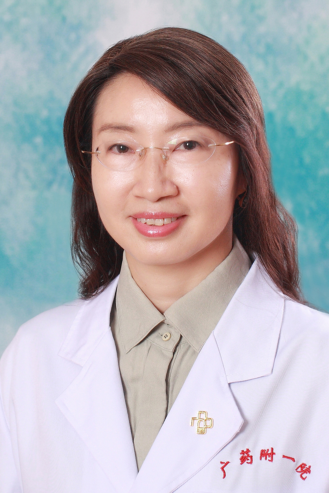

<!-- AUTO-GENERATED-BY: work/generate_obsidian_profiles.py -->

<!-- TEMPLATE: D:\workspace\信息收集整理\医生画像仓库\模板\医生画像模板.md -->

# 皇甫丽

## 基础信息

| 字段 | 内容 |
|---|---|
| 姓名 | 皇甫丽 |
| 医院 | 广东药科大学附属第一医院 |
| 科室 | 心理科（共和门诊、健康管理中心） |
| 职称/身份 | 教授、主任医师、 |
| 来源链接 | [官网原文](https://www.gy120.net/articleshow.asp?articleid=102) |
| 采集日期 | 2026-08-15 |

## 简介/擅长

各种精神心理疾病的诊治：如精神分裂症、焦虑症、抑郁症、强迫症、失眠、创伤后应激障碍（天灾人祸、疾病创伤、家庭暴力等）躯体疾病导致的各种心理问题；青少年儿童的各种心理困惑和心理问题（逃学、厌学、分离焦虑、考试焦虑、与父母关系不良、人际交往困惑、成长的烦恼等）；情感婚恋的各种问题（恋爱交友、失恋、夫妻关系不良、亲子关系不良、婚外情、婆媳关系）等各种心理问题。

## 教育与进修经历

- 2001.5—2001 ． 12 于北医六院进修 社会任职：中国民族卫生协会心理健康分会理事 中华医学会广州市精神医学分会常委 广东省心理健康协会社会心理服务工作委员会广东省心理治疗专业委员会委员 中国心理卫生协会会员 中华医学会广东省分会睡眠协会委员 广东省中西医结合学会双心医学委员会常委 广东省心理危机干预专业委员会委员 广东省女医师协会心理健康委员会委员 主要论著：于省部级杂志发表 20 多篇心理专业文章，主持和参与过省部级研究 10 多项。

## 科研项目与成果

- 《脑卒中后精神障碍126例临床分析》 《齐拉西酮与氯丙嗪对首发精神分裂症病人认知功能影响比较》 《 火车司机生活质量及心理健康状况调查》 《火车司机心理健康及心理防御机制调查》 《领导干部心理健康状况及应对方式调查》 《住院冠心病患者心理健康水平及相关因素调查分析》 《心理干预对脑卒中患者抑郁情绪和生活质量的影响》 科研与获奖：《火车司机生活质量及相关因素的对照研究》（主持） 《领导干部的心理状况和生活质量研究及干预对策》（主持） 《儿童行为问题与父母婚姻质量的关系及家庭治疗的研究》（参与） 广东省科技厅课题：《…

## 论文与学术产出

- 2001.5—2001 ． 12 于北医六院进修 社会任职：中国民族卫生协会心理健康分会理事 中华医学会广州市精神医学分会常委 广东省心理健康协会社会心理服务工作委员会广东省心理治疗专业委员会委员 中国心理卫生协会会员 中华医学会广东省分会睡眠协会委员 广东省中西医结合学会双心医学委员会常委 广东省心理危机干预专业委员会委员 广东省女医师协会心理健康委员会委员 主要论著：于省部级杂志发表 20 多篇心理专业文章，主持和参与过省部级研究 10 多项。

## 可包装亮点

- 2001.5—2001 ． 12 于北医六院进修 社会任职：中国民族卫生协会心理健康分会理事 中华医学会广州市精神医学分会常委 广东省心理健康协会社会心理服务工作委员会广东省心理治疗专业委员会委员 中国心理卫生协会会员 中华医学会广东省分会睡眠协会委员 广东省中西医结合学会双心医学委员会常委 广东省心理危机干预专业委员会委员 广东省女医师协会心理健康委员会…
- 《脑卒中后精神障碍126例临床分析》 《齐拉西酮与氯丙嗪对首发精神分裂症病人认知功能影响比较》 《 火车司机生活质量及心理健康状况调查》 《火车司机心理健康及心理防御机制调查》 《领导干部心理健康状况及应对方式调查》 《住院冠心病患者心理健康水平及相关因素调查分析》 《心理干预对脑卒中患者抑郁情绪和生活质量的影响》 科研与获奖：《火车司机生活质量及相关因素…

## 重点疾病/人群标签

- 慢性病：冠心病、癌
- 肿瘤：冠心病、癌
- 生殖疾病：
- 免疫/风湿：
- 术后恢复/康复：
- 疑难重症：

## 证据摘录

> 只摘录官网公开信息中的短句或关键字段，不复制大段原文。

- 官网身份字段：教授、主任医师、
- 官网简介/擅长：各种精神心理疾病的诊治：如精神分裂症、焦虑症、抑郁症、强迫症、失眠、创伤后应激障碍（天灾人祸、疾病创伤、家庭暴力等）躯体疾病导致的各种心理问题；青少年儿童的各种心理困惑和心理问题（逃学、厌学、分离焦虑、考试焦虑、与父母关系不良、人际交往困惑、成长的烦恼等）；情感婚恋的各种问题（恋爱交友、失恋、夫妻关系不良、亲子关系不良、婚外情、婆媳关系）等各种心理问题。
- 官网亮眼经历线索：2001.5—2001 ． 12 于北医六院进修 社会任职：中国民族卫生协会心理健康分会理事 中华医学会广州市精神医学分会常委 广东省心理健康协会社会心理服务工作委员会广东省心理治疗专业委员会委员 中国心理卫生协会会员 中华医学会广东省分会睡眠协会委员 广东省中西医结合学会双心医学委员会常委 广东省心理危机干预专业委员会委员 广东省女医师协会心理健康委员会委员 主要论著：于省部级杂志发表 20 多篇心理专业文章，主持和参与过省部级研究…
- 来源链接：https://www.gy120.net/articleshow.asp?articleid=102

## BD 画像摘要

皇甫丽医生可作为慢性病、肿瘤方向的基础画像候选。后续 BD 使用应继续以官网来源和人工复核为准，不添加疗效承诺或无来源包装。

## 合规边界

- 仅使用医院官网、官方公众号、官方小程序等公开渠道。
- 不采集私人电话、私人微信、家庭住址、患者隐私或非公开排班信息。
- 不写“保证治愈”“疗效第一”“包治疑难杂症”等无法由官网证明的表述。
