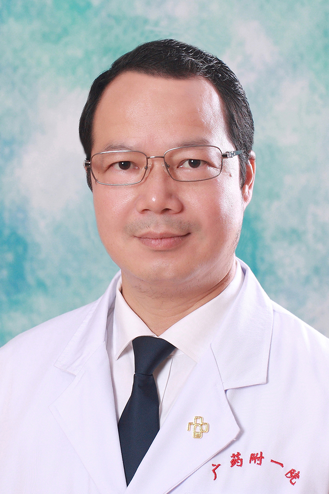

<!-- AUTO-GENERATED-BY: work/generate_obsidian_profiles.py -->

<!-- TEMPLATE: D:\workspace\信息收集整理\医生画像仓库\模板\医生画像模板.md -->

# 石艺华

## 基础信息

| 字段 | 内容 |
|---|---|
| 姓名 | 石艺华 |
| 医院 | 广东药科大学附属第一医院 |
| 科室 | 康复医学科（健康管理中心） |
| 职称/身份 | 副教授、主任中医师 |
| 来源链接 | [官网原文](https://www.gy120.net/articleshow.asp?articleid=175) |
| 采集日期 | 2026-08-15 |

## 简介/擅长

以神经康复、骨关节病康复为特长，擅长中西医综合性康复评定和治疗，在脑卒中后瘫痪、失语、吞咽功能障碍的康复治疗方面有丰富的经验。

## 可包装亮点

- 个人介绍：1994.09-1999.07 北京中医药大学 就读 1999.07-2003.01 沈阳市苏家屯区中医院 中医康复科 2003.01-- 至今 广东药学院附属第一医院 康复医学科 社会任职：广东省医院协会康复医学管理专业委员会委员 广东省医学会物理医学与康复学中西医结合学组成员 广东省医学会社区康复学分会常务委员 广州市康复医学会理事会理事

## 重点疾病/人群标签

- 慢性病：
- 肿瘤：
- 生殖疾病：
- 免疫/风湿：
- 术后恢复/康复：康复、功能障碍
- 疑难重症：

## 证据摘录

> 只摘录官网公开信息中的短句或关键字段，不复制大段原文。

- 官网身份字段：副教授、主任中医师
- 官网简介/擅长：以神经康复、骨关节病康复为特长，擅长中西医综合性康复评定和治疗，在脑卒中后瘫痪、失语、吞咽功能障碍的康复治疗方面有丰富的经验。
- 官网亮眼经历线索：个人介绍：1994.09-1999.07 北京中医药大学 就读 1999.07-2003.01 沈阳市苏家屯区中医院 中医康复科 2003.01-- 至今 广东药学院附属第一医院 康复医学科 社会任职：广东省医院协会康复医学管理专业委员会委员 广东省医学会物理医学与康复学中西医结合学组成员 广东省医学会社区康复学分会常务委员 广州市康复医学会理事会理事
- 来源链接：https://www.gy120.net/articleshow.asp?articleid=175

## BD 画像摘要

石艺华医生可作为术后恢复/康复方向的基础画像候选。后续 BD 使用应继续以官网来源和人工复核为准，不添加疗效承诺或无来源包装。

## 合规边界

- 仅使用医院官网、官方公众号、官方小程序等公开渠道。
- 不采集私人电话、私人微信、家庭住址、患者隐私或非公开排班信息。
- 不写“保证治愈”“疗效第一”“包治疑难杂症”等无法由官网证明的表述。
