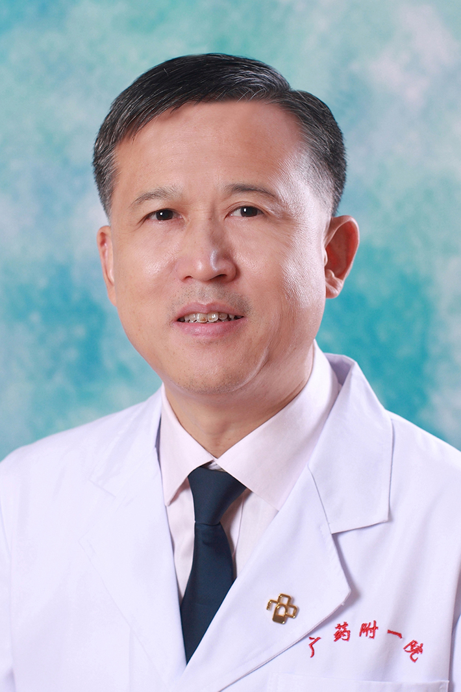

<!-- AUTO-GENERATED-BY: work/generate_obsidian_profiles.py -->

<!-- TEMPLATE: D:\workspace\信息收集整理\医生画像仓库\模板\医生画像模板.md -->

# 祝曙光

## 基础信息

| 字段 | 内容 |
|---|---|
| 姓名 | 祝曙光 |
| 医院 | 广东药科大学附属第一医院 |
| 科室 | 心胸外科 |
| 职称/身份 | 主任医师 |
| 来源链接 | [官网原文](https://www.gy120.net/articleshow.asp?articleid=233) |
| 采集日期 | 2026-08-15 |

## 简介/擅长

擅长普胸疾病（食管肿瘤、肺肿瘤、纵隔肿瘤、气管肿瘤、手汗症、支气管扩张症、，）诊断和外科治疗，擅长胸腔镜下(纵隔肿瘤切除、肺叶切除、食管肿瘤切除)。擅长心脏疾病（心脏瓣膜病、主动脉瘤）的诊断和外科治疗

## 教育与进修经历

- 个人介绍：自 1987 年大学本科毕业后一直从事胸心外科临床、科研、教学工作。
- 先后获得中山大学胸心外科硕士、博士学位。
- 曾在香港大学玛丽医院做高级访问学者，美国维吉尼亚联邦大学，Pauley 心肺中心做博士后。

## 科研项目与成果

- 个人介绍：自 1987 年大学本科毕业后一直从事胸心外科临床、科研、教学工作。

## 论文与学术产出

- 发表论文30余篇，其中SCI 论文9篇。

## 可包装亮点

- 曾在香港大学玛丽医院做高级访问学者，美国维吉尼亚联邦大学，Pauley 心肺中心做博士后。
- 于1998年晋升为心胸外科副主任医师，2013年晋升为心胸外科主任医师。
- 发表论文30余篇，其中SCI 论文9篇。
- 社会任职：中华医学会广东省胸外分会委员 主要论著：1.Sirtuin1(SIRT1) activation mediates Sildenafil induced delayed cardioprotection against Ischemia-Reperfusion injury in mice. Plos One. 9: e86977-86983.2…

## 重点疾病/人群标签

- 慢性病：冠心病、肿瘤、瘤、肺癌
- 肿瘤：冠心病、肿瘤、瘤、肺癌
- 生殖疾病：
- 免疫/风湿：
- 术后恢复/康复：
- 疑难重症：

## 证据摘录

> 只摘录官网公开信息中的短句或关键字段，不复制大段原文。

- 官网身份字段：主任医师
- 官网简介/擅长：擅长普胸疾病（食管肿瘤、肺肿瘤、纵隔肿瘤、气管肿瘤、手汗症、支气管扩张症、，）诊断和外科治疗，擅长胸腔镜下(纵隔肿瘤切除、肺叶切除、食管肿瘤切除)。擅长心脏疾病（心脏瓣膜病、主动脉瘤）的诊断和外科治疗
- 官网亮眼经历线索：曾在香港大学玛丽医院做高级访问学者，美国维吉尼亚联邦大学，Pauley 心肺中心做博士后。 于1998年晋升为心胸外科副主任医师，2013年晋升为心胸外科主任医师。 发表论文30余篇，其中SCI 论文9篇。 社会任职：中华医学会广东省胸外分会委员 主要论著：1.Sirtuin1(SIRT1) activation mediates Sildenafil induced delayed cardioprotection against…
- 来源链接：https://www.gy120.net/articleshow.asp?articleid=233

## BD 画像摘要

祝曙光医生可作为慢性病、肿瘤方向的基础画像候选。后续 BD 使用应继续以官网来源和人工复核为准，不添加疗效承诺或无来源包装。

## 合规边界

- 仅使用医院官网、官方公众号、官方小程序等公开渠道。
- 不采集私人电话、私人微信、家庭住址、患者隐私或非公开排班信息。
- 不写“保证治愈”“疗效第一”“包治疑难杂症”等无法由官网证明的表述。
