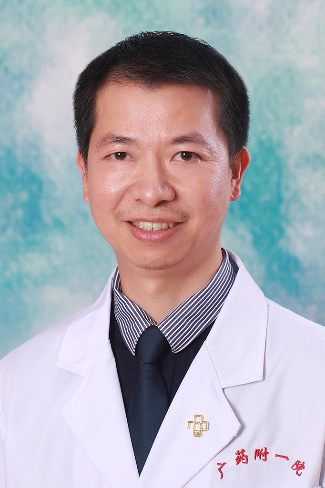

<!-- AUTO-GENERATED-BY: work/generate_obsidian_profiles.py -->

<!-- TEMPLATE: D:\workspace\信息收集整理\医生画像仓库\模板\医生画像模板.md -->

# 秦鑫添

## 基础信息

| 字段 | 内容 |
|---|---|
| 姓名 | 秦鑫添 |
| 医院 | 广东药科大学附属第一医院 |
| 科室 | 肿瘤一科（农林门诊） |
| 职称/身份 | 副教授、副主任医师 |
| 来源链接 | [官网原文](https://www.gy120.net/articleshow.asp?articleid=337) |
| 采集日期 | 2026-08-15 |

## 简介/擅长

擅长鼻咽癌、肺癌、胃癌、食管癌、原发性肝癌、结直肠癌、头颈癌、乳腺癌、恶性淋巴瘤等实体瘤的诊断和内科（化疗、靶向治疗和生物免疫治疗等）综合治疗；擅长肿瘤急症的诊断和处理。

## 教育与进修经历

- 个人介绍：1999年6月中山医科大学大学临床医学本科毕业；
- 2005年9月至2008年6月 中山大学附属肿瘤医院攻读肿瘤内科学硕士研究生，获肿瘤学硕士学位；

## 科研项目与成果

- 社会任职：广东省医学会肿瘤学分会第六届委员会鼻咽癌学组成员 科研与获奖：2003年6月获广州市抗击“非典”标兵称号，获省抗击“非典”二等功。

## 可包装亮点

- 2008年7月至今 广东药学院附属第一医院肿瘤一科工作，担任主治医师，副主任医师。
- 社会任职：广东省医学会肿瘤学分会第六届委员会鼻咽癌学组成员 科研与获奖：2003年6月获广州市抗击“非典”标兵称号，获省抗击“非典”二等功。

## 重点疾病/人群标签

- 慢性病：
- 肿瘤：肿瘤、癌、瘤、淋巴瘤、化疗、靶向、鼻咽癌、肺癌、肝癌、胃癌、肠癌、乳腺癌、免疫
- 生殖疾病：
- 免疫/风湿：肿瘤、癌、瘤、淋巴瘤、化疗、靶向、鼻咽癌、肺癌、肝癌、胃癌、肠癌、乳腺癌、免疫
- 术后恢复/康复：
- 疑难重症：

## 证据摘录

> 只摘录官网公开信息中的短句或关键字段，不复制大段原文。

- 官网身份字段：副教授、副主任医师
- 官网简介/擅长：擅长鼻咽癌、肺癌、胃癌、食管癌、原发性肝癌、结直肠癌、头颈癌、乳腺癌、恶性淋巴瘤等实体瘤的诊断和内科（化疗、靶向治疗和生物免疫治疗等）综合治疗；擅长肿瘤急症的诊断和处理。
- 官网亮眼经历线索：2008年7月至今 广东药学院附属第一医院肿瘤一科工作，担任主治医师，副主任医师。 社会任职：广东省医学会肿瘤学分会第六届委员会鼻咽癌学组成员 科研与获奖：2003年6月获广州市抗击“非典”标兵称号，获省抗击“非典”二等功。
- 来源链接：https://www.gy120.net/articleshow.asp?articleid=337

## BD 画像摘要

秦鑫添医生可作为肿瘤、免疫/风湿/感染方向的基础画像候选。后续 BD 使用应继续以官网来源和人工复核为准，不添加疗效承诺或无来源包装。

## 合规边界

- 仅使用医院官网、官方公众号、官方小程序等公开渠道。
- 不采集私人电话、私人微信、家庭住址、患者隐私或非公开排班信息。
- 不写“保证治愈”“疗效第一”“包治疑难杂症”等无法由官网证明的表述。
